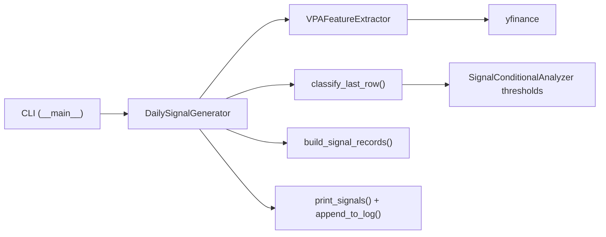

# Design Document: Daily VPA Signal Generator

## Overview

A CLI module that runs daily after market close, downloads recent OHLCV data for a specified ticker (default SPY), classifies the latest candle using VPA logic, applies contrarian inversion (bearish VPA → BUY), and appends structured signals to a persistent CSV log.

**Data Flow:**
```
CLI args (--ticker, --lookback-days, --output-dir) → Download OHLCV (yfinance) → VPA Feature Extraction → Signal Classification → Contrarian Inversion → Console Output + CSV Append
```

## Architecture



**Design Decisions:**
- Reuses `VPAFeatureExtractor` for download/extraction but validates only ≥50 rows (not the 2000-row minimum in `generate_dataset()`).
- Imports `COMPOSITE_THRESHOLD` and `ACC_DIST_SCORE_THRESHOLD` from `SignalConditionalAnalyzer` directly.
- Single-file module (`daily_signal.py`) with `__main__` block for CLI invocation.
- Ticker threaded from CLI → generator → signal records → CSV log path for multi-ticker support.

## Components and Interfaces

### Public API (`daily_signal.py`)

```python
@dataclass(frozen=True)
class SignalRecord:
    ticker: str                  # e.g. "SPY", "AAPL"
    date: str                    # ISO 8601 YYYY-MM-DD
    signal_type: str             # e.g. "distribution"
    original_direction: str      # "up" or "down"
    adjusted_direction: str      # Always "BUY" for actionable signals
    confidence_level: str        # "High", "Medium-High", "Low-Medium", "Low"
    suggested_hold_days: int     # Always 10

class DailySignalGenerator:
    def __init__(self, output_dir: Path, lookback_days: int = 200, ticker: str = "SPY") -> None: ...
    def run(self) -> list[SignalRecord]: ...

# Internal functions
def classify_last_row(df: pd.DataFrame) -> set[SignalType]: ...
def build_signal_records(ticker: str, date: str, signal_types: set[SignalType]) -> list[SignalRecord]: ...
def print_signals(ticker: str, date: str, records: list[SignalRecord]) -> None: ...
def append_to_log(records: list[SignalRecord], log_path: Path) -> None: ...
def parse_args(argv: list[str] | None = None) -> argparse.Namespace: ...
def main() -> None: ...
```

## Data Models

```python
# Reused from signal_analysis.py
# SignalType: STRONG_BULLISH, STRONG_BEARISH, ACCUMULATION, DISTRIBUTION, ACCUMULATION_TEST_PASS
# SignalDirection: UP, DOWN
# SIGNAL_DIRECTIONS: dict[SignalType, SignalDirection]

CONFIDENCE_MAP: dict[SignalType, str] = {
    SignalType.DISTRIBUTION: "High",
    SignalType.STRONG_BEARISH: "Medium-High",
    SignalType.STRONG_BULLISH: "Low-Medium",
    SignalType.ACCUMULATION: "Low",
}

CONFIDENCE_ORDER: list[str] = ["High", "Medium-High", "Low-Medium", "Low"]
EXCLUDED_SIGNALS: set[SignalType] = {SignalType.ACCUMULATION_TEST_PASS}

CSV_COLUMNS: list[str] = [
    "ticker", "date", "signal_type", "original_direction",
    "adjusted_direction", "confidence_level", "suggested_hold_days",
]
```

Default log path: `{output_dir}/{ticker.lower()}_daily_signals.csv` (e.g. `ml_validation_output/spy_daily_signals.csv`).

## Correctness Properties

*Properties are formal statements about what the system should do, bridging human-readable specs and machine-verifiable guarantees.*

### Property 1: Signal classification matches threshold rules

*For any* feature vector with numeric values for `composite_score`, `acc_dist_flag`, `acc_dist_type`, and `acc_dist_score`, the set of signal types returned by `classify_last_row` SHALL be exactly the set of types whose threshold conditions are satisfied (composite_score ≥ 15 → STRONG_BULLISH, ≤ -15 → STRONG_BEARISH, flag=1 & type=1 → ACCUMULATION, flag=1 & type=-1 → DISTRIBUTION, flag=1 & type=1 & score≥15 → ACCUMULATION_TEST_PASS), and an empty set when no conditions are met or relevant fields are NaN.

**Validates: Requirements 3.1, 3.2, 3.3, 3.4, 3.5, 3.6, 3.7**

### Property 2: Contrarian mapping produces correctly ordered records

*For any* non-empty subset of `SignalType` values (excluding ACCUMULATION_TEST_PASS) and any valid ticker string, `build_signal_records` SHALL produce one `SignalRecord` per type with `ticker` matching the input, `adjusted_direction="BUY"`, the correct confidence level from `CONFIDENCE_MAP`, `suggested_hold_days=10`, and records ordered by confidence descending (High, Medium-High, Low-Medium, Low).

**Validates: Requirements 4.1, 4.2, 4.3, 4.4, 4.5, 4.6, 10.2, 10.3**

### Property 3: Signal date is the chronologically latest date

*For any* valid OHLCV DataFrame with ≥50 rows in arbitrary order, the signal date produced SHALL equal the maximum date value in the dataset after sorting.

**Validates: Requirements 1.5**

### Property 4: Insufficient data detection

*For any* DataFrame where the count of rows with all-valid OHLCV columns is less than 50, the Signal_Generator SHALL raise `InsufficientDataError`.

**Validates: Requirements 1.2, 10.4**

### Property 5: CSV deduplication on append

*For any* list of `SignalRecord` values and an existing CSV log, `append_to_log` SHALL not produce duplicate rows when the same (date, signal_type, ticker) combination already exists in the file.

**Validates: Requirements 6.1**

### Property 6: CLI lookback-days range validation

*For any* integer value provided as `--lookback-days`, `parse_args` SHALL accept it if and only if it is in the range [70, 3650], rejecting values outside with exit code 2.

**Validates: Requirements 7.3, 7.6**

### Property 7: Feature extraction equivalence

*For any* valid OHLCV dataset of ≥50 trading days, the feature vector produced for the final row by `DailySignalGenerator` SHALL be identical to the feature vector produced by `VPAFeatureExtractor.generate_dataset()` for the same row given the same input data.

**Validates: Requirements 2.1, 2.2**

## Error Handling

| Scenario | Exception / Exit | Code |
|----------|-----------------|------|
| yfinance returns no data or network error | `InsufficientDataError` → stderr, exit 1 | 1 |
| < 50 valid rows after NaN removal | `InsufficientDataError` → stderr, exit 1 | 1 |
| Warm-up consumes all rows | `InsufficientDataError` → stderr, exit 1 | 1 |
| Config file missing/invalid JSON | Descriptive error → stderr, exit 1 | 1 |
| Ticker has no data on yfinance | `InsufficientDataError` → stderr, exit 1 | 1 |
| `--lookback-days` out of range or non-integer | Usage message → stderr, exit 2 | 2 |
| Unrecognized CLI argument | Usage message → stderr, exit 2 | 2 |
| CSV write failure (permissions/disk) | Error message → stderr, exit 1 | 1 |

## Testing Strategy

**Property-based tests** (using `hypothesis`):
- Each correctness property above maps to one property test with ≥100 iterations.
- Generators produce random feature vectors, signal type subsets, OHLCV DataFrames, ticker strings, and integer values.
- Tag format: `Feature: daily-vpa-signal-generator, Property N: <title>`

**Unit tests** (using `pytest`):
- Console output format (capture stdout, verify ticker and fields present)
- CSV header creation vs append (file existence scenarios)
- No-signal case (no write, "No high-conviction signal" message includes ticker)
- Config loading error messages
- Platform path handling (pathlib usage)
- Multi-ticker log file naming (`{ticker.lower()}_daily_signals.csv`)

**Integration tests:**
- End-to-end with mocked yfinance for multiple tickers, verify full pipeline output
- Equivalence check against `VPAFeatureExtractor` on a small real dataset
