# Design Document

## Overview

This feature adds the **Double Smoothed Stochastic (DSS) Bressert** oscillator to the
trading project (`d:\projects\trading\vpa`) as a new, config-driven signal category. The
work is tracked by Jira ticket **SP-325** (Story, Side Projects / trading project) and
follows the requirements in `requirements.md` for this spec.

The design is grounded entirely in the existing project conventions and introduces no new
architecture:

- A **pure calculator** module `vpa/dss_bressert.py`, in the same spirit as `vpa/rsi.py`
  (`calculate_rsi`) — deterministic, side-effect free, returning the neutral value `50.0`
  during warmup.
- **Frozen dataclass config** in `vpa/config/settings.py` (`DSSScores`,
  `DSSBressertSettings`), a `_dss_bressert_settings(raw)` loader helper, and a
  `dss_bressert` field on the `Settings` dataclass — shaped exactly like the existing
  `rsi` / `ma_crossover` blocks and built with the same helpers (`_section`, `_optional`,
  `_number`, `_positive_int`).
- **`MarketAnalyzer` integration** in `vpa/app_runner.py`: an
  `_init_dss_bressert_config()` init hook, a `compute_dss_bressert_columns()`
  pre-computation step (mirroring `compute_rsi_column()`), and a
  `detect_dss_bressert_signals(row_index)` method that contributes a single additive
  sub-score to the composite `trade_signal` — exactly like `detect_rsi_signals` and
  `detect_ma_signals`.
- **Isolated backtest wiring** reusing the existing `BacktestEngine` unchanged: new
  `SignalType` members plus `SIGNAL_DIRECTIONS` entries in
  `vpa/ml_validation/signal_analysis.py`, an extended `classify_signals`, and a
  `DSS_Bressert_Only` `StrategyVariation` in `vpa/backtesting/variations.py`.
- **A visualization capability** on `MarketAnalyzer` (`graph_dss_bressert`) that plots the
  price candles with the DSS oscillator and trigger line in a lower panel — a
  developer-facing verification aid for comparing the indicator against TradingView. It
  reuses the existing mplfinance approach from `graph_intervals()` and reads the
  already-computed `DSS` / `DSS_Trigger` columns rather than recomputing the indicator.

The signal degrades gracefully when disabled, when configuration is invalid, or when there
is insufficient data — mirroring how RSI returns a neutral value and how `ma_crossover`
uses an `enabled` flag.

### Indicator Algorithm (confirmed, TradingView Pine Script v4)

Inputs (Pine names in parentheses): `Stochastic_Period` (PDS, default 10),
`Smoothing_Period` (EMAlen, default 9), `Trigger_Period` (TriggerLen, default 5),
`Overbought_Threshold` (default 80), `Oversold_Threshold` (default 20).

Define a windowed stochastic over close/high/low series:

```
stoch(c, h, l, n)[t] = 100 * (c[t] - lowest(l, n)[t]) / (highest(h, n)[t] - lowest(l, n)[t])
```

where `lowest(l, n)[t]` and `highest(h, n)[t]` are the min low / max high over the trailing
`n` bars ending at `t`. When the range `highest(h, n) - lowest(l, n)` is zero (a flat
window), the division is guarded (see Error Handling): the stochastic carries forward the
prior stochastic value, or `50.0` if there is no prior value.

The full DSS Bressert chain:

```
xPreCalc = ema( stoch(close, high, low, PDS),           EMAlen )
xDSS     = ema( stoch(xPreCalc, xPreCalc, xPreCalc, PDS), EMAlen )   # oscillator
xTrigger = ema( xDSS,                                    TriggerLen ) # trigger line
```

The **second stochastic** uses `xPreCalc` as close, high **and** low simultaneously, i.e.

```
stoch2[t] = 100 * (xPreCalc[t] - lowest(xPreCalc, PDS)[t]) / (highest(xPreCalc, PDS)[t] - lowest(xPreCalc, PDS)[t])
```

`ema(values, length)` is the standard exponential moving average with
`alpha = 2 / (length + 1)`, seeded from the first available value.

Both the oscillator (`xDSS`) and the trigger (`xTrigger`) are bounded in `[0.0, 100.0]`.
Resolution / timeframe is **out of scope**: the calculation runs on the analyzer's existing
daily bar series (Req 2.8), and `DSS_Config` exposes no timeframe parameter.

### Minimum Warmup Length

The chain composes two trailing-window stochastics (each needs `PDS` bars) and two EMAs
(EMAlen and TriggerLen). Following the requirements' approximation and matching the
running-series semantics of `compute_rsi_column`, the design fixes:

```
minimum_warmup_length = Stochastic_Period + Smoothing_Period + Trigger_Period - 2
```

For the defaults (10 + 9 + 5 − 2) this is **22 rows**. For every row index `i` strictly
less than `minimum_warmup_length`, the calculator emits the `Neutral_Value` `50.0` for both
oscillator and trigger (Req 8.1, 8.2). Rows at or beyond the warmup index carry the computed
values. Because EMAs are running, the warmup boundary is an approximation of the point at
which the smoothing chain has stabilised; it is defined as a single, deterministic constant
so the analyzer and tests agree on exactly which rows are "sufficient".

## Architecture

### Component and Data Flow — live analysis path

The DSS Bressert signal plugs into the existing per-row analysis pipeline. The pure
calculator computes two whole-series columns once, up front; the analyzer then reads those
columns row-by-row inside its existing loop and folds a single sub-score into the composite
`trade_signal` sum.

```mermaid
flowchart LR
    A["config/config.json<br/>dss_bressert block"] --> B["load_settings()<br/>DSSBressertSettings"]
    B --> C["MarketAnalyzer._init_dss_bressert_config()<br/>validate + enable/disable"]
    C --> D["compute_dss_bressert_columns()"]
    D --> E["vpa/dss_bressert.py<br/>calculate_dss_bressert(high, low, close, ...)"]
    E --> F["myDF['DSS']<br/>myDF['DSS_Trigger'] columns"]
    F --> G["detect_dss_bressert_signals(row_index)"]
    G --> H["{dss_bressert_signals: list,<br/>dss_bressert_signal_score: float}"]
    H --> I["process_data(): trade_signal += dss_bressert_signal_score"]
    I --> J["Composite trade_signal"]
```



The DSS sub-score is added to the existing summation alongside `single_candle`, `trend`,
`multiple_bar`, `acc_dist`, `ma_crossover`, `rsi`, and `price_vs_sma` (Req 5.1, 5.3).

### Component and Data Flow — isolated backtest path

The isolated backtest reuses the existing engine untouched (Req 6.3). The feature dataset
carries per-row DSS crossover columns; `classify_signals` turns those into `SignalEntry`
records; a DSS-only `StrategyVariation` filters the signal log; and `run_variation` calls
`BacktestEngine().run(...)` exactly once, threading the result through the existing pricing,
equity-curve, and metrics pipeline.

```mermaid
flowchart LR
    A["Feature dataset<br/>dss_bullish_cross / dss_bearish_cross columns"] --> B["SignalConditionalAnalyzer.classify_signals(df)"]
    B --> C["SignalEntry records<br/>DSS_BULLISH (UP) / DSS_BEARISH (DOWN)"]
    C --> D["DSS_Bressert_Only StrategyVariation<br/>signal_filter = _include_dss"]
    D --> E["run_variation(): BacktestEngine().run(filtered_log, prices, config)"]
    E --> F["pnl.price_trades → equity_curve → metrics.calculate"]
    F --> G["MetricsResult<br/>(full performance suite)"]
```



The feature extractor (`vpa/ml_validation/feature_extractor.py`) must also emit the DSS
crossover columns so the dataset carries them; this is called out as an integration point
below, with primary scope kept on calculator + analyzer + backtest wiring.

## Components and Interfaces

### 1. Pure calculator — `vpa/dss_bressert.py` (new module)

A new module mirroring the purity and neutral-value discipline of `vpa/rsi.py`. Because the
DSS chain is a running EMA/stochastic composition over the whole series (not a single-window
snapshot like a single RSI value), the calculator computes the entire oscillator and trigger
series once — the analyzer then materialises them as DataFrame columns (like
`compute_rsi_column`).

```python
def _stochastic_series(
    high: list[float], low: list[float], close: list[float], period: int
) -> list[float]:
    """Trailing-window stochastic %K series over close/high/low.

    For each index t, computes 100 * (close[t] - lowest(low, period)) /
    (highest(high, period) - lowest(low, period)) over the trailing `period` bars.
    Flat-range windows (max == min) carry forward the previous stochastic value, or
    50.0 when there is no previous value. Pure and deterministic.
    """


def _ema_series(values: list[float], length: int) -> list[float]:
    """Exponential moving average series with alpha = 2 / (length + 1).

    Seeded from the first element; index t depends only on values[:t+1]. Pure.
    """


def calculate_dss_bressert(
    high: list[float],
    low: list[float],
    close: list[float],
    stochastic_period: int = 10,
    smoothing_period: int = 9,
    trigger_period: int = 5,
) -> tuple[list[float], list[float]]:
    """Compute the DSS Bressert oscillator and trigger line for a whole series.

    Returns (oscillator, trigger), each a list aligned to the input series.
    Applies the chain:
        xPreCalc = ema(stoch(close, high, low, PDS), EMAlen)
        oscillator = ema(stoch(xPreCalc, xPreCalc, xPreCalc, PDS), EMAlen)
        trigger    = ema(oscillator, TriggerLen)
    Every index strictly below minimum_warmup_length is set to the Neutral_Value 50.0
    for BOTH lists. Returns (all-50.0, all-50.0) when the series is shorter than the
    warmup length. Returns (all-50.0, all-50.0) with NO error when any period is not an
    integer >= 1. Deterministic and side-effect free; performs no I/O.
    """
```

Contract highlights (Req 1, Req 8):

- **Bounds** — every oscillator and trigger value is in `[0.0, 100.0]` (Req 1.2, 1.3),
  which follows from the stochastic definition (each `%K` is clamped to `[0, 100]`, and an
  EMA of values in `[0, 100]` stays in `[0, 100]`).
- **Monotone series** — a strictly rising close/high/low series drives the stochastic
  toward 100, so the oscillator is `>= 50.0` (Req 1.4); strictly falling drives it toward
  0, so the oscillator is `<= 50.0` (Req 1.5).
- **Flat series** — a constant price series yields flat-range windows throughout, so the
  guarded stochastic returns the neutral `50.0`, and the oscillator is exactly `50.0`
  (Req 1.6).
- **Invalid periods** — if any of `stochastic_period`, `smoothing_period`,
  `trigger_period` is not an integer `>= 1`, the calculator returns the neutral series and
  raises no error (Req 1.7).
- **Determinism** — identical inputs always yield identical outputs; no globals, no RNG,
  no clock, no I/O (Req 1.8).
- **Warmup** — indices below `minimum_warmup_length` are `50.0` (Req 8.1, 8.2).

### 2. Config typing — `vpa/config/settings.py` (additions)

Two new frozen dataclasses and a `dss_bressert` field on `Settings`, plus a loader helper,
matching the `RSIScores` / `RSISettings` / `_price_vs_sma_settings` pattern exactly.

```python
@dataclass(frozen=True)
class DSSScores:
    bullish_crossover: float = 0
    bearish_crossover: float = 0
    oversold: float = 0
    overbought: float = 0


@dataclass(frozen=True)
class DSSBressertSettings:
    enabled: bool = True
    stochastic_period: int = 10
    smoothing_period: int = 9
    trigger_period: int = 5
    overbought_threshold: float = 80
    oversold_threshold: float = 20
    scores: DSSScores = DSSScores()
```

`Settings` gains a `dss_bressert: DSSBressertSettings` field. A `_dss_bressert_settings(raw)`
helper builds it from the raw section, reusing `_section`, `_optional`, `_number`, and the
`enabled`-flag handling used by `_price_vs_sma_settings`:

```python
def _dss_bressert_settings(raw: dict[str, Any]) -> DSSBressertSettings:
    scores = _section(raw, "scores", "dss_bressert.scores")
    return DSSBressertSettings(
        enabled=_optional(raw, "enabled", True, "dss_bressert.enabled", bool),
        stochastic_period=_optional(raw, "stochastic_period", 10, "dss_bressert.stochastic_period", int),
        smoothing_period=_optional(raw, "smoothing_period", 9, "dss_bressert.smoothing_period", int),
        trigger_period=_optional(raw, "trigger_period", 5, "dss_bressert.trigger_period", int),
        overbought_threshold=_number(raw, "overbought_threshold", 80, "dss_bressert.overbought_threshold"),
        oversold_threshold=_number(raw, "oversold_threshold", 20, "dss_bressert.oversold_threshold"),
        scores=DSSScores(
            bullish_crossover=_number(scores, "bullish_crossover", 0, "dss_bressert.scores.bullish_crossover"),
            bearish_crossover=_number(scores, "bearish_crossover", 0, "dss_bressert.scores.bearish_crossover"),
            oversold=_number(scores, "oversold", 0, "dss_bressert.scores.oversold"),
            overbought=_number(scores, "overbought", 0, "dss_bressert.scores.overbought"),
        ),
    )
```

Inside `load_settings()`, a `dss_bressert=_dss_bressert_settings(_section(raw, "dss_bressert", "dss_bressert"))`
argument is added to the `Settings(...)` construction. Because `_section` returns `{}` when
the key is absent and every field uses `_optional` / `_number` defaults, an absent
`dss_bressert` block yields the Req 2.3 defaults (`enabled` = true, PDS = 10, EMAlen = 9,
TriggerLen = 5, overbought = 80, oversold = 20, all scores = 0).

Deep-range validation (periods in `1..500`, thresholds in `0..100` with
`oversold < overbought`) is **not** performed at load time; it lives in the analyzer's init
hook so that invalid values disable the signal for the session rather than raising a
`ConfigurationError` (Req 2.6, 2.7). This matches how `_init_rsi_config` validates thresholds
at analyzer init rather than in `load_settings`.

### 3. MarketAnalyzer integration — `vpa/app_runner.py` (additions)

Follows the per-signal convention already used for MA, RSI, and price-vs-SMA.

**`__init__`** — add `self._init_dss_bressert_config()` alongside the existing
`_init_ma_config()`, `_init_rsi_config()`, `_init_price_vs_sma_config()` calls.

**`_init_dss_bressert_config()`** — sets `self.__dss_bressert_config` and
`self.__dss_bressert_enabled`, mirroring `_init_rsi_config`:

```python
def _init_dss_bressert_config(self):
    """Load and validate the dss_bressert configuration section.

    Sets self.__dss_bressert_config and self.__dss_bressert_enabled. Uses
    defaults if the section is absent. Disables the signal (with a WARN log)
    when the enabled flag is false/absent, when a period is not an int in
    1..500, or when thresholds are outside 0..100 or oversold >= overbought.
    """
    self.__dss_bressert_config = self.__config.dss_bressert
    cfg = self.__dss_bressert_config

    # Req 7.5: absent/non-boolean enabled -> disabled. Settings coerces the type,
    # so a false flag simply disables.
    if not cfg.enabled:
        self.__dss_bressert_enabled = False
        return

    # Req 2.6: periods must be integers in 1..500.
    for name, value in (
        ("stochastic_period", cfg.stochastic_period),
        ("smoothing_period", cfg.smoothing_period),
        ("trigger_period", cfg.trigger_period),
    ):
        if not isinstance(value, int) or isinstance(value, bool) or not (1 <= value <= 500):
            self.__logger.log(
                f"DSS Bressert disabled: invalid {name} ({value}). Must be an integer in 1..500.",
                level="WARN",
            )
            self.__dss_bressert_enabled = False
            return

    # Req 2.7: thresholds in 0..100 with oversold < overbought.
    oversold = cfg.oversold_threshold
    overbought = cfg.overbought_threshold
    if not (0 <= oversold <= 100) or not (0 <= overbought <= 100) or oversold >= overbought:
        self.__logger.log(
            f"DSS Bressert disabled: invalid thresholds (oversold={oversold}, overbought={overbought}).",
            level="WARN",
        )
        self.__dss_bressert_enabled = False
        return

    self.__dss_bressert_enabled = True
```

**`compute_dss_bressert_columns()`** — pre-computes the `DSS` and `DSS_Trigger` columns on
`self.myDF`, a no-op when disabled, mirroring `compute_rsi_column()`:

```python
def compute_dss_bressert_columns(self):
    """Pre-compute DSS and DSS_Trigger columns on self.myDF. No-op when disabled."""
    if not self.__dss_bressert_enabled:
        return
    from vpa.dss_bressert import calculate_dss_bressert

    cfg = self.__dss_bressert_config
    highs = self.myDF["High"].tolist()
    lows = self.myDF["Low"].tolist()
    closes = self.myDF["Close"].tolist()
    oscillator, trigger = calculate_dss_bressert(
        highs, lows, closes,
        cfg.stochastic_period, cfg.smoothing_period, cfg.trigger_period,
    )
    self.myDF["DSS"] = oscillator
    self.myDF["DSS_Trigger"] = trigger
```

**`detect_dss_bressert_signals(row_index)`** — returns exactly two dictionary entries: a
signals list and a numeric sub-score, matching the `rsi_signals` / `rsi_signal_score` and
`ma_crossover_signals` / `ma_crossover_signal_score` shape (Req 5.2). Crossover detection
uses `prev_row = self.myDF.iloc[row_index - 1]` versus the current row, exactly like the
`detect_ma_signals` golden/death cross; zone scoring mirrors `detect_rsi_signals`.

```python
def detect_dss_bressert_signals(self, row_index: int) -> dict:
    """Detect DSS Bressert crossover and zone signals for the given row.

    Returns dict with keys: dss_bressert_signals (list[str]),
    dss_bressert_signal_score (float).

    Graceful degradation: returns empty list + 0.0 when disabled (Req 7),
    when the row index is below the warmup length (Req 8.3), or when the
    current/previous DSS or DSS_Trigger value is NaN/undefined (Req 3.6, 8.4).
    """
    empty = {"dss_bressert_signals": [], "dss_bressert_signal_score": 0.0}

    if not self.__dss_bressert_enabled:
        return empty
    if "DSS" not in self.myDF.columns or "DSS_Trigger" not in self.myDF.columns:
        return empty

    cfg = self.__dss_bressert_config
    warmup = cfg.stochastic_period + cfg.smoothing_period + cfg.trigger_period - 2
    if row_index < warmup:
        return empty

    current = self.myDF.iloc[row_index]
    dss = current["DSS"]
    trig = current["DSS_Trigger"]
    if pd.isna(dss) or pd.isna(trig) or not np.isfinite(dss) or not np.isfinite(trig):
        return empty

    scores = cfg.scores
    signals_list: list[str] = []
    total_score = 0.0

    # Crossover detection (Req 3) — needs a previous row.
    if row_index > 0:
        prev = self.myDF.iloc[row_index - 1]
        prev_dss = prev["DSS"]
        prev_trig = prev["DSS_Trigger"]
        if not (pd.isna(prev_dss) or pd.isna(prev_trig)):
            # Bullish: prev DSS <= prev trigger AND curr DSS > curr trigger.
            if prev_dss <= prev_trig and dss > trig:
                signals_list.append("DSS Bullish Crossover")
                total_score += scores.bullish_crossover
            # Bearish: prev DSS >= prev trigger AND curr DSS < curr trigger.
            elif prev_dss >= prev_trig and dss < trig:
                signals_list.append("DSS Bearish Crossover")
                total_score -= scores.bearish_crossover

    # Zone detection (Req 4) — thresholds already validated at init.
    if dss <= cfg.oversold_threshold:
        signals_list.append("DSS Oversold")
        total_score += scores.oversold          # configured positive/bullish value
    elif dss >= cfg.overbought_threshold:
        signals_list.append("DSS Overbought")
        total_score += scores.overbought        # configured negative/bearish value

    return {"dss_bressert_signals": signals_list, "dss_bressert_signal_score": total_score}
```

Sign convention (Req 3, Req 4): a **bullish crossover adds** `bullish_crossover`; a
**bearish crossover subtracts** `bearish_crossover`; **oversold adds** the (positive)
`oversold` score; **overbought adds** the (negative) `overbought` score.

**`process_data()`** — three edits, matching the existing Step 6.x structure:

1. Add `self.compute_dss_bressert_columns()` beside the other `compute_*` calls.
2. Add a **Step 6.4** detect-and-merge block:
   ```python
   # Step 6.4: Detect DSS Bressert signals
   dss_signals = self.detect_dss_bressert_signals(row_position)
   signals["dss_bressert_signals"] = dss_signals["dss_bressert_signals"]
   signals["dss_bressert_signal_score"] = dss_signals["dss_bressert_signal_score"]
   ```
3. Add `+ signals["dss_bressert_signal_score"]` to the `trade_signal` summation (which
   currently sums `single_candle`, `trend`, `multiple_bar`, `acc_dist`, `ma_crossover`,
   `rsi`, `price_vs_sma`). This makes DSS a single additive term with no weighting, scaling,
   or ordering dependency (Req 5.1, 5.3).

### 4. Backtest wiring — `vpa/ml_validation/signal_analysis.py` (additions)

Two new `SignalType` members and their `SIGNAL_DIRECTIONS` entries, then an extension of
`classify_signals` to recognise per-row DSS crossover columns.

```python
class SignalType(Enum):
    STRONG_BULLISH = "strong_bullish"
    STRONG_BEARISH = "strong_bearish"
    ACCUMULATION = "accumulation"
    DISTRIBUTION = "distribution"
    ACCUMULATION_TEST_PASS = "accumulation_test_pass"
    DSS_BULLISH = "dss_bullish"     # new
    DSS_BEARISH = "dss_bearish"     # new


SIGNAL_DIRECTIONS = {
    ...,  # existing entries unchanged
    SignalType.DSS_BULLISH: SignalDirection.UP,
    SignalType.DSS_BEARISH: SignalDirection.DOWN,
}
```

`classify_signals(df)` gains two more `notna`-masked column reads, in the same style as the
existing `composite_score` / `acc_dist_flag` masks. The feature dataset carries two boolean
DSS crossover columns (design names `dss_bullish_cross` and `dss_bearish_cross`); a truthy
value on a row marks a matched signal:

```python
# DSS crossover columns (present when the DSS feature is emitted)
if "dss_bullish_cross" in df.columns:
    dss_bull_valid = df["dss_bullish_cross"].notna()
    dss_bull_mask = dss_bull_valid & (df["dss_bullish_cross"] == 1)
    result[SignalType.DSS_BULLISH] = df.index[dss_bull_mask].tolist()
if "dss_bearish_cross" in df.columns:
    dss_bear_valid = df["dss_bearish_cross"].notna()
    dss_bear_mask = dss_bear_valid & (df["dss_bearish_cross"] == 1)
    result[SignalType.DSS_BEARISH] = df.index[dss_bear_mask].tolist()
```

Because `result` is initialised as `{st: [] for st in SignalType}`, the two new members
default to empty lists when the columns are absent — a dataset without DSS columns simply
contributes zero DSS signals (Req 6.4).

### 5. Backtest wiring — `vpa/backtesting/variations.py` (additions)

A DSS-only filter and a `DSS_Bressert_Only` `StrategyVariation`, following the existing
`_include_contrarian` / `Contrarian_Only` pattern. The engine is reused **unchanged** — no
modification, subclassing, or monkeypatching (Req 6.3):

```python
_DSS_SIGNAL_TYPES = frozenset({SignalType.DSS_BULLISH, SignalType.DSS_BEARISH})


def _include_dss(entry: SignalEntry) -> bool:
    """DSS_Bressert_Only filter: accept only DSS_BULLISH / DSS_BEARISH (Req 6.1)."""
    return entry.signal_type in _DSS_SIGNAL_TYPES
```

Added inside `build_default_variations()`:

```python
variations.append(
    StrategyVariation(
        name="DSS_Bressert_Only",
        signal_filter=_include_dss,
    )
)
```

`run_variation` (unchanged) filters the signal log to DSS-only entries, calls
`BacktestEngine().run(...)` exactly once, and threads the result through
`pnl.price_trades → equity_curve.build_equity_curve → metrics.calculate`, producing the full
`MetricsResult` suite: total return, annualised return, buy-and-hold return, Sharpe ratio,
maximum drawdown, win rate, profit factor, average win, average loss, expectancy, time in
market, number of trades, and trades per year (Req 6.1, 6.2). When the DSS filter matches
zero entries, the filtered log is empty and the engine completes without error, reporting a
metrics result with number of trades `0` and every trade-derived metric `0.0` (Req 6.4).
`run_variations` already isolates per-variation failures into `VariationFailure(name, error)`
without aborting the batch (Req 6.5).

### 6. Feature extractor integration point — `vpa/ml_validation/feature_extractor.py`

For the isolated backtest dataset to carry DSS signals, the feature extractor must emit the
two crossover columns. `VPAFeatureExtractor` uses a fixed `FEATURE_COLUMNS` list and builds
each row in `_extract_feature_vector`. The integration is:

- Add `dss_bullish_cross` and `dss_bearish_cross` to the emitted columns (following the
  existing `rsi_value` / `rsi_signal_score` additions, which are already members of
  `FEATURE_COLUMNS`).
- Populate them per row from `detect_dss_bressert_signals(row_index)` output: `1` when the
  respective crossover signal name is present in `dss_bressert_signals`, else `0`.

This is called out as an integration point; primary implementation scope is the calculator,
the analyzer methods, and the backtest wiring above. The exact feature-extractor row-build
edits are deferred to task breakdown.

### 7. DSS Bressert chart — `vpa/app_runner.py` (addition)

A new `MarketAnalyzer` method `graph_dss_bressert` renders the price candles in the upper
panel with the DSS oscillator and trigger line together in a lower panel (Req 10.1). It
reuses the existing mplfinance approach from `graph_intervals()` — which already calls
`mpf.plot(df, type="candle", style="charles", volume=True, savefig=chart_filename)` — and
extends it with `make_addplot` series routed to a distinct lower panel.

Because `graph_intervals()` builds a per-window DataFrame with a `Date` index, the
full-series chart must likewise be built from a copy of `self.myDF` whose `Date` column is
parsed to datetime and set as the index (mplfinance requires a `DatetimeIndex`). The method
reads the already-computed `self.myDF["DSS"]` and `self.myDF["DSS_Trigger"]` columns and does
**not** recompute the indicator (Req 10.4); `compute_dss_bressert_columns()` runs inside
`process_data()`. When the signal is disabled or those columns are absent, it falls back to a
price-only chart and completes without error (Req 10.6).

```python
def graph_dss_bressert(self, show_chart: bool = False):
    """Render a candlestick chart with the DSS oscillator/trigger in a lower panel.

    Reuses the graph_intervals() mplfinance approach. Reads the pre-computed
    DSS / DSS_Trigger columns (does not recompute — Req 10.4). Falls back to a
    price-only chart with no error when disabled or when the columns are absent
    (Req 10.6). Saves a PNG under log/ (Req 10.5).
    """
    import mplfinance as mpf

    # DatetimeIndex is required by mplfinance; build a plotting copy from self.myDF.
    df = self.myDF.copy()
    df["Date"] = pd.to_datetime(df["Date"])
    df = df.set_index("Date")

    # Guard: disabled or missing columns -> price-only chart, no error (Req 10.6).
    addplots = []
    panel_ratios = (6, 2)
    if self.__dss_bressert_enabled and {"DSS", "DSS_Trigger"}.issubset(df.columns):
        cfg = self.__dss_bressert_config
        overbought = cfg.overbought_threshold
        oversold = cfg.oversold_threshold
        panel = 2  # below price (0) and volume (1)
        # Two distinct, colour/label-distinguished series (Req 10.3) plus the two
        # horizontal threshold reference lines (Req 10.2), all in the lower panel.
        addplots = [
            mpf.make_addplot(df["DSS"], panel=panel, color="blue",
                             ylabel="DSS", ylim=(0, 100)),
            mpf.make_addplot(df["DSS_Trigger"], panel=panel, color="red"),
            mpf.make_addplot([overbought] * len(df), panel=panel,
                             color="green", linestyle="--"),
            mpf.make_addplot([oversold] * len(df), panel=panel,
                             color="red", linestyle="--"),
        ]
        panel_ratios = (6, 2, 2)

    chart_filename = f"log/{self.__ticker}_dss_bressert.png"
    mpf.plot(
        df,
        type="candle",
        style="charles",
        volume=True,
        addplot=addplots,
        panel_ratios=panel_ratios,
        savefig=chart_filename,
    )
    if show_chart:
        mpf.plot(df, type="candle", style="charles", volume=True,
                 addplot=addplots, panel_ratios=panel_ratios)
```

Notes:

- The PNG is written under the existing `log/` chart output location, consistent with
  `graph_intervals()` (e.g. `log/{ticker}_dss_bressert.png`), and the chart is optionally
  displayed when `show_chart` is `True` (Req 10.5). The exact ticker attribute name follows
  whatever `graph_intervals()` already uses for its filename.
- The oscillator and trigger are rendered as two distinct series distinguished by colour and
  label (Req 10.3); the overbought/oversold reference lines are drawn as constant-value
  `make_addplot` series in the same lower panel (Req 10.2), read from
  `cfg.overbought_threshold` / `cfg.oversold_threshold`.
- Rendering consumes the scored `DSS` / `DSS_Trigger` columns verbatim, guaranteeing the
  plotted values match the values the analyzer scored (Req 10.4).

## Data Models

### New dataclasses (`vpa/config/settings.py`)

| Dataclass | Fields | Defaults | Requirement |
|---|---|---|---|
| `DSSScores` | `bullish_crossover`, `bearish_crossover`, `oversold`, `overbought` (all `float`) | all `0` | Req 2.1, 2.2, 2.3 |
| `DSSBressertSettings` | `enabled: bool`, `stochastic_period: int`, `smoothing_period: int`, `trigger_period: int`, `overbought_threshold: float`, `oversold_threshold: float`, `scores: DSSScores` | `True`, `10`, `9`, `5`, `80`, `20`, `DSSScores()` | Req 2.1, 2.3 |

`Settings` gains one field: `dss_bressert: DSSBressertSettings`.

### New DataFrame columns (`self.myDF` in `MarketAnalyzer`)

| Column | Type | Meaning |
|---|---|---|
| `DSS` | `float` | DSS Bressert oscillator, `[0.0, 100.0]`, `50.0` during warmup |
| `DSS_Trigger` | `float` | Trigger line (EMA of oscillator), `[0.0, 100.0]`, `50.0` during warmup |

### New per-row signals dictionary entries (Req 5.2)

| Key | Type | Meaning |
|---|---|---|
| `dss_bressert_signals` | `list[str]` | Zero or more signal-name strings (e.g. `"DSS Bullish Crossover"`, `"DSS Oversold"`) |
| `dss_bressert_signal_score` | `float` (numeric) | Additive sub-score folded into the composite `trade_signal` |

### New feature-dataset columns (backtest path)

| Column | Type | Meaning |
|---|---|---|
| `dss_bullish_cross` | `0`/`1` | Bullish DSS crossover occurred on this row |
| `dss_bearish_cross` | `0`/`1` | Bearish DSS crossover occurred on this row |

### New `SignalType` members (`vpa/ml_validation/signal_analysis.py`)

| Member | Value | Direction (`SIGNAL_DIRECTIONS`) |
|---|---|---|
| `DSS_BULLISH` | `"dss_bullish"` | `SignalDirection.UP` |
| `DSS_BEARISH` | `"dss_bearish"` | `SignalDirection.DOWN` |

### `config/config.json` addition

```json
"dss_bressert": {
  "enabled": true,
  "stochastic_period": 10,
  "smoothing_period": 9,
  "trigger_period": 5,
  "overbought_threshold": 80,
  "oversold_threshold": 20,
  "scores": {
    "bullish_crossover": 0,
    "bearish_crossover": 0,
    "oversold": 0,
    "overbought": 0
  }
}
```

## Correctness Properties

*A property is a characteristic or behavior that should hold true across all valid
executions of a system — essentially, a formal statement about what the system should do.
Properties serve as the bridge between human-readable specifications and machine-verifiable
correctness guarantees.*

The DSS Bressert calculator is a pure function over price series and the analyzer's
sub-score is a pure function of the DSS/Trigger columns and config, so property-based
testing applies well to the calculator maths and the crossover/zone scoring. (Backtest
engine reuse and metrics reporting are external-pipeline integration concerns and are
covered by integration tests in the Testing Strategy, not by properties.)

### Property 1: Oscillator and trigger are bounded

*For any* OHLC series of length greater than or equal to the minimum warmup length and any
periods (`stochastic_period`, `smoothing_period`, `trigger_period`) that are integers `>= 1`,
every value in both the returned oscillator series and the returned trigger series is
greater than or equal to `0.0` and less than or equal to `100.0`.

**Validates: Requirements 1.1, 1.2, 1.3**

### Property 2: Monotone series drive the oscillator to the correct side of 50

*For any* strictly increasing price series, every computed (post-warmup) oscillator value is
greater than or equal to `50.0`; and *for any* strictly decreasing price series, every
computed (post-warmup) oscillator value is less than or equal to `50.0`.

**Validates: Requirements 1.4, 1.5**

### Property 3: Series shorter than or earlier than warmup are neutral

*For any* price series shorter than the minimum warmup length, every returned oscillator and
trigger value equals `50.0`; and *for any* price series at least as long as the minimum
warmup length, every value at an index strictly less than the minimum warmup length equals
`50.0`.

**Validates: Requirements 8.1, 8.2, 8.3**

### Property 4: Determinism

*For any* fixed inputs, invoking `calculate_dss_bressert` twice returns identical oscillator
and trigger series (no dependence on hidden state, randomness, time, or I/O).

**Validates: Requirements 1.8**

### Property 5: Invalid periods yield a neutral series with no error

*For any* period argument that is not an integer greater than or equal to `1` (zero,
negative, or non-integer), the calculator returns an all-`50.0` oscillator series and raises
no error.

**Validates: Requirements 1.7**

### Property 6: Bullish crossover yields a positive sub-score

*For any* pair of consecutive rows where the previous DSS value is less than or equal to the
previous trigger and the current DSS value is strictly greater than the current trigger, and
a positive `bullish_crossover` score, with no zone contribution, the DSS sub-score is
strictly greater than `0.0`.

**Validates: Requirements 3.1, 3.2**

### Property 7: Bearish crossover yields a negative sub-score

*For any* pair of consecutive rows where the previous DSS value is greater than or equal to
the previous trigger and the current DSS value is strictly less than the current trigger,
and a positive `bearish_crossover` score, with no zone contribution, the DSS sub-score is
strictly less than `0.0`.

**Validates: Requirements 3.3, 3.4**

### Property 8: No signal condition contributes zero

*For any* enabled row where the DSS remains on the same side of the trigger across the
current and previous rows AND the DSS value lies strictly between the oversold and overbought
thresholds, the DSS signals list is empty and the DSS sub-score is exactly `0.0`.

**Validates: Requirements 3.5, 4.3, 5.5**

### Property 9: Oversold zone contributes the configured oversold score

*For any* enabled row whose DSS value is less than or equal to the oversold threshold and
where no crossover occurs, the DSS sub-score equals the configured oversold-zone score.

**Validates: Requirements 4.1, 9.6**

### Property 10: Overbought zone contributes the configured overbought score

*For any* enabled row whose DSS value is greater than or equal to the overbought threshold
and where no crossover occurs, the DSS sub-score equals the configured overbought-zone score.

**Validates: Requirements 4.2, 9.5**

### Property 11: Disabled degradation

*For any* row index, when the DSS Bressert category is disabled, `detect_dss_bressert_signals`
returns an empty signals list and a sub-score of exactly `0.0`, and the calculator is not
invoked.

**Validates: Requirements 2.5, 5.4, 7.1, 7.2, 7.3, 7.4, 9.7**

### Property 12: Composite additivity and invariance

*For any* processed row, the composite `trade_signal` computed with the DSS Bressert term
equals the composite computed without the DSS term plus the DSS sub-score, and every other
signal category's numeric contribution is identical to the value it would have without the
DSS term.

**Validates: Requirements 5.1, 5.3**

### Property 13: Output shape

*For any* row, `detect_dss_bressert_signals` returns a dictionary with exactly two entries: a
`dss_bressert_signals` value that is a list of strings, and a `dss_bressert_signal_score`
value of numeric type.

**Validates: Requirements 5.2**

## Error Handling

The design favours **graceful degradation** over raised exceptions, matching how RSI returns
a neutral value and how `ma_crossover` disables via a flag. There are five distinct
degradation paths.

| Condition | Where handled | Behaviour | Requirement |
|---|---|---|---|
| **Disabled** (`enabled` false or absent/non-boolean) | `_init_dss_bressert_config` sets `__dss_bressert_enabled = False` | `compute_dss_bressert_columns` is a no-op; `detect_dss_bressert_signals` returns `{[], 0.0}`; calculator never invoked; composite unchanged | Req 2.5, 7.1–7.5 |
| **Invalid config** (period not int in `1..500`; threshold not in `0..100`; `oversold >= overbought`) | `_init_dss_bressert_config` logs a `WARN` via `self.__logger.log(..., level="WARN")` and disables for the session, retaining other values | Signal disabled; no error raised; other categories unaffected | Req 2.6, 2.7, 4.5 |
| **Insufficient data** (row index `< minimum_warmup_length`) | Calculator emits `50.0` for warmup rows; `detect_dss_bressert_signals` returns `{[], 0.0}` when `row_index < warmup` | No spurious signal; sub-score `0.0` | Req 8.1–8.3 |
| **NaN / non-finite DSS or trigger** on current or previous row | `detect_dss_bressert_signals` guards with `pd.isna(...)` / `np.isfinite(...)` | Returns `{[], 0.0}`; no crossover or zone signal | Req 3.6, 4.4, 8.4 |
| **Flat-range division-by-zero** inside the stochastic (`highest == lowest` over the window) | `_stochastic_series` guards the denominator | Carries forward the prior stochastic value, or `50.0` when there is no prior value; a fully flat series yields oscillator `50.0` | Req 1.6 |

Additional notes:

- **Invalid periods passed directly to the calculator** (bypassing config validation) return
  an all-`50.0` neutral series and raise nothing (Req 1.7), so the calculator is safe to call
  unguarded.
- **Config loading** (`load_settings`) keeps the existing `ConfigurationError` behaviour only
  for type mismatches on present fields (via `_optional` / `_number`); range/ordering
  problems are deliberately deferred to the analyzer init hook so they disable the session
  rather than aborting startup.
- **Backtest variation errors** are already isolated by `run_variations` into a
  `VariationFailure(name, error)` without aborting the batch (Req 6.5).

## Testing Strategy

A dual approach: **property-based tests** for the calculator maths and the crossover/zone
scoring (universal properties across generated inputs), and **example / integration tests**
for specific behaviours, edge cases, config validation, and the backtest pipeline.

### Property-based tests (Hypothesis)

The project already uses **Hypothesis** for property-based testing (see the `.hypothesis`
example database in `bf_trader_py`; the trading project follows the same convention). Each
property from the Correctness Properties section maps to a **single** Hypothesis test
configured to run a minimum of **100 iterations** (`@settings(max_examples=100)`), tagged with
a comment referencing the design property.

Tag format: `# Feature: dss-bressert-signal, Property {number}: {property_text}`

| Property | Generator sketch |
|---|---|
| P1 bounds | Random OHLC lists (length ≥ warmup) with `low <= close, open <= high` and valid periods; assert all oscillator + trigger values in `[0, 100]` |
| P2 monotone | Strictly increasing / strictly decreasing base series; assert post-warmup oscillator `>= 50` / `<= 50` |
| P3 warmup-neutral | Series shorter than warmup, and series ≥ warmup; assert `50.0` for warmup indices |
| P4 determinism | Any OHLC series; assert two calls return equal lists |
| P5 invalid periods | Draw invalid period values (0, negatives, floats); assert all-`50.0`, no exception |
| P6 bullish crossover | Construct `DSS`/`DSS_Trigger` arrays with an upward cross at the tested row, positive `bullish_crossover`, DSS in neutral zone; assert sub-score `> 0` |
| P7 bearish crossover | Downward cross, positive `bearish_crossover`, DSS in neutral zone; assert sub-score `< 0` |
| P8 no-signal-zero | Same-side pair, DSS strictly between thresholds; assert empty list + `0.0` |
| P9 oversold score | DSS `<= oversold`, no cross; assert sub-score equals configured oversold score |
| P10 overbought score | DSS `>= overbought`, no cross; assert sub-score equals configured overbought score |
| P11 disabled | Any row index with disabled config; assert empty list + `0.0`, calculator not called |
| P12 composite additivity | Any processed row; assert composite-with-DSS == composite-without + DSS sub-score |
| P13 output shape | Any row; assert dict keys/types (`list[str]`, numeric) |

The analyzer-facing properties (P6–P13) are exercised by seeding `myDF` with crafted `DSS`
and `DSS_Trigger` columns and a `MarketAnalyzer` built from a `fixed_df`, so the scoring logic
is tested independently of the calculator maths and without any data fetch.

### Unit / example tests

Focused examples and edge cases that complement (rather than duplicate) the properties:

- **Calculator reference** (Req 1.9): a small hand-computed series compared to expected
  oscillator/trigger values, verifying the exact chain (`ema(stoch(ema(stoch(...))))` and
  trigger = `ema(oscillator, TriggerLen)`).
- **Flat series** (Req 1.6): constant prices → oscillator exactly `50.0`.
- **Warmup neutral** (Req 9.2): series shorter than warmup → oscillator exactly `50.0`.
- **Bounds spot-check** (Req 9.1): a valid series → returned oscillator in `[0, 100]`.
- **Bullish / bearish sub-score sign** (Req 9.3, 9.4): crafted crossover rows → sub-score
  `> 0` / `< 0`.
- **Zone-score equality** (Req 9.5, 9.6): DSS at/over overbought and at/under oversold →
  sub-score equals the configured score.
- **NaN guards** (Req 3.6, 4.4, 8.4): NaN/inf DSS or trigger on current/previous row → empty
  list + `0.0`.
- **Config defaults** (Req 2.3): settings loaded with no `dss_bressert` block → documented
  defaults.
- **Config validation** (Req 2.6, 2.7): invalid periods and inverted/out-of-range thresholds
  → signal disabled, `WARN` logged.
- **Disabled analyzer** (Req 9.7): disabled config → empty list + `0.0`.

### Integration tests (backtest, Req 6)

The isolated backtest reuses the existing engine, so it is verified with 1–3 representative
fixtures rather than property tests:

- **DSS-only run** (Req 6.1, 6.2, 6.3): a fixture signal log containing DSS and non-DSS
  entries plus a price series → run `DSS_Bressert_Only` through `run_variation` → assert the
  engine ran once via its public `run` API, only DSS entries were priced, and a full
  `MetricsResult` suite is produced (total return, annualised return, buy-and-hold, Sharpe,
  max drawdown, win rate, profit factor, avg win, avg loss, expectancy, time in market, num
  trades, trades/year).
- **Zero matches** (Req 6.4): a signal log with no DSS entries → completes without error,
  `num_trades == 0`, every trade-derived metric `0.0`.
- **Failure isolation** (Req 6.5): a deliberately failing variation in a batch →
  `VariationFailure(name, error)` recorded, other variations still run.
- **`classify_signals` DSS columns**: a feature-dataset DataFrame with
  `dss_bullish_cross` / `dss_bearish_cross` → correct `SignalEntry` records with
  `DSS_BULLISH` (UP) / `DSS_BEARISH` (DOWN) directions; absent columns → no DSS entries.

### Manual visual verification (chart, Req 10)

The DSS chart is a rendering/visual aid, not a pure function, so it gets **no correctness
property** (the 13 properties above are unchanged). It is validated two ways:

- **Smoke test**: invoke `graph_dss_bressert` with the signal enabled and the `DSS` /
  `DSS_Trigger` columns present, and assert the PNG file is produced under `log/` without
  raising. Repeat with the signal disabled (and with the columns absent) and assert a
  price-only chart is produced without an exception (Req 10.5, 10.6). This is a
  single-execution check — behaviour does not vary meaningfully with input, so property
  testing does not apply.
- **Manual comparison**: visually compare the rendered DSS lower panel against the user's
  TradingView chart for the same ticker and timeframe to confirm parity of the oscillator,
  the trigger line, and the overbought/oversold reference lines (Req 10.1–10.3).

### Why property-based testing applies here

The calculator is a pure function over large input spaces (arbitrary OHLC series and period
combinations) with clear universal properties (bounds, monotonicity, determinism, neutral
warmup), and the scoring logic is a pure function of the DSS/Trigger columns and config. This
is exactly the profile PBT suits. The backtest engine reuse, metrics reporting, config
loading, and feature-extractor wiring are integration/example concerns (external pipeline,
one-shot configuration, fixed schema) and are therefore covered by example and integration
tests instead.
