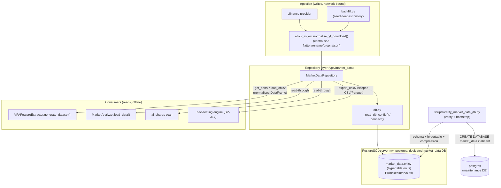
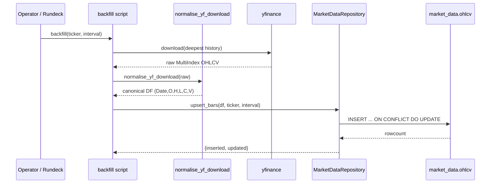
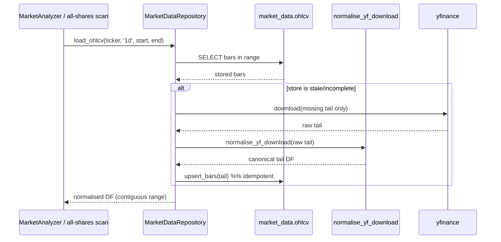
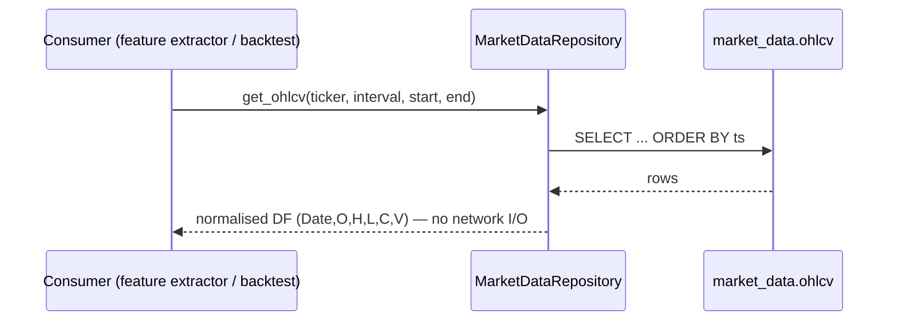
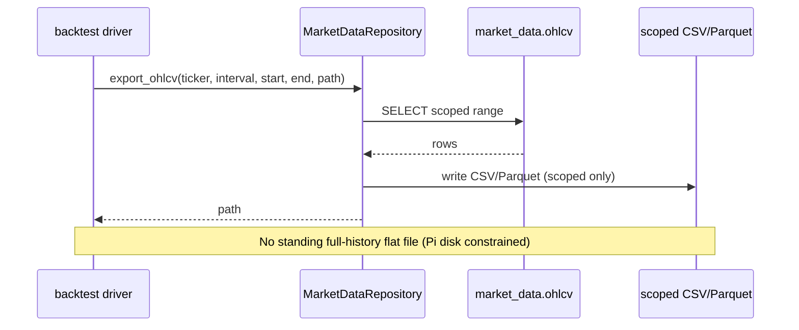

# Design Document: Market Data Store (SP-349)

## Overview

SP-349 implements a persistent market-data store so OHLCV data is **captured and
accumulated over time** rather than re-fetched from yfinance on every run. yfinance
becomes an ingestion source *behind* the store rather than the runtime dependency of
the VPA scan/feature/backtest paths. This yields a proprietary dataset that grows
deeper than the provider lookback window and lets backtesting and ML feature
generation run fully offline.

This is the **BUILD** following the SP-324 storage-strategy spike. The technology and
schema are already decided and are **not** re-litigated here:

- **System of record:** the PostgreSQL server on the always-on Raspberry Pi (the
  `my_postgres` Docker container on `my_trading_network`). This container **will be
  rebuilt fresh on a `timescale/timescaledb` (arm64) image** as part of this work —
  confirmed with the operator, whose Betfair data on that server is disposable. Live
  diagnostics verified the container currently runs vanilla `postgres:16.1` with **no
  TimescaleDB available**, so the rebuild is a prerequisite (see the Infrastructure
  Migration section).
- **Isolation:** a **dedicated `market_data` database** on that server (NOT the
  Betfair `bf_trader` database), with its own `market_data` schema inside it. Trading
  owns this database end-to-end — clean ownership, independent backup/lifecycle.
- **Time-series:** **TimescaleDB is enabled as part of this build** — `ohlcv` is a
  hypertable on `ts` with native compression on older chunks. Enabling it now (while
  provisioning fresh, on the rebuilt TimescaleDB-capable image) is the cheapest moment
  per SP-324.
- **Access:** a thin repository layer.

The design deliberately mirrors the Betfair project (`bf_trader_py`) connection and
verify/bootstrap conventions so the two projects behave identically against the shared
Postgres instance.

### Grounding in the existing codebase

The design is grounded in these real files (all under `d:\projects\trading` unless noted):

- `vpa/ml_validation/feature_extractor.py` — `VPAFeatureExtractor.generate_dataset(days)`
  calls `yf.download(...)`, then MultiIndex-flattens, case-insensitively renames to
  `Date, Open, High, Low, Close, Volume`, `dropna`, `sort_values("Date")`, and enforces
  a **2000-row minimum** raising `InsufficientDataError`.
- `vpa/app_runner.py` — `MarketAnalyzer.load_data()` calls `yf.download(...)` over a
  window from `_get_data_days()`, `reset_index()`, then sets
  `self.myDF.columns = ["Date","Close","High","Low","Open","Volume"]` and sorts by Date.
- `vpa/app_all_shares.py` — the all-shares scan builds a `MarketAnalyzer` per SP500
  ticker (~500 `yf.download` calls per run).
- `vpa/backtesting/` — the SP-317 engine is pure/offline and reads a local feature CSV
  (`ml_validation_output/{ticker}/{ticker}_vpa_features.csv`); it never touches the
  network.
- `utils/utils.py` — contains `trading_days_between(start_date, end_date)` (pandas
  business-day count) and `get_live_data_from_yfinance(...)` which flattens the
  MultiIndex via `columns.get_level_values(0)` and renames to
  `["Date","Close","High","Low","Open","Volume"]`. This is the **duplicated
  normalisation** we centralise.
- `bf_trader_py/scripts/verify_db.py` — the pattern to mirror: `_read_db_config` from
  `.env`, `psycopg2.connect(..., connect_timeout=10)`, `CREATE SCHEMA/TABLE IF NOT
  EXISTS`, structured result dict, non-zero exit code on failure.
- `bf_trader_py/.env.example` — the DB keys to mirror (`DB_HOST=my_postgres`,
  `DB_PORT=5432`, `DB_USER=postgres`, `DB_PWD=...`); trading mirrors these but points
  `DB_NAME` at its own dedicated `market_data` database rather than `bf_trader`.

> **Note on `trading_days_between`:** the referenced helper lives in the top-level
> `utils/utils.py` (importable as `from utils.utils import trading_days_between`), not
> `vpa/utils`. The design references the real location.

---

# Part 1 — High-Level Design

## Architecture



**Key architectural idea:** all four consumers stop calling `yf.download` directly.
They call the repository, which returns the already-normalised
`Date, Open, High, Low, Close, Volume` DataFrame they each already expect. The only
component that talks to yfinance is the centralised ingestion function, invoked by the
read-through loader (to fetch the missing tail) and by backfill.

## Components and Interfaces

| Component | Module (proposed) | Responsibility |
|---|---|---|
| DB config/connection helper | `vpa/market_data/db.py` | `_read_db_config()` reads `DB_*` from `.env` (`DB_NAME` = dedicated `market_data` DB); `connect()` opens `psycopg2` with `connect_timeout=10`. Mirrors Betfair's connection style, differing only in `DB_NAME`. |
| Verify/bootstrap script | `scripts/verify_market_data_db.py` | Idempotently ensures the dedicated `market_data` **database** exists (create via a maintenance-DB connection if absent), then the `market_data` schema + `ohlcv` table + index + **TimescaleDB extension + hypertable + compression policy** exist; returns structured result; exits non-zero on failure. Extends the `verify_db.py` pattern. |
| Ingestion/normalisation | `vpa/market_data/ohlcv_ingest.py` | `normalise_yf_download()` — the single canonical flatten/rename/dropna/sort → canonical DataFrame + `ts` UTC bar-open mapping. Replaces the duplicated logic. |
| Repository | `vpa/market_data/repository.py` | `MarketDataRepository` with `upsert_bars`, `get_ohlcv`, `load_ohlcv` (read-through), `export_ohlcv`. |
| Backfill | `scripts/backfill_market_data.py` | Seed deepest available history for a ticker+interval; documented + exercised for SPY. |
| Consumers (migrated) | existing files | Read from repository instead of `yf.download`. |

## Data Models

The schema is **exactly** as confirmed in SP-324 §7 and is not modified:

```sql
CREATE SCHEMA IF NOT EXISTS market_data;

CREATE TABLE IF NOT EXISTS market_data.ohlcv (
    ticker      TEXT        NOT NULL,
    interval    TEXT        NOT NULL,          -- '1d','4h','1h','15m', ...
    ts          TIMESTAMPTZ NOT NULL,          -- bar OPEN time, UTC
    open        DOUBLE PRECISION NOT NULL,
    high        DOUBLE PRECISION NOT NULL,
    low         DOUBLE PRECISION NOT NULL,
    close       DOUBLE PRECISION NOT NULL,
    volume      DOUBLE PRECISION,
    adjusted    BOOLEAN     NOT NULL DEFAULT TRUE,
    source      TEXT        NOT NULL DEFAULT 'yfinance',
    ingested_at TIMESTAMPTZ NOT NULL DEFAULT now(),
    PRIMARY KEY (ticker, interval, ts)
);

CREATE INDEX IF NOT EXISTS ix_ohlcv_ticker_interval_ts
    ON market_data.ohlcv (ticker, interval, ts);
```

**TimescaleDB (enabled in this build).** After the table exists, enable the extension,
convert `ohlcv` to a hypertable partitioned on `ts`, and configure native compression
for older chunks. All steps are idempotent:

```sql
CREATE EXTENSION IF NOT EXISTS timescaledb;

-- Make ohlcv a hypertable partitioned on the bar-open timestamp.
SELECT create_hypertable('market_data.ohlcv', 'ts', if_not_exists => TRUE);

-- Native columnar compression for older chunks (segment by the query keys).
ALTER TABLE market_data.ohlcv SET (
    timescaledb.compress,
    timescaledb.compress_segmentby = 'ticker, interval'
);

-- Compress chunks older than 30 days (idempotent; policy is added once).
SELECT add_compression_policy('market_data.ohlcv', INTERVAL '30 days');
```

> **PK / hypertable compatibility.** Timescale requires the partitioning column `ts`
> to be part of any unique index or primary key. The SP-324 §7 PK is
> `(ticker, interval, ts)` — it already includes `ts`, so the hypertable conversion is
> compatible with **no change** to the column definitions. The exact SP-324 §7 columns
> are preserved as-is.

**Validation / conventions:**
- `ts` is the bar **open** time in **UTC**. Daily bars use midnight UTC of the trading
  day. Intraday intervals (later) use the bar-open instant.
- The PK `(ticker, interval, ts)` is the sole dedup mechanism — one row per bar.
- `interval` is a free-text tag; `'1d'` now, `'15m' | '1h' | '4h'` slot in later with
  **no structural change**.
- `adjusted=TRUE` today (auto_adjust). A raw series is added later as
  `adjusted=FALSE` rows rather than mutating existing rows.
- The store's canonical read shape is `Date, Open, High, Low, Close, Volume` — the
  exact columns every consumer already expects (with `Date` derived from `ts`).

## Sequence Flows

### Flow A — Backfill (seed history)



### Flow B — Incremental capture (read-through persists the tail)



### Flow C — Offline read (no network)



### Flow D — Scoped export for offline backtesting



---

# Part 2 — Low-Level Design

## Module Layout

```
vpa/market_data/
    __init__.py
    db.py                # _read_db_config(), connect()  (mirrors Betfair)
    ohlcv_ingest.py      # normalise_yf_download(), fetch_yf()  (centralised)
    repository.py        # MarketDataRepository
scripts/
    verify_market_data_db.py   # verify + bootstrap (mirrors verify_db.py)
    backfill_market_data.py    # seed deepest history; exercised for SPY
```

`market_data` is a Python package under `vpa/` so imports read
`from vpa.market_data.repository import MarketDataRepository`. Language is **Python**
throughout (the entire trading codebase is Python; psycopg2/pandas already the stack).

## 1. DB config/connection helper (`vpa/market_data/db.py`)

Mirrors `bf_trader_py/scripts/verify_db.py` `_read_db_config` and the `psycopg2.connect`
call with `connect_timeout=10`.

```python
REQUIRED_DB_KEYS = ["DB_HOST", "DB_PORT", "DB_NAME", "DB_USER", "DB_PWD"]
CONNECT_TIMEOUT_S = 10

def _read_db_config(env_path: str | None = None) -> dict:
    """Read DB_* keys from .env. Missing/empty -> "" (so validation can report all)."""

def validate_env(config: dict, required_keys: list[str]) -> list[str]:
    """Return the list of required keys that are missing/empty."""

def connect(config: dict | None = None):
    """Open a psycopg2 connection with connect_timeout=10.

    psycopg2.connect(host=..., port=..., dbname=..., user=..., password=...,
                     connect_timeout=CONNECT_TIMEOUT_S)
    DB_HOST defaults to container name 'my_postgres'; on Windows dev a hosts-file
    entry maps my_postgres -> 127.0.0.1 (same as Betfair). DB_NAME points at the
    dedicated 'market_data' database (NOT 'bf_trader').
    """

def connect_maintenance(config: dict | None = None):
    """Open a connection to a maintenance database (e.g. 'postgres') on the same
    server, used only by bootstrap to check for / create the dedicated market_data
    database. CREATE DATABASE cannot run inside a transaction, so this connection is
    used in autocommit mode.
    """
```

**Formal spec — `connect`:**
- Preconditions: `validate_env` returns `[]` for the config.
- Postconditions: returns an open connection, or raises within `CONNECT_TIMEOUT_S`
  seconds if unreachable. No schema side effects.

## 2. Verify/bootstrap (`scripts/verify_market_data_db.py`)

Trading equivalent of `verify_db.py`; idempotent; structured result + exit code. It
also handles that the dedicated `market_data` database itself may need creating, and
that TimescaleDB objects must be set up on first provisioning.

```python
TARGET_DB = "market_data"          # dedicated database name (from DB_NAME)
MAINTENANCE_DB = "postgres"        # used only to CREATE DATABASE if absent
MARKET_DATA_SCHEMA = "market_data"

# Step 1 runs on the maintenance connection (autocommit — CREATE DATABASE cannot run
# inside a transaction and cannot use IF NOT EXISTS directly):
#   SELECT 1 FROM pg_database WHERE datname = %s;      -- (TARGET_DB)
#   -- if absent:
#   CREATE DATABASE market_data;

# Step 2 runs on a fresh connection to the dedicated market_data database:
DDL = """
CREATE SCHEMA IF NOT EXISTS market_data;
CREATE TABLE IF NOT EXISTS market_data.ohlcv ( ... );   -- exact SP-324 §7 DDL
CREATE INDEX IF NOT EXISTS ix_ohlcv_ticker_interval_ts
    ON market_data.ohlcv (ticker, interval, ts);

CREATE EXTENSION IF NOT EXISTS timescaledb;
SELECT create_hypertable('market_data.ohlcv', 'ts', if_not_exists => TRUE);
ALTER TABLE market_data.ohlcv SET (
    timescaledb.compress,
    timescaledb.compress_segmentby = 'ticker, interval'
);
SELECT add_compression_policy('market_data.ohlcv', INTERVAL '30 days');
"""

def verify_market_data_db(env_path: str | None = None) -> dict:
    """Returns:
        {
          "reachable": bool,
          "missing_config": list[str],
          "db_ready": bool,         # dedicated market_data database exists after run
          "schema_ready": bool,     # schema + table + index + hypertable present
          "created": list[str],     # subset of ["database","schema","table","index",
                                    #            "extension","hypertable",
                                    #            "compression_policy"]
          "error": str | None,
        }
    """

def main() -> int:
    """Print result; exit 2 if missing_config, 1 if unreachable, 0 on success."""
```

**Bootstrap sequence:**

```pascal
FUNCTION verify_market_data_db(env_path):
    config <- _read_db_config(env_path)
    missing <- validate_env(config, REQUIRED_DB_KEYS)
    IF missing NOT EMPTY THEN RETURN { reachable:false, missing_config:missing, ... }

    // Step 1: ensure the dedicated database exists (maintenance connection, autocommit)
    mconn <- connect_maintenance(config)          // dbname = MAINTENANCE_DB
    IF NOT EXISTS (SELECT 1 FROM pg_database WHERE datname = TARGET_DB) THEN
        EXECUTE "CREATE DATABASE market_data"      // cannot be inside a transaction
        created += "database"
    END IF
    close mconn

    // Step 2: create schema/extension/table/index/hypertable in the dedicated DB
    conn <- connect(config)                        // dbname = market_data
    EXECUTE DDL   // all IF NOT EXISTS / if_not_exists => idempotent
    conn.commit()
    RETURN { reachable:true, db_ready:true, schema_ready:true, created, error:null }
```

**Formal spec — `verify_market_data_db`:**
- Preconditions: `.env` present (else `missing_config == REQUIRED_DB_KEYS`, no connect).
- Postconditions: if `reachable`, then afterward:
  - the dedicated `market_data` **database** exists (created via the maintenance
    connection only if absent; `CREATE DATABASE` run in autocommit, never inside a
    transaction, never with `IF NOT EXISTS`);
  - `market_data` schema, `market_data.ohlcv`, and the index exist (created only if
    absent — `IF NOT EXISTS` throughout);
  - the `timescaledb` extension is present, `ohlcv` is a hypertable on `ts`, and the
    compression settings + compression policy are configured.
- Idempotent: a second run creates nothing (`created == []`), adds no duplicate
  compression policy, and leaves data unchanged.

## 3. Centralised ingestion/normalisation (`vpa/market_data/ohlcv_ingest.py`)

Single source of truth for the flatten/rename/dropna/sort that is currently duplicated
across `utils.get_live_data_from_yfinance`, `MarketAnalyzer.load_data`, and
`VPAFeatureExtractor.generate_dataset`.

```python
CANONICAL_COLUMNS = ["Date", "Open", "High", "Low", "Close", "Volume"]

def normalise_yf_download(raw: pd.DataFrame) -> pd.DataFrame:
    """Flatten MultiIndex -> case-insensitive rename -> dropna(OHLCV) -> sort by Date.
    Returns a DataFrame with exactly CANONICAL_COLUMNS. Pure (no network)."""

def fetch_yf(ticker: str, interval: str, start, end) -> pd.DataFrame:
    """Thin yf.download wrapper (auto_adjust=True, progress=False) -> normalise_yf_download."""

def to_store_rows(df: pd.DataFrame, ticker, interval, source, adjusted) -> list[tuple]:
    """Map canonical DF rows to (ticker, interval, ts_utc, open, high, low, close,
    volume, adjusted, source). Date -> ts as UTC bar-open (daily = midnight UTC)."""
```

**Normalisation pseudocode** (consolidates the two existing variants):

```pascal
FUNCTION normalise_yf_download(raw):
    df <- raw.reset_index()
    IF df.columns IS MultiIndex THEN
        df.columns <- df.columns.get_level_values(0)   // flatten (matches utils.py)
    END IF
    // case-insensitive map to canonical names
    col_map <- { lower(c): c FOR c IN df.columns }
    FOR rc IN CANONICAL_COLUMNS DO
        IF rc NOT IN df.columns AND lower(rc) IN col_map THEN
            rename col_map[lower(rc)] -> rc
        END IF
    END FOR
    df <- df.dropna(subset = [Open, High, Low, Close, Volume])
    df <- df.sort_values("Date").reset_index(drop=True)
    RETURN df[CANONICAL_COLUMNS]
```

## 4. Repository (`vpa/market_data/repository.py`)

```python
class MarketDataRepository:
    def __init__(self, conn_factory=connect): ...

    def upsert_bars(self, df: pd.DataFrame, ticker: str, interval: str,
                    source: str = "yfinance", adjusted: bool = True) -> dict:
        """Idempotent ON CONFLICT upsert. Returns {'inserted': n, 'updated': m}."""

    def get_ohlcv(self, ticker: str, interval: str, start, end) -> pd.DataFrame:
        """Offline read. Returns canonical Date,O,H,L,C,V DF ordered by Date. No network."""

    def load_ohlcv(self, ticker: str, interval: str, start, end) -> pd.DataFrame:
        """Read-through: return from store; fetch+persist only the missing tail from
        yfinance when the store is stale/incomplete. Returns canonical DF."""

    def export_ohlcv(self, ticker: str, interval: str, start, end,
                     path: str, fmt: str = "csv") -> str:
        """Scoped export to CSV/Parquet for offline backtesting/ML. Returns path.
        NOT a standing full-history copy (Pi disk constraint)."""
```

## Key SQL

```sql
-- upsert_bars (idempotent; PK prevents duplicate bars; re-running a day is safe)
INSERT INTO market_data.ohlcv
    (ticker, interval, ts, open, high, low, close, volume, adjusted, source, ingested_at)
VALUES (%s, %s, %s, %s, %s, %s, %s, %s, %s, %s, now())
ON CONFLICT (ticker, interval, ts) DO UPDATE SET
    open=EXCLUDED.open, high=EXCLUDED.high, low=EXCLUDED.low,
    close=EXCLUDED.close, volume=EXCLUDED.volume,
    adjusted=EXCLUDED.adjusted, source=EXCLUDED.source, ingested_at=now();

-- get_ohlcv (offline read)
SELECT ts, open, high, low, close, volume
FROM market_data.ohlcv
WHERE ticker=%s AND interval=%s AND ts >= %s AND ts <= %s
ORDER BY ts;
```

## Algorithmic Pseudocode

### upsert_bars (idempotency)

```pascal
FUNCTION upsert_bars(df, ticker, interval, source, adjusted):
    ASSERT df has columns [Date, Open, High, Low, Close, Volume]
    rows <- to_store_rows(df, ticker, interval, source, adjusted)   // Date -> ts UTC bar-open
    conn <- connect()
    inserted <- 0 ; updated <- 0
    FOR each row IN rows DO
        result <- execute UPSERT_SQL(row)      // xmax=0 => insert, else update
        IF result.was_insert THEN inserted += 1 ELSE updated += 1
    END FOR
    conn.commit()
    RETURN { inserted, updated }
```
- Postcondition: for any bar `(ticker, interval, ts)` present in `df`, exactly one row
  exists in the store afterward (PK invariant). Running twice changes no row count.

### load_ohlcv (read-through, fetch only the missing tail)

```pascal
FUNCTION load_ohlcv(ticker, interval, start, end):
    stored <- get_ohlcv(ticker, interval, start, end)   // offline first
    expected_last <- last expected bar-open on/before end (per interval calendar)
    have_last <- max(stored.Date) IF stored non-empty ELSE NULL

    IF have_last IS NULL OR have_last < expected_last THEN
        tail_start <- (have_last + 1 bar) IF have_last ELSE start
        raw <- fetch_yf(ticker, interval, tail_start, end)   // ONLY the missing tail
        tail <- normalise_yf_download(raw)
        // do not persist a partial in-progress final bar (intraday-relevant; daily trivial)
        tail <- drop_incomplete_final_bar(tail, interval)
        upsert_bars(tail, ticker, interval)                  // idempotent
        stored <- get_ohlcv(ticker, interval, start, end)    // re-read merged view
    END IF
    RETURN stored
```
- For daily gap detection, reuse `utils.utils.trading_days_between(start, end)` to know
  how many trading-day bars *should* exist in a range. Intraday needs session-aware
  calendars later (out of scope now).

### backfill (seed deepest history)

```pascal
FUNCTION backfill(ticker, interval):
    raw <- yf.download(ticker, period="max", auto_adjust=True, progress=False)
    df  <- normalise_yf_download(raw)
    result <- upsert_bars(df, ticker, interval)   // idempotent; safe to re-run
    RETURN result
```
Run (documented): `python scripts/backfill_market_data.py --ticker SPY --interval 1d`.
Exercised for at least SPY as acceptance evidence.

## Example Usage

```python
# Offline read (backtest / feature generation) — no network
repo = MarketDataRepository()
df = repo.get_ohlcv("SPY", "1d", "2015-01-01", "2024-12-31")

# Read-through during a scan — persists the freshly-fetched tail idempotently
df = repo.load_ohlcv("SPY", "1d", start, end)

# Scoped export for an offline backtest run (no standing full-history file)
path = repo.export_ohlcv("SPY", "1d", "2020-01-01", "2024-12-31",
                         "ml_validation_output/SPY/SPY_ohlcv.parquet", fmt="parquet")
```

## Consumer Migration

| File | Current | After migration |
|---|---|---|
| `vpa/ml_validation/feature_extractor.py` | `yf.download` + inline flatten/rename/dropna/sort | `df = repo.load_ohlcv(ticker, "1d", start, end)`; keep the 2000-row / `InsufficientDataError` check unchanged. Returned columns are the same `Date,Open,High,Low,Close,Volume`. |
| `vpa/app_runner.py` `MarketAnalyzer.load_data()` | `yf.download` then `columns=["Date","Close","High","Low","Open","Volume"]` | `self.myDF = repo.load_ohlcv(ticker, "1d", start, end)` (read-through fetches+persists only missing tail). Column set preserved for downstream ordering. |
| `vpa/app_all_shares.py` scan | ~500 `yf.download`/run | Per-ticker `repo.load_ohlcv(...)`; once history is warm, most network load disappears and each day's bars persist idempotently. |
| `vpa/backtesting/` | reads local feature CSV, offline | Add on-demand `export_ohlcv(...)` so ML/feature generation and backtests run fully offline without a standing full-history flat file. |
| `utils/utils.py` `get_live_data_from_yfinance` | duplicated normalisation | Delegate to `ohlcv_ingest.normalise_yf_download` (single source of truth). |

## Design Decisions (surfaced explicitly)

1. **Dedicated `market_data` database (CONFIRMED).** Trading points `DB_NAME` at a
   **separate `market_data` database** on the shared `my_postgres` server, NOT at
   Betfair's `bf_trader` database. Inside that database it keeps its own `market_data`
   schema (the table stays `market_data.ohlcv`). Rationale: trading is a separate app
   with its own ownership — a dedicated database gives clean ownership boundaries and
   an independent backup/lifecycle, decoupled from Betfair. Connection still mirrors
   Betfair (`DB_HOST=my_postgres`, `DB_PORT`, `DB_USER`, `DB_PWD` from `.env`); only
   `DB_NAME` differs. The bootstrap script creates the database if it does not already
   exist.
2. **`ts` stored as bar-open time in UTC.** Do not persist a partial in-progress final
   bar (matters for intraday later; daily is trivial since the day closes before the
   next scheduled run).
3. **`adjusted=TRUE` today** (auto_adjust). A raw series is added later as
   `adjusted=FALSE` rows, never by mutating existing rows.
4. **TimescaleDB ENABLED as part of this build (CONFIRMED).** `ohlcv` is created as a
   hypertable on `ts` with native compression on older chunks. Rationale: we are
   provisioning the dedicated database fresh, and per SP-324 §5.1/§7 provisioning time
   is the cheapest moment to enable the extension — enabling now avoids a later
   migration after the table has grown. It directly addresses the Pi's disk constraint
   (columnar compression) and the intraday row-volume climb ahead of SP-342. Separate
   future note: **4h is derived** (resample from 1h) later — out of scope now, but the
   schema is already interval-ready.
5. **Offline backtesting via scoped export**, not a standing flat-file copy (Pi disk
   constraint).

## Error Handling

| Scenario | Response | Recovery |
|---|---|---|
| DB server unreachable within 10s | verify/connect returns `reachable=False` + error; exit 1 | Rundeck job fails loudly; capture not stood up |
| Missing `.env` DB keys | `missing_config` populated; exit 2; no connect attempted | Operator adds keys |
| Dedicated `market_data` database absent | bootstrap detects via `pg_database`, runs `CREATE DATABASE` on the maintenance connection (autocommit), then continues | Inherent; first-run provisioning |
| TimescaleDB extension not available in the server image | `CREATE EXTENSION` fails; verify returns error; exit 1 | Rebuild `my_postgres` on the `timescale/timescaledb` image per the Infrastructure Migration section, then re-run bootstrap |
| yfinance returns empty tail | read-through returns stored data unchanged; log warning | Next scheduled run retries |
| Duplicate bar re-ingested | `ON CONFLICT DO UPDATE` — one row, updated `ingested_at` | Inherent; no action |

## Testing Strategy

- **Unit:** `normalise_yf_download` (MultiIndex + flat inputs, case-insensitive rename,
  dropna, sort); `validate_env`; `to_store_rows` UTC mapping.
- **Idempotency/append integration:** upsert the same bars twice → identical row set,
  no duplicates. Offline `get_ohlcv` performs no network call (assert via a patched
  `yf.download` that raises if invoked).
- **Bootstrap idempotency (incl. Timescale):** running `verify_market_data_db` twice
  is a no-op on the second run — the database, schema, table, index, extension,
  hypertable and compression policy already exist, `created == []`, and no duplicate
  compression policy is added.
- **Property-based (hypothesis, already a dependency):** see Correctness Properties.
- **Backfill acceptance:** exercise backfill for SPY and read it back offline.

## Cross-Platform / Deployment

- Runs on ARM Linux (Pi capture host) and Windows x64 (dev). Pure-logic functions
  (`normalise_yf_download`, `validate_env`, `to_store_rows`) are platform-agnostic.
- `DB_HOST=my_postgres` resolves via Docker DNS on the Pi; on Windows dev a hosts-file
  entry maps `my_postgres → 127.0.0.1` (same convention as Betfair).
- **Add `psycopg2` to `requirements.txt`** (currently absent — prefer
  `psycopg2-binary` pinned, matching Betfair's usage).
- Deployment follows the trading project's build/deploy path; the Postgres server
  container already exists. The dedicated `market_data` database is created on first
  run by the bootstrap script. Daily incremental capture is scheduled via **Rundeck**
  jobs invoking shell scripts on the Pi.
- **TimescaleDB is a Pi deployment prerequisite.** The `my_postgres` server image must
  provide the `timescaledb` extension. On the Pi (ARM64) this means using an
  arm64-capable image — the official `timescale/timescaledb` image supports arm64.
  Live diagnostics confirmed the current `my_postgres` image is vanilla Postgres, so
  the container is rebuilt on the Timescale image before this build can bootstrap — see
  the Infrastructure Migration section below.

## Infrastructure Migration (my_postgres → TimescaleDB image)

This build depends on a one-off, **destructive** rebuild of the shared `my_postgres`
container onto a TimescaleDB-capable image. It is a **deployment/task step, performed
at execution time — not during design**, and requires **explicit operator go-ahead**
because it drops the shared server's databases.

### Current confirmed state (from live SSH diagnostics)

Stated as verified facts, not assumptions:

- `my_postgres` runs the **vanilla image `postgres:16.1`** (Debian, aarch64). It does
  **not** include TimescaleDB: `pg_available_extensions` returns **zero rows** for
  `timescaledb`, so `CREATE EXTENSION timescaledb` would **fail today**.
- Databases present on the server: `postgres` (maintenance) and `bf_trader`.
- A `my_pgadmin` (`dpage/pgadmin4`) container runs alongside `my_postgres` on
  `my_trading_network`.
- The Betfair `bf_trader_py/docker-compose.yml` defines **only** the `bf_capture`
  service and attaches `my_trading_network` as an **external** network. It does **not**
  define the `my_postgres` service — so `my_postgres` is provisioned **outside** this
  compose file, from a separate/standalone definition.
- **`my_postgres` definition location — RESOLVED.** `my_postgres` is defined in
  `bf_trader_py/build/postgres_build.sh`. That script does
  `docker rm -f my_postgres my_pgadmin`, then
  `docker run --name my_postgres --network my_trading_network --ip 172.19.0.3
  --restart unless-stopped -e POSTGRES_PASSWORD=... -p 5432:5432 -d postgres:16.1`,
  waits for readiness, copies `sql/create_database.sql` into the container and runs it
  against the `postgres` database, then runs `my_pgadmin` (`dpage/pgadmin4`) at
  `--ip 172.19.0.4 -p 80:80`. Live `docker inspect` confirmed the running container
  matches this script exactly (image `postgres:16.1`, network `my_trading_network`, IP
  `172.19.0.3`, restart `unless-stopped`) — **no container-config drift**. The image
  swap is therefore a **one-line change** in `postgres_build.sh`
  (`postgres:16.1` → a `timescale/timescaledb` arm64 tag compatible with PG16).

### ⚠ Rebuild prerequisite / blocker — CONFIRMED Betfair schema drift

The rebuild step below is **BLOCKED** until a Betfair schema-drift reconciliation is
done first, otherwise the rebuild will silently drop two live tables:

- The live `bf` schema on the Pi contains **six** tables, but Betfair's
  `build/sql/create_database.sql` and `scripts/verify_db.py` (`REQUIRED_TABLES`) only
  define **four**. The two undocumented tables that exist live but are **missing from
  both scripts** are `bf.quality_run` and `bf.quality_match_result`.
- Because `postgres_build.sh` rebuilds the container and only runs
  `create_database.sql`, and `verify_db.py` only knows the four tables, a rebuild would
  **NOT recreate these two tables** — losing their definitions. This must be reconciled
  **BEFORE** the destructive rebuild.
- Exact live DDL captured via `pg_dump` (recorded here so it is not lost):

  ```sql
  CREATE TABLE bf.quality_match_result (
      run_id uuid NOT NULL,
      target_id text,
      market_id text,
      present_outcome text,
      coverage_outcome text,
      consistency_outcome text,
      useful_outcome text,
      overall_outcome text,
      evidence jsonb
  );
  ALTER TABLE bf.quality_match_result OWNER TO postgres;

  CREATE TABLE bf.quality_run (
      run_id uuid NOT NULL,
      run_started timestamp with time zone,
      run_finished timestamp with time zone,
      look_back_start timestamp with time zone,
      look_back_end timestamp with time zone,
      matches_verified integer,
      matches_passed integer,
      matches_failed integer,
      overall_alert boolean,
      status text,
      notes text
  );
  ALTER TABLE bf.quality_run OWNER TO postgres;
  ```

- **Ownership of the fix:** the drift resolution is a **Betfair-project concern** and
  will be handled by a **separate follow-up ticket** (the operator will create it right
  after SP-349). That follow-up must: add these two tables to `create_database.sql`,
  add them to `verify_db.py`'s `REQUIRED_TABLES` + `TABLE_DDL`, and (for the Timescale
  rebuild) switch the image in `postgres_build.sh`. **SP-349's own rebuild step is
  BLOCKED on that reconciliation being done first**, so the rebuild does not silently
  drop the `quality_*` tables.

### Rebuild plan

1. **Edit the image in `postgres_build.sh`.** The `my_postgres` definition is
   `bf_trader_py/build/postgres_build.sh` (location RESOLVED — see above). Change the
   `docker run` image `postgres:16.1` → `timescale/timescaledb:<pg16-compatible-tag>`
   (arm64). This is a one-line change; there is no separate standalone compose file to
   hunt for.
2. **Reconcile the Betfair schema drift FIRST (blocker).** The `bf.quality_run` and
   `bf.quality_match_result` tables must be added to `create_database.sql` and
   `verify_db.py` (separate Betfair follow-up ticket) before the destructive rebuild,
   so they are recreated rather than lost.
3. **Recreate the container.** This **DROPS the `bf_trader` database** — acceptable per
   the operator (Betfair data is disposable).
4. **Preserve/recreate** the `my_trading_network` external network and the `my_pgadmin`
   container so the rest of the stack is unchanged (both are already re-created by
   `postgres_build.sh`).

### Post-rebuild schema restoration (BOTH projects)

- **Betfair:** run its existing `scripts/verify_db.py` to recreate the `bf` schema and
  its capture tables from `build/sql/create_database.sql`. This restoration **must
  include the reconciled `quality_*` tables** (`bf.quality_run` and
  `bf.quality_match_result`) — i.e. `create_database.sql` and `verify_db.py` must
  already carry all six tables (the original four plus the two reconciled ones) via the
  separate Betfair follow-up ticket, otherwise the two `quality_*` tables are lost on
  rebuild.
- **Trading:** run the new `scripts/verify_market_data_db.py` to create the dedicated
  `market_data` database + `market_data` schema + `ohlcv` hypertable + compression.

### Verification

- `CREATE EXTENSION timescaledb` succeeds.
- `ohlcv` is a hypertable.
- A smoke SPY backfill + offline read works.
- Betfair capture still connects.

> This is a destructive, shared-resource change. It affects the Betfair project as well
> as trading, so it should be **captured in Jira for traceability**. The Betfair
> schema-drift reconciliation (adding `bf.quality_run` and `bf.quality_match_result` to
> `create_database.sql` + `verify_db.py`, and switching the image in
> `postgres_build.sh`) is a **separate Betfair follow-up ticket** the operator will
> create right after SP-349; SP-349's rebuild step is blocked on it. Keep it light — no
> ticket numbers are invented here.

## Dependencies

- `psycopg2` (NEW — add to `requirements.txt`).
- `pandas`, `yfinance` (already present).
- `hypothesis`, `pytest`, `pytest-cov` (already present) for the test suite.
- Existing PostgreSQL `my_postgres` server container on `my_trading_network`, hosting
  the new dedicated `market_data` database.
- **TimescaleDB via a CONFIRMED planned infra migration.** Live diagnostics verified
  `my_postgres` currently runs a vanilla `postgres:16.1` image with no TimescaleDB, so
  `my_postgres` will be **rebuilt fresh on `timescale/timescaledb` (arm64)** — a
  confirmed, planned migration, not an unresolved risk (Betfair data is disposable per
  the operator). The same migration **re-provisions Betfair's schema** via its existing
  `scripts/verify_db.py`. See the Infrastructure Migration section for the full plan.
  The `my_postgres` container definition location is now **RESOLVED** — it is
  `bf_trader_py/build/postgres_build.sh` (the image swap is a one-line change there;
  `docker inspect` confirmed no container-config drift).
  ⚠ **Prerequisite to resolve before executing the rebuild:** the CONFIRMED Betfair
  schema drift — the live `bf` schema has two tables (`bf.quality_run`,
  `bf.quality_match_result`) that are missing from `create_database.sql` and
  `verify_db.py`. A **separate Betfair follow-up ticket** must add them to those
  scripts (and switch the image in `postgres_build.sh`) first, so the destructive
  rebuild does not silently drop them. SP-349's rebuild step is blocked on this.

## Out of Scope (noted, not built)

- Intraday intervals `'15m' | '1h' | '4h'` (schema-ready; needs SP-342 source +
  session-aware calendars for gap detection).
- Raw (`adjusted=FALSE`) series.

---

## Correctness Properties (for property-based testing)

1. **Idempotency (PK invariant).** For any set of bars `B`,
   `upsert_bars(B); upsert_bars(B)` yields the same stored rows as a single
   `upsert_bars(B)` — identical count, no duplicate `(ticker, interval, ts)`.

   ```
   ∀ B: rows_after(upsert(upsert(∅, B)), B) == rows_after(upsert(∅, B))
        ∧ no_duplicates(ticker, interval, ts)
   ```

2. **Round-trip.** Bars upserted then read via `get_ohlcv` equal the normalised input
   (within float tolerance) for the same ticker/interval/range.

   ```
   ∀ df: get_ohlcv(ticker, interval, min(df.Date), max(df.Date))
         ≈ normalise_yf_download(df)   (OHLCV within ε)
   ```

3. **Offline read.** `get_ohlcv` and `export_ohlcv` never perform network I/O
   (assert a patched `yf.download` is never called).

4. **Read-through completeness.** `load_ohlcv(ticker, interval, start, end)` returns a
   contiguous set of trading-day bars for the requested range — no missing days the
   source could provide — and fetches only the missing tail (no full re-download when
   the store already covers a prefix). Daily contiguity is checked against
   `utils.utils.trading_days_between(start, end)`.

5. **Bootstrap idempotency (incl. Timescale objects).** Running
   `verify_market_data_db` when the store is already provisioned is a no-op: the
   dedicated database, schema, `ohlcv` table, index, `timescaledb` extension,
   hypertable, and compression policy already exist, so nothing new is created and no
   duplicate compression policy is added.

   ```
   ∀ state S where provisioned(S):
       verify(S) == S  ∧  created(verify(S)) == []
       ∧ is_hypertable(market_data.ohlcv, 'ts')
       ∧ count(compression_policy(market_data.ohlcv)) == 1
   ```
