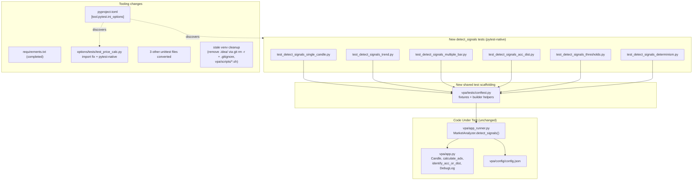

# Design Document

## Overview

This feature (Jira **SP-307**) improves and consolidates the test suite for the trading project. It is a *test-and-tooling* effort, so this design is careful to distinguish two kinds of artifact:

- **Code-under-test (CUT):** existing production modules that are *not* modified by this work — chiefly `MarketAnalyzer.detect_signals()` in `vpa/app_runner.py` and its collaborators in `vpa/app.py` (`Candle`, `calculate_adx`, `identify_acc_or_dist`, `DebugLog`). The `detect_signals` scoring logic must remain byte-for-byte unchanged; the tests exist precisely so it can be refactored *later* without silent drift.
- **Test artifacts and tooling (produced by this work):** new deterministic tests for `detect_signals`, a shared test-construction helper/fixture, a repository-root pytest configuration, the four `unittest.TestCase` files converted to pytest-native style, a completed `requirements.txt`, a coverage command, and cleanup of stale references to the project's former virtual-environment name.

The work breaks into six delivery areas mapped to the thirteen requirements:

1. **Regression tests for `detect_signals()`** across the four signal categories, threshold edge cases, and deterministic construction (Requirements 1–6).
2. **Deterministic analyzer construction under test** — the central technical challenge, since `detect_signals` reads name-mangled private state and `MarketAnalyzer.__init__` performs network loading and opens a log file (Requirement 6).
3. **Fixing the broken import** in `options/tests/test_price_calc.py` and adding **repository-root pytest configuration** (Requirements 7–8).
4. **Standardizing all four `unittest.TestCase` files to pytest-native style** and authoring the new tests pytest-native from the outset (Requirement 11).
5. **Completing *and* minimizing `requirements.txt`** — the manifest work has two complementary halves that together make the manifest both *complete* and *minimal*: it must be **complete** (Requirement 12 — add the missing test/runtime dependencies `pytest`, `hypothesis`, `xgboost`, `pytest-cov`, `coverage`) and **minimal** (Requirement 13 — remove the unused TensorFlow/Keras stack that belongs to the separate MLL project, not the trading project). Goal 4 adds what is missing; Goal 5 removes what is unused; the end state is a manifest that lists exactly the packages the trading project imports directly plus the genuine transitive dependencies of retained packages.
6. **Coverage measurement** for `vpa/app_runner.py` (Requirement 10), plus the guarantee that all existing tests keep passing (Requirement 9).

In addition, a user-directed **stale virtual-environment cleanup** element (no numbered acceptance criterion) is folded into this design: the project recently moved its virtualenv to `.venv` from a differently-named `venv`, and stale references to the old name remain in IDE and script files. These must be cleaned so a fresh `.venv` install works cleanly. The concrete references were located during design research and are enumerated in the Architecture section.

### Research Findings

The following facts were established by reading the code and configuration directly; every design decision below is grounded in them.

**`detect_signals` control flow (CUT — `vpa/app_runner.py`).** The method builds a single result dict with eight keys across four blocks:

- *Single-candle:* appends `"Up Bar"`/`"Down Bar"` (score `+1`/`-1`); for each period in `__deque_dictionary`, if `this_candle.spread_percentiles[period] > 70` appends `"Wide Spread (<period>)"` (`+2.5` up / `-2.5` down) and, nested, if `volume_percentiles[period] > 70` appends `"High Volume (<period>)"` (`+2.5`/`-2.5`); then `shooting_star` → `"Shooting Star"` (`-3`) *elif* `hammer` → `"Hammer"` (`+3`).
- *Trend:* `adx_values = calculate_adx(self.__deque_dictionary["period_three"])`; `trending = adx_values[0] > 25`, `trending_up = adx_values[2] > adx_values[3]`, `trending_down = adx_values[3] > adx_values[2]`. Only when `trending` are `"Market is trending"` plus `"Trending Up"` (`+5`) / `"Trending Down"` (`-5`) appended.
- *Multiple-bar:* per period counts `up_bar_count`, `high_spread_count`, `high_volume_count`, `anomaly_count`; sets `<period>_bull` when `up_bar_count >= Signal_Bar_Count`, `elif <period>_bear` when `up_bar_count <= PERIOD_ONE_LENGTH - Signal_Bar_Count`; sets `<period>_volume_backed` when `high_spread_count >= High_Spread_Count and high_volume_count >= High_Volume_Count and anomaly_count <= Anomaly_Threshold`. Scoring appends `"Bull Signal"`/`"Bear Signal"` (`±2.5`) and, when volume-backed, doubles to `±5.0` and appends `"Volume Backed (<period>)"`.
- *Acc/Dist:* `identify_acc_or_dist(period_three, period_one)` → `(bool, "Acc"|"Dist")`; appends `"Possible Acc"` (`+10`) / `"Possible Dist"` (`-10`); if `spread_percentiles["period_one"] > 65 or is_candle_pattern()` then `"Test Pass"` (`±5`) when `volume_percentiles["period_one"] < 50` else `"Test Fail"` (`-2` for Acc / `+2` for Dist); independently, if `spread_percentiles["period_two"] < 40 and volume_percentiles["period_two"] > 60` appends `"Climax"` (`±10`).

**Name mangling (critical constraint).** `detect_signals` reads private attributes set in `__init__`: `self.__deque_dictionary`, `self.__percentiles_store`, `self.__config`, and `self.__logger`. From outside the class these are accessible only via the mangled names `analyzer._MarketAnalyzer__deque_dictionary`, `_MarketAnalyzer__config`, `_MarketAnalyzer__logger`, and `_MarketAnalyzer__percentiles_store`. `detect_signals` itself reads `__deque_dictionary`, `__config`, and `__logger`; it does not read `__percentiles_store` (that is only used by `update_percentiles`). Tests therefore populate the deques and set the per-candle `spread_percentiles`/`volume_percentiles` dictionaries directly, rather than driving `update_percentiles`.

**`Candle` (CUT — `vpa/app.py`).** Constructed `Candle(time, volume, open, high, low, close)`. `up_bar = close > open`. `spread = abs(close - open)`. Wicks: `upper_wick = high - close`, `lower_wick = close - low`. Pattern flags computed in `__init__`: shooting-star when `upper_wick > 2*spread and upper_wick > 2*lower_wick`; hammer when `lower_wick > 2*spread and lower_wick > 2*upper_wick`; long-legged-doji (LLD) when both wicks `> 2*spread`, and an LLD *clears* shooting-star/hammer. `spread_percentiles` and `volume_percentiles` are settable dict properties; the `volume_percentiles` setter also recomputes an internal `__anomaly` map from `spread_percentiles`, so **spread percentiles must be assigned before volume percentiles** to avoid a `KeyError`. `is_candle_pattern()` returns True if any of shooting_star/hammer/lld.

**`calculate_adx` (CUT).** Raises `ValueError("Not enough data to calculate ADX. At least 15 periods are required.")` when `len(candles) < period + 1` with default `period=14`. Returns `[adx0, mean_tr_smooth, mean_dm_plus_smooth, mean_dm_minus_smooth]`; `detect_signals` uses indices `[0]`, `[2]`, `[3]`.

**`identify_acc_or_dist` (CUT).** Takes `(period_three, period_one)`. Computes period_three volume percentiles `[65, 90]` and price percentiles `[10, 20, 80]`; counts period_one candles with `volume > p3_vol_65`; `near_lows = period_one[-1].close < p3_price_20`, `near_highs = period_one[-1].close > p3_price_80`. Returns `(True, "Acc")` when `high_volume_count >= 3 and near_lows`, `(True, "Dist")` when `high_volume_count >= 3 and near_highs`, else `(False, "")`. It reads only `.volume` and `.close`, so lightweight objects (or `Candle`s) suffice.

**`DebugLog` (CUT — construction side-effect).** `__init__` opens `vpa/log/<file_prefix>_<YYYYMMDD>.txt` in append mode using `os.path.dirname(__file__)` — the log path is fixed to `vpa/log/` regardless of any test-chosen directory. The directory `vpa/log/` exists in the working tree and is git-ignored. `MarketAnalyzer.__init__` always constructs a `DebugLog`. This drives the Requirement 6.5 approach below.

**Config (`vpa/config/config.json`).** `PERIOD_ONE_LENGTH=5`, `PERIOD_TWO_LENGTH=25`, `PERIOD_THREE_LENGTH=50`, `PERCENTILE_START=5`, `PERCENTILE_INCREMENTS=5`. `trading_parameters` per period includes `High_Spread_Threshold=55`, `High_Volume_Threshold=55`, `Anomaly_Threshold=20`, and `Signal_Bar_Count` of `4`/`13`/`26`, `High_Spread_Count` `3`/`6`/`12`, `High_Volume_Count` `3`/`6`/`12`. Note the bear condition uses `PERIOD_ONE_LENGTH` (5) for every period, which the tests must respect exactly as written.

**Existing test suite.** ~20 files are already pytest-native (plain functions, `hypothesis`, bare `assert`) — e.g. `vpa/tests/test_rsi.py`, which also demonstrates the local idioms this design reuses (`make_temp_config`, `make_minimal_df`, `tempfile`). Four files still use `unittest.TestCase`: `vpa/tests/test_alpha.py`, `vpa/tests/test_execution.py`, `options/tests/test_implied_volatility.py`, `options/tests/test_price_calc.py`. `vpa/` has `__init__.py`; `utils/` and `options/tests/` do **not** (they resolve as implicit namespace packages when pytest runs from the repo root — confirmed by `test_implied_volatility.py` already importing `from utils.utils import ...` successfully).

**The broken import.** `options/tests/test_price_calc.py` does `from price_calc import ...`, which only resolves when CWD is inside `options/`. The five names it needs (`calculate_binomial_parameters`, `calculate_volatility`, `get_asset_data`, `price_option`, `process_data`) all live in `utils/utils.py` and are already imported from there by `options/price_calc.py` and by the sibling `test_implied_volatility.py`. Importing from `utils.utils` (not `price_calc`) also avoids executing `options/price_calc.py`'s module-level pricing script at import time, satisfying Requirement 7.4.

**Stale virtualenv references (user-directed cleanup).** A repository search for the former `venv` name outside `.venv/` found:

| File | Stale reference | Correct target |
|---|---|---|
| `.idea/` (entire directory — 11 git-tracked files: `.idea/.gitignore`, `.idea/inspectionProfiles/profiles_settings.xml`, `.idea/misc.xml`, `.idea/modules.xml`, `.idea/runConfigurations/{Alpha___All_Shares,Alpha___SPY,Options_3_2,Options_payoff,Unit_Tests___vpa_alpha}.xml`, `.idea/trading.iml`, `.idea/vcs.xml`) | PyCharm-specific config carrying stale `venv` references (a run-config `SDK_HOME`, an `.iml` `excludeFolder`, a leftover `Black` component), no longer used | remove the whole folder via `git rm -r .idea` (the files are git-tracked, not just on disk) and add `.idea/` to the repo-root `.gitignore` so it does not return, because PyCharm is no longer used |
| `vpa/scripts/start_vpa.sh` | `source /usr/local/trading/venv/bin/activate` | `source /usr/local/trading/.venv/bin/activate` |
| `vpa/scripts/start_vpa_all_shares.sh` | same as above | same as above |
| `vpa/scripts/start_vpa_forex.sh` | same as above | same as above |

`.gitignore` already ignores `.venv` and `vpa/log` correctly but does **not** yet list `.idea/` (so `.idea/` must be added to it as part of the removal); the CI workflow `.github/workflows/ruff.yml` installs Ruff via `pip` on a fresh runner and contains **no** venv reference, so it needs no change. These findings are reflected in the Components section (Area F).

## Architecture

### High-level structure



### The central problem: constructing a `MarketAnalyzer` under test

`detect_signals` is an instance method that reads name-mangled private state, and the constructor has two undesirable side effects for testing: it loads market data (network) and it opens a log file. The design must reach a state where `detect_signals` can run against fully controlled inputs with **zero** network access and **no** stray log artifacts.

Three construction obstacles and the chosen response for each:

1. **Network data load.** `__init__` calls `self.load_data()` unless `fixed_df` is passed. `load_data` calls `yf.download(...)` when `config["use_real_data"]` is true. **Response:** always pass a non-null `fixed_df` and `ticker_symbol=None` (Requirement 6.1). As defence-in-depth (Requirements 6.6, 6.7), the fixture also monkeypatches `vpa.app_runner.yf.download` to raise, so any accidental network path *fails the test* instead of making a request.

2. **Log file on construction.** `DebugLog.__init__` opens `vpa/log/<prefix>_<date>.txt`. The path is hard-coded to `vpa/log/` via `os.path.dirname(__file__)`, so a test-supplied directory cannot redirect it through the public API. **Response (primary):** monkeypatch `DebugLog` at its use site (`vpa.app_runner.DebugLog`) with a lightweight in-memory stand-in (a null logger exposing `.log(msg, level=...)`), so no file is opened at all — the cleanest way to make the tests hermetic and satisfy Requirement 6.5's "direct that log file to a test-controlled directory … and remove … whether the test passes or fails". **Response (fallback, if a real `DebugLog` is ever required):** construct it with a unique `log_prefix` and, in fixture teardown, remove the created file under `vpa/log/`; a `tmp_path`-based redirect is documented as the intent even though the current `DebugLog` ignores directory arguments. The primary approach is preferred because it removes the side effect entirely.

3. **Name-mangled private state.** After construction, `detect_signals` reads `_MarketAnalyzer__deque_dictionary`, `_MarketAnalyzer__config`, and `_MarketAnalyzer__logger`. **Response:** the builder helper populates the three deques (`period_one`, `period_two`, `period_three`) with fully-specified `Candle`s whose `spread_percentiles`/`volume_percentiles` are set directly to known values (spread before volume, per the setter constraint). The config is already loaded from the real `vpa/config/config.json` by the constructor, so thresholds match production; tests do not fabricate config unless a specific threshold scenario requires it.

### Two construction strategies, one helper

The requirements permit *either* a non-null `fixed_df` *or* direct population of the rolling windows (Requirement 6.1). Both are used, chosen per scenario:

- **Direct deque population (primary for most scoring tests).** Bypasses `process_data`/`update_percentiles` entirely, giving exact control over each candle's percentile dictionaries and bar direction. This is how single-candle, multiple-bar, acc/dist, and threshold-edge tests achieve deterministic, boundary-precise inputs.
- **`fixed_df` from `spy_data.csv` (for trend/ADX realism).** The trend tests need candle sequences that produce a specific ADX from `calculate_adx`. A fixed slice of `vpa/data/spy_data.csv` (already used by `test_alpha.py`, which asserts a known ADX vector for the first 50 candles) provides deterministic ADX inputs without hand-computing smoothed DM values. Where a specific `adx_values` relationship is easier to force synthetically, the test constructs candles directly instead.

### Placement of the shared scaffolding

A new **`vpa/tests/conftest.py`** holds the fixtures and the builder helper. `conftest.py` is chosen over a plain helper module because:

- pytest auto-discovers fixtures in `conftest.py` without imports, matching the existing pytest-native convention.
- It is scoped to `vpa/tests/`, where all the new `detect_signals` tests live, and does not affect `options/tests`.
- Monkeypatch-based logger/network neutralization belongs in a fixture, which `conftest.py` is designed to host.

Plain builder *functions* (e.g. `make_candle(...)`, `make_analyzer(...)`, `populate_windows(...)`) are also defined in `conftest.py` and imported by tests via a fixture that returns them, or referenced through a small importable `vpa/tests/_detect_signals_helpers.py` module if any helper must be shared with non-fixture code. The default is: fixtures for setup/teardown, plain functions for data construction.

### Tooling architecture

- **Pytest discovery** is configured once in `pyproject.toml` under `[tool.pytest.ini_options]`, pinning the repo root as rootdir and setting `testpaths` plus `norecursedirs` consistent with the existing Ruff `exclude` list. No competing `pytest.ini`/`setup.cfg` exists, so `pyproject.toml` is authoritative.
- **Dependency manifest** changes are additive edits to `requirements.txt`, preserving the existing `==`/`>=` pinning style.
- **Stale venv cleanup** edits IDE/script files listed in the research table; these are configuration-only and do not affect Python behavior, but they keep a fresh `.venv` install and IDE run consistent.

## Components and Interfaces

The work is organized into six components (Areas A–F). Each lists its produced artifacts, key interfaces, and the requirements it serves.

### Area A — Shared test scaffolding (`vpa/tests/conftest.py`)

This is the foundation every new `detect_signals` test builds on. It provides deterministic construction and side-effect neutralization.

**Builder helpers (plain functions):**

- `make_candle(*, up=True, volume=1000, spread=1.0, upper_wick=0.0, lower_wick=0.0, time="2023-01-03T00:00:00+00:00") -> Candle`
  Constructs a `Candle` with `open`/`high`/`low`/`close` derived so the resulting `up_bar`, `spread`, `upper_wick`, `lower_wick`, and pattern flags are exactly as requested. Because `Candle` computes patterns from wick/spread ratios, the helper solves for OHLC values that yield the intended `shooting_star`/`hammer`/`lld` state (e.g. for a plain up bar: `open < close`, tiny wicks; for a shooting star: `upper_wick > 2*spread` and `> 2*lower_wick`).
- `set_percentiles(candle, *, spread: dict, volume: dict) -> None`
  Assigns `candle.spread_percentiles = spread` **then** `candle.volume_percentiles = volume` (order matters: the volume setter reads spread percentiles to compute the anomaly map). Both dicts key on `"period_one"`/`"period_two"`/`"period_three"`.
- `populate_windows(analyzer, period_one, period_two, period_three) -> None`
  Writes candle lists into `analyzer._MarketAnalyzer__deque_dictionary["period_one"|...]` via the mangled name, respecting each deque's `maxlen`.
- `make_minimal_df(rows=250) -> pandas.DataFrame`
  Reused idiom from `test_rsi.py` for the `fixed_df` path; columns `Date, Close, High, Low, Open, Volume`. A variant `load_spy_slice(n)` reads the first `n` rows of `vpa/data/spy_data.csv` for the trend/ADX tests.

**Fixtures:**

- `no_network(monkeypatch)` — monkeypatches `vpa.app_runner.yf.download` to raise `AssertionError("network access attempted")`. Autouse within the new test modules so any code path reaching a live load fails the test (Requirements 6.6, 6.7).
- `null_logger(monkeypatch)` — monkeypatches `vpa.app_runner.DebugLog` to a stand-in class whose `__init__` opens no file and whose `.log(self, message, level="DEBUG")` is a no-op. Prevents any log file being created (Requirement 6.5). Autouse within the new test modules.
- `analyzer_factory(no_network, null_logger)` — returns a callable `build(*, fixed_df=None, config_path=DEFAULT_CONFIG) -> MarketAnalyzer` that constructs the analyzer with `ticker_symbol=None`. When `fixed_df` is None the caller subsequently uses `populate_windows`; when provided, the DataFrame path is used. `DEFAULT_CONFIG` points at the real `vpa/config/config.json`.
- `populated_analyzer(analyzer_factory)` — convenience fixture returning an analyzer whose three windows are pre-filled with a neutral baseline set of candles that the individual tests then adjust.

**Teardown / cleanup:** because `null_logger` prevents file creation, no filesystem teardown is normally needed. The fixture nonetheless documents and (in the fallback real-logger path) executes removal of any `vpa/log/*` file it created, using a `try/finally` so cleanup runs whether the test passes or fails (Requirement 6.5).

*Requirements served: 6.1, 6.2, 6.4, 6.5, 6.6, 6.7 (and the construction basis for 1–5).*

### Area B — `detect_signals` regression tests (new, pytest-native)

Six test modules under `vpa/tests/`, all authored in pytest-native style from the outset (Requirement 11.10 — no `unittest.TestCase`, no `import unittest`, no `unittest.main()`):

- **`test_detect_signals_single_candle.py`** (Requirement 1): up/down bar (`±1`), wide-spread `>70` (`±2.5`), high-volume nested `>70` (`±2.5`), absence when spread `≤70`, shooting-star (`-3`, no Hammer) and hammer (`+3`, no Shooting Star). Determinism of the single-candle block is folded into Area B via a repeated-call assertion but the general property lives in Area E's determinism test.
- **`test_detect_signals_trend.py`** (Requirement 2): trending up (`+5`), trending down (`-5`), not-trending (empty, `0`), and `ValueError` when `period_three` has fewer than 15 candles. Uses `load_spy_slice` for realistic ADX and/or synthetic candle sequences engineered to make `adx_values[0]`, `[2]`, `[3]` satisfy each branch.
- **`test_detect_signals_multiple_bar.py`** (Requirement 3): bull `≥ Signal_Bar_Count` (`+2.5`), bear `≤ PERIOD_ONE_LENGTH − Signal_Bar_Count` (`-2.5`), volume-backed doubling (`±5.0` + `"Volume Backed"`), neutral band (no signal, `0`), and volume sub-condition failure (undoubled `±2.5`, no `"Volume Backed"`). Inputs set `up_bar` counts and the per-candle spread/volume percentiles so `high_spread_count`, `high_volume_count`, and `anomaly_count` land on the intended side of their thresholds.
- **`test_detect_signals_acc_dist.py`** (Requirement 4): Acc (`+10`) / Dist (`-10`); Test Pass (`±5`) / Test Fail (`-2` Acc / `+2` Dist); Climax (`±10`). The accumulation/distribution condition is forced by controlling period_three volume/close percentiles and `period_one[-1].close` relative to price percentiles, exactly as `identify_acc_or_dist` computes them.
- **`test_detect_signals_thresholds.py`** (Requirement 5): edge triples at/below/above each enumerated boundary (see Area D).
- **`test_detect_signals_determinism.py`** (Requirement 6.3, 1.11): repeated invocation equality (see Area E).

Each test asserts on the exact list membership/absence and the score contribution described by its acceptance criterion, using bare `assert`, `pytest.approx` for the fractional scores (`2.5`, `5.0`), and `pytest.raises(ValueError)` for the ADX-insufficiency case.

*Requirements served: 1, 2, 3, 4 (and 5, 6 via Areas D, E, A).*

### Area C — Import fix and root-level discovery (Requirements 7, 8)

- **`options/tests/test_price_calc.py` import fix:** replace `from price_calc import (...)` with `from utils.utils import calculate_binomial_parameters, calculate_volatility, get_asset_data, price_option, process_data`. This resolves from the repository root, preserves the five functions' behavior (same implementations `options/price_calc.py` already uses), and avoids executing `price_calc.py`'s module-level pricing script (no yfinance at import — Requirement 7.4). The file is also converted to pytest-native under Area E.
- **`pyproject.toml` pytest configuration:** add
  ```toml
  [tool.pytest.ini_options]
  testpaths = ["vpa/tests", "options/tests"]
  norecursedirs = [".venv", "__pycache__", ".git", ".hypothesis", "ml_validation_output", "test_data", ".ruff_cache", ".pytest_cache"]
  ```
  Presence of `[tool.pytest.ini_options]` in `pyproject.toml` makes the repo root the resolved rootdir (Requirement 8.1). `testpaths` ensures discovery is CWD-independent (Requirement 8.2); `norecursedirs` mirrors the Ruff `exclude` list plus cache dirs so non-test directories are skipped (Requirement 8.4). `options/tests` lacking `__init__.py` is fine — pytest's rootdir-based import mode plus implicit namespace packages already resolve `utils.utils`.

*Requirements served: 7.1, 7.2, 7.3, 7.4, 8.1, 8.2, 8.3, 8.4.*

### Area D — Threshold edge-condition tests (Requirement 5)

Concrete triples (One_Step = 1 for the integer percentile/count inputs) for each enumerated boundary:

- **Spread/volume percentile 70 (strict `>`):** assert `"Wide Spread"`/`"High Volume"` **absent** at `70`, **absent** at `69`, **present** at `71` (Req 5.5, and the generic 5.1/5.3/5.4 for a strict boundary).
- **`Signal_Bar_Count` (inclusive `≥` for bull):** assert `"Bull Signal"` **present** when up-bar count equals `Signal_Bar_Count`, **present** at one above, **absent** at one below (Req 5.6, and 5.2 for an inclusive boundary).
- **Acc/Dist test-pass boundaries — `period_one` spread `65` (strict `>`) and `period_one` volume `50` (strict `<`):** with an acc/dist condition fixed, assert the `"Test Pass"`/`"Test Fail"` outcomes each strict comparison produces at, below, and above the boundary (Req 5.7).

These live in `test_detect_signals_thresholds.py` and complement the property-based monotonicity checks (Area E) with explicit boundary examples.

*Requirements served: 5.1, 5.2, 5.3, 5.4, 5.5, 5.6, 5.7.*

### Area E — Pytest-native standardization + property tests (Requirement 11)

**Conversions** (behavior-preserving, per the Assertion_Translation map):

| File | `setUp` → fixture? | Assertions to translate | `suite()`/`__main__` to remove |
|---|---|---|---|
| `vpa/tests/test_alpha.py` | yes (deque dict + `spy_data.csv` load) | `assertEqual`→`==`, `assertTrue`→`assert`, `assertIn`→`in`, `assertIsNotNone`→`is not None`, `assertRaises`→`pytest.raises` | remove `suite()` and `__main__` runner |
| `vpa/tests/test_execution.py` | not needed (no `setUp`) | `assertEqual`→`==` | remove `__main__`/`unittest.main()` |
| `options/tests/test_implied_volatility.py` | not needed | `assertAlmostEqual(a,b,places=2)`→`assert a == pytest.approx(b, abs=1e-2)` | remove `__main__`/`unittest.main()` |
| `options/tests/test_price_calc.py` | yes (constants + `sample_data`) | `assertIsInstance`→`isinstance`, `assertFalse`→`assert not`, `assertIn`→`in`, `assertGreater`→`>`, `assertLess`→`<`, `assertAlmostEqual`→`pytest.approx` | remove `__main__`/`unittest.main()` |

After conversion, zero `test_*.py` modules `import unittest` or call `unittest.main()` (Requirement 11.9). Each converted test preserves its original pass/fail outcome (Requirements 11.2–11.6, 11.11, and Requirement 9).

**Note on `test_alpha.py` behavior preservation:** it currently asserts a specific ADX vector and reads columns including `"Adj Close"` from `spy_data.csv`. The conversion keeps the same data source, same numeric expectations, and same intent — only the assertion syntax and the removal of the `unittest` scaffolding change.

**Property tests** (using `hypothesis`, matching the existing suite convention) live alongside the example tests, tagged per the required format. They validate the four correctness properties below.

*Requirements served: 11.1–11.11.*

### Area F — Dependencies (complete + minimal), coverage, and stale venv cleanup (Requirements 10, 12, 13; plus user-directed cleanup)

The manifest work in this area has two complementary halves that run against the *same* `requirements.txt`: **completion** (Requirement 12 — add what is imported but missing) and **pruning** (Requirement 13 — remove what is listed but unused). Both are governed by the same ultimate safety net: a fresh-`.venv` install followed by a full-suite run from the repository root (Fresh_Install_Verification). The end state is a manifest that is simultaneously *complete* and *minimal* (Requirement 13.8).

**`requirements.txt` completion (Requirement 12):** append, in the existing `==` style, the third-party libraries the suite/production code import but that are absent — explicitly `pytest==9.1.1`, `hypothesis==6.165.10`, `xgboost==3.4.1`, plus `pytest-cov` and `coverage` pinned to the versions installed into `.venv` during this work. Versions must match `.venv` (Requirement 12.3, 12.4). A verification step greps the test suite and `vpa/ml_validation/*` for imports and confirms each third-party import is present in the manifest (Requirement 12.6).

**`requirements.txt` pruning (Requirement 13) — import-driven removal governed by fresh install.** The manifest currently pins a large TensorFlow/Keras stack whose top-level packages (`tensorflow`, `keras`) are imported *nowhere* under `d:\projects\trading` — a repository-wide search confirms they are used only by the separate MLL project (`d:\projects\MLL`). Their exclusive transitive dependencies are therefore leftovers in the trading manifest. The pruning approach is:

1. **Enumerate the removable TensorFlow_Stack packages.** The candidate removal set is the packages that exist in the manifest only as transitive dependencies of `tensorflow`/`keras`:
   `absl-py`, `astunparse`, `flatbuffers`, `gast`, `google-pasta`, `grpcio`, `h5py`, `libclang`, `ml-dtypes`, `namex`, `opt_einsum`, `optree`, `protobuf`, `termcolor`, `wrapt`, `Werkzeug`, `Markdown`.
   These are removed from the manifest because no trading-project module imports them via a Direct_Import and none is a Transitive_Dependency of a Retained_Dependency (Requirements 13.2, 13.3).

2. **Keep the genuinely-imported ML packages.** `xgboost` and `scikit-learn` are retained because the trading project imports them via Direct_Imports — `xgboost` in `vpa/ml_validation/analysis.py` and `vpa/ml_validation/walk_forward.py`, and `scikit-learn` in `vpa/ml_validation/walk_forward.py` and the ML-validation tests (Requirement 13.4). `xgboost` is *also* the dependency being **added** under Requirement 12, so completion and pruning agree on keeping it.

3. **Apply the ambiguity rule — retain rather than remove on missing-direct-import alone.** A package that is *not* directly imported but *could* be a Transitive_Dependency of a Retained_Dependency is **retained**, not removed. The retained-because-possibly-transitive set is `matplotlib`, `pandas`, `scikit-learn`, `xgboost`, `yfinance`, `selenium`, and `mplfinance` (and any transitive dependency of these). Removal is only ever applied to packages that are both non-imported *and* not a plausible transitive dependency of a retained package — i.e. the TensorFlow_Stack set above (Requirement 13.5, 13.1).

4. **Let Fresh_Install_Verification govern the final list.** After editing the manifest, install it into a freshly-created `.venv` (a Clean_Environment) and collect + run the full test suite from the repository root. This install-then-run check is the authority over the final dependency list: if any removal breaks collection or a run with a `ModuleNotFoundError`, the offending package is *restored* to the manifest with a pinned exact version and Fresh_Install_Verification is re-run until zero `ModuleNotFoundError` occurrences remain (Requirements 13.6, 13.7). The enumerated removal list above is therefore the *initial* candidate set; the fresh-install outcome determines what actually stays out.

The completion edits (add) and pruning edits (remove) are applied to the manifest together and verified by the *same* Fresh_Install_Verification run, so the two requirements cannot contradict each other: a package that Requirement 12 adds (e.g. `xgboost`) is never a pruning candidate, and a package Requirement 13 removes is never one the suite imports.

**Coverage (Requirement 10):** documented command run from the repository root:
```
pytest --cov=vpa/app_runner --cov-report=term-missing
```
The baseline line-coverage of `vpa/app_runner.py` is recorded to one decimal place *before* the new `detect_signals` tests are added (Requirement 10.2); the post-change measurement must be strictly greater (Requirement 10.3). If `pytest-cov`/`coverage` cannot install or the command cannot produce the metric, the failure is reported and no coverage number is recorded (Requirement 10.5). The same pinned `pytest-cov`/`coverage` versions satisfy both Requirement 10.1 and Requirement 12.4 with no contradiction.

**Stale venv cleanup (user-directed):** apply the edits in the research table — remove the entire `.idea/` folder, which is PyCharm-specific config no longer used, via `git rm -r .idea` (its 11 files are git-tracked, so a filesystem delete alone would leave them in the index), and add `.idea/` to the repo-root `.gitignore` so the folder does not return; and repoint the `vpa/scripts/*.sh` activation lines → `/usr/local/trading/.venv/bin/activate`. Removing the whole `.idea/` folder subsumes the previously-planned surgical `.idea/*` edits (run-config `SDK_HOME`, `.iml` `excludeFolder`, and the leftover `Black` component). A final grep for the old `venv` name (outside `.venv/`) still applies to the shell scripts and must return no matches, and `pytest`/`ruff` must run under `.venv`.

*Requirements served: 10.1–10.5, 12.1–12.6, 13.1–13.8, and the user-directed cleanup.*

## Data Models

These are the test-side data shapes; none are new production types. They describe how tests parameterize the code-under-test.

### `CandleSpec` (conceptual test input)

The parameters `make_candle` accepts, and the derived `Candle` properties they control:

| Field | Type | Controls |
|---|---|---|
| `up` | bool | `up_bar` (sets `close` above/below `open`) |
| `volume` | number | `Candle.volume` (feeds `identify_acc_or_dist`) |
| `spread` | float | `abs(close - open)` |
| `upper_wick` | float | `high - close` (drives shooting-star) |
| `lower_wick` | float | `close - low` (drives hammer) |
| `time` | str | `Candle.time` (never asserted on; determinism-neutral) |

Pattern intent is derived: shooting star requires `upper_wick > 2*spread and upper_wick > 2*lower_wick`; hammer requires `lower_wick > 2*spread and lower_wick > 2*upper_wick`; LLD (both wicks `> 2*spread`) clears both — the helper avoids accidental LLD unless a test asks for it.

### Percentile dictionaries

Per candle, two dicts keyed by period name, each an integer percentile bucket (multiples of `PERCENTILE_INCREMENTS`, i.e. `5..95`):

```
spread_percentiles = {"period_one": int, "period_two": int, "period_three": int}
volume_percentiles = {"period_one": int, "period_two": int, "period_three": int}
```

Assignment order is spread-then-volume (the volume setter reads spread to compute the anomaly map). Edge tests set values such as `70`, `69`, `71`, `65`, `50`, `40`, `60` exactly.

### `detect_signals` result contract (asserted output)

```
{
  "single_candle_signals": list[str],   "single_candle_signal_score": number,
  "trend_signals":         list[str],   "trend_signal_score":         number,
  "multiple_bar_signals":  list[str],   "multiple_bar_signal_score":  number,
  "acc_dist_signals":      list[str],   "acc_dist_signal_score":      number,
}
```

Tests assert on membership/absence of specific strings (e.g. `"Wide Spread (period_one)"`, `"Volume Backed (period_two)"`, `"Test Pass"`, `"Climax"`) and on score contributions, comparing floats with `pytest.approx`.

### Configuration surface consumed by tests

Read-only from `vpa/config/config.json`: `PERIOD_ONE_LENGTH`, `PERIOD_TWO_LENGTH`, `PERIOD_THREE_LENGTH`, and per-period `trading_parameters` (`Signal_Bar_Count`, `High_Spread_Threshold`, `High_Volume_Threshold`, `Anomaly_Threshold`, `High_Spread_Count`, `High_Volume_Count`). Inline literals in `detect_signals` (`70`, `65`, `50`, `40`, `60`, `25`) are treated as fixed boundaries by the edge tests.

## Correctness Properties

*A property is a characteristic or behavior that should hold true across all valid executions of a system — essentially, a formal statement about what the system should do. Properties serve as the bridge between human-readable specifications and machine-verifiable correctness guarantees.*

Most acceptance criteria in this feature are directives about *what the tests must assert* for fixed inputs, so they are realized as example-based and edge-case tests (Areas B and D). The genuinely universal statements — determinism and threshold monotonicity — are captured as the four properties below, following the prework analysis and its redundancy reflection (R1.11 and R6.3 collapse into one determinism property; R5.1–5.4 are the generic form of the concrete boundaries in R5.5–5.7 and are represented by the three monotonicity properties plus the Area D edge triples).

### Property 1: `detect_signals` is deterministic and idempotent

*For any* MarketAnalyzer whose rolling windows are populated with a fixed set of candles (each with fixed percentile dictionaries), invoking `detect_signals(this_candle)` any number of times with the same inputs yields identical `single_candle_signals`, `trend_signals`, `multiple_bar_signals`, `acc_dist_signals`, and all four score values on every invocation.

**Validates: Requirements 1.11, 6.3**

### Property 2: Wide-spread / high-volume presence tracks the 70 boundary

*For any* candle and period, `"Wide Spread (<period>)"` appears in `single_candle_signals` if and only if that candle's `spread_percentiles[period] > 70`; and `"High Volume (<period>)"` appears if and only if additionally `volume_percentiles[period] > 70`. Signal presence is monotonic in the percentile value around the strict boundary 70.

**Validates: Requirements 1.4, 1.6, 1.8, 5.5**

### Property 3: Bull-signal presence tracks the `Signal_Bar_Count` boundary

*For any* period and any up-bar count `c` in that period's window, `"Bull Signal (<period>)"` appears in `multiple_bar_signals` if and only if `c >= Signal_Bar_Count` for that period (holding volume-backing conditions constant). Presence is monotonic in `c` at the inclusive boundary.

**Validates: Requirements 3.2, 5.6**

### Property 4: Acc/Dist "Test Pass" presence tracks the 65 and 50 boundaries

*For any* candle under an established accumulation or distribution condition, `"Test Pass"` appears in `acc_dist_signals` if and only if (`spread_percentiles["period_one"] > 65` OR `is_candle_pattern()` is True) AND `volume_percentiles["period_one"] < 50`; otherwise, when the candidate condition holds but the volume condition fails, `"Test Fail"` appears instead. The Test Pass / Test Fail outcome is determined exactly by these two strict boundaries.

**Validates: Requirements 4.4, 4.5, 4.6, 4.7, 5.7**

## Error Handling

Because the code-under-test is unchanged, error handling here is about how the *tests* handle the CUT's behavior and their own hermeticity.

- **ADX insufficiency (expected error path).** When `period_three` holds fewer than 15 candles, `detect_signals` propagates `calculate_adx`'s `ValueError`. The trend test asserts this with `pytest.raises(ValueError)` and matches the message text (Requirement 2.5). This is a *tested* behavior, not a failure.
- **Percentile assignment order.** Assigning `volume_percentiles` before `spread_percentiles` raises `KeyError` inside the `Candle` setter (it reads spread to build the anomaly map). The `set_percentiles` helper enforces spread-first ordering so tests never trigger this accidentally.
- **Missing period key.** `detect_signals` indexes `spread_percentiles[period]` for every period in `__deque_dictionary`. Any test that populates a window must set that candle's percentile dict for all three period keys, or the CUT raises `KeyError`. The helper always writes all three keys.
- **Accidental network access.** The `no_network` fixture converts any reached `yf.download` into an `AssertionError`, so a construction mistake (e.g. forgetting `fixed_df`) fails loudly rather than making a request (Requirements 6.6, 6.7).
- **Log-file side effects.** The `null_logger` fixture prevents file creation; the fallback path removes any created file in `finally` so a mid-test failure never leaves artifacts (Requirement 6.5).
- **Coverage tooling failure.** If `pytest-cov`/`coverage` cannot be installed or the coverage command cannot emit the metric, the developer reports the failure and records no baseline or post-change number (Requirement 10.5) — the design treats a failed measurement as "no data", never as a fabricated value.
- **Collection errors.** The import fix (Area C) plus root-level `testpaths` eliminate the single existing collection error; the acceptance bar is zero collection errors from the repo root (Requirements 7.2, 8.3, 9.1).

## Testing Strategy

This feature *produces* tests, so "testing strategy" here means the conventions the produced tests follow and how each requirement type is verified.

### Dual approach

- **Example-based unit tests** cover the concrete scoring outcomes (single-candle, trend, multiple-bar, acc/dist) and the specific edge triples at each boundary. These are the bulk of Areas B and D, because the acceptance criteria specify exact inputs and exact expected list/score outcomes.
- **Property-based tests** (via `hypothesis`, consistent with the ~15 existing property-test files) cover the four universal properties: determinism/idempotence and the three threshold-monotonicity properties. Each property test generates inputs (percentile values, up-bar counts, acc/dist-consistent candle sets) and asserts the invariant across all of them.

### Why property-based testing applies here

`detect_signals` is effectively a pure function of its populated deque state and the passed candle (no I/O once the logger and network are neutralized), and it has clear universal invariants (determinism, monotonic boundary behavior) over a large integer input space (percentiles `5..95`, bar counts `0..PERIOD_LENGTH`). That is the textbook case for PBT. The remaining requirements are not PBT-suitable and use other strategies:

- **Requirements 7, 8 (discovery/config), 10 (coverage), 12 (dependency completion), 13 (dependency pruning):** verified by running `pytest`/coverage from the repo root and by Fresh_Install_Verification — a clean-`.venv` install of the completed-and-pruned manifest followed by a full-suite run. These are integration/smoke checks, not properties. For Requirement 13 specifically, the fresh-install-then-run outcome governs the final dependency list: any pruned package that breaks an import is restored and re-verified.
- **Requirement 11 (style conversion):** verified by behavior preservation — every converted test yields the same pass/fail outcome (Requirement 9) — plus a static check that no `test_*.py` imports `unittest` or calls `unittest.main()`.
- **Requirement 6 construction guarantees:** verified by the fixture design and the `no_network` assertion, i.e. smoke-level guarantees exercised on every test run.

### Property test configuration

- Each property test runs a minimum of 100 iterations (`@settings(max_examples=100)` or higher), matching the existing suite.
- Each property test is tagged with a comment referencing its design property, in the format:
  `# Feature: marketanalyzer-signal-detection-tests, Property <number>: <property text>`
- Each of the four correctness properties is implemented by a single property-based test.
- Property-generated inputs must remain hermetic: they construct `Candle`s and populate deques in-memory, never touching the network or the filesystem (the `no_network` and `null_logger` fixtures apply).

### Unit-test balance

Unit tests focus on the specific scoring examples, the boundary triples, integration points (the `identify_acc_or_dist` / `calculate_adx` collaborations reached through `detect_signals`), and the expected `ValueError`. Broad input coverage is delegated to the property tests so the example set stays small and readable.

### Suite-level acceptance

- `pytest` from the repository root reports **zero failures and zero collection errors** (Requirements 8.3, 9.1, 11.11).
- All previously passing tests still pass (Requirement 9.2).
- A fresh `.venv` install from the completed **and pruned** `requirements.txt` can collect and run the whole suite with no `ModuleNotFoundError` (Requirements 12.5, 13.6) — the same Fresh_Install_Verification run confirms both that nothing needed is missing and that nothing removed was actually required.
- `pytest --cov=vpa/app_runner` shows post-change line coverage strictly above the recorded baseline (Requirement 10.3).

## Requirements-to-Design Mapping

| Requirement | Design component(s) |
|---|---|
| 1 — Single-candle regression tests | Area B (`test_detect_signals_single_candle.py`), Area A (construction), Property 2 |
| 2 — Trend regression tests | Area B (`test_detect_signals_trend.py`), Area A (`fixed_df`/`load_spy_slice`) |
| 3 — Multiple-bar regression tests | Area B (`test_detect_signals_multiple_bar.py`), Property 3 |
| 4 — Acc/Dist regression tests | Area B (`test_detect_signals_acc_dist.py`), Property 4 |
| 5 — Threshold edge conditions | Area D (`test_detect_signals_thresholds.py`), Properties 2, 3, 4 |
| 6 — Deterministic construction | Area A (fixtures, builders, `no_network`, `null_logger`), Area E determinism test, Property 1 |
| 7 — Fix broken import | Area C (import fix, no import-time network) |
| 8 — Root pytest discovery | Area C (`pyproject.toml [tool.pytest.ini_options]`) |
| 9 — Existing tests keep passing | Areas C, E (behavior preservation); suite-level acceptance |
| 10 — Coverage reporting | Area F (coverage command, baseline vs post-change) |
| 11 — Pytest-native standardization | Area E (four conversions + new tests native + static check) |
| 12 — Complete `requirements.txt` | Area F (add missing pinned deps matching `.venv`) |
| 13 — Prune unused `requirements.txt` deps | Area F (import-driven removal of TensorFlow_Stack; retain xgboost/scikit-learn + ambiguous transitive deps; fresh-install verification governs final list) |
| User-directed — stale venv cleanup | Area F (remove `.idea/` via `git rm -r .idea` + add `.idea/` to `.gitignore`; `vpa/scripts/*.sh` edits; grep verification of scripts) |

## Design Decisions and Rationale

- **Monkeypatch the logger rather than redirect it.** `DebugLog` hard-codes its path to `vpa/log/`, so the public `log_prefix`/directory arguments cannot make construction hermetic. Replacing `vpa.app_runner.DebugLog` with a null logger removes the side effect entirely and is simpler and safer than creating-and-deleting real files. The delete-based fallback is documented for the case where a real logger is genuinely needed.
- **Populate deques directly for most tests, use `fixed_df` for trend.** Direct population gives exact, boundary-precise control over percentile inputs — essential for the edge tests — while the ADX branch benefits from realistic candle sequences from `spy_data.csv`, whose ADX output is already a known quantity in `test_alpha.py`.
- **`conftest.py` in `vpa/tests/` rather than a repo-wide helper.** Keeps the new scaffolding scoped to where the `detect_signals` tests live, auto-discovers fixtures, and avoids affecting `options/tests`.
- **Configure discovery in `pyproject.toml`.** There is no competing pytest config file; centralizing in `pyproject.toml` matches where Ruff is already configured and keeps `norecursedirs` aligned with the Ruff `exclude` list.
- **Import from `utils.utils`, not `price_calc`.** It resolves from the repo root, reuses the exact functions production already uses, and — importantly — avoids running `price_calc.py`'s module-level pricing script (which would touch yfinance) at import time.
- **Prune with import-driven removal, then let a fresh install govern the final list.** Rather than trusting a static removal list, the design pairs an *import-driven* candidate set with a *fresh-install* safety net. The candidate set comes from a repository-wide search establishing that `tensorflow`/`keras` are imported nowhere under `d:\projects\trading`, so their exclusive transitive TensorFlow_Stack packages (`absl-py`, `astunparse`, `flatbuffers`, `gast`, `google-pasta`, `grpcio`, `h5py`, `libclang`, `ml-dtypes`, `namex`, `opt_einsum`, `optree`, `protobuf`, `termcolor`, `wrapt`, `Werkzeug`, `Markdown`) are leftovers from the separate MLL project. The check that actually *governs* the result is installing the edited manifest into a clean `.venv` and running the full suite: any removal that breaks an import surfaces as a `ModuleNotFoundError`, and the offending package is restored with a pinned version and re-verified. This prune-then-verify loop keeps the manifest minimal without guessing — the install outcome, not the static list, is the authority.
- **Bias toward retention under ambiguity.** A missing Direct_Import is *not* sufficient grounds for removal. Packages that could plausibly be transitive dependencies of a Retained_Dependency (`matplotlib`, `pandas`, `scikit-learn`, `xgboost`, `yfinance`, `selenium`, `mplfinance`) are kept rather than removed, because dropping a genuine transitive dependency would break a clean install even when no trading module names it directly. Removal is confined to packages that are both non-imported and not a plausible transitive dependency — the TensorFlow_Stack set — which also keeps pruning (Requirement 13) from ever contradicting completion (Requirement 12): `xgboost`, added by completion, is explicitly retained by pruning.
- **Fold venv cleanup into this spec.** The move to `.venv` left concrete stale references: the entire `.idea/` folder (a PyCharm run-config pointing at `venv/Scripts/python.exe`, an `.iml` excluding `venv`, and a leftover `Black` component whose `sdkName` pointed at the `bf_trader_py` project) plus three shell scripts activating `/usr/local/trading/venv`. Because PyCharm is no longer used, the `.idea/` folder is removed wholesale via `git rm -r .idea` (its 11 files are git-tracked) and `.idea/` is added to `.gitignore` so it cannot return — rather than repointing the individual references inside it. Removing the whole folder makes the earlier per-file concerns moot: the `Black`-component detail no longer needs handling since the file containing it is gone. The shell-script activation lines are repointed to `.venv`. Fixing these alongside the dependency/clean-install work ensures a fresh environment resolves to `.venv`.

## Resolved Confirmations

- **`.idea/misc.xml` Black component — resolved (subsumed).** Because PyCharm is no longer used, the entire `.idea/` folder (all 11 git-tracked files, including `misc.xml`) is removed via `git rm -r .idea` and `.idea/` is added to `.gitignore`. Removing the whole folder subsumes the earlier question of surgically deleting the `<component name="Black">` block — the file that contained it no longer exists, so no per-component edit is needed.
- **Coverage command — resolved.** `pytest --cov=vpa/app_runner --cov-report=term-missing`, run from the repository root, is the documented command for Requirement 10.4.
