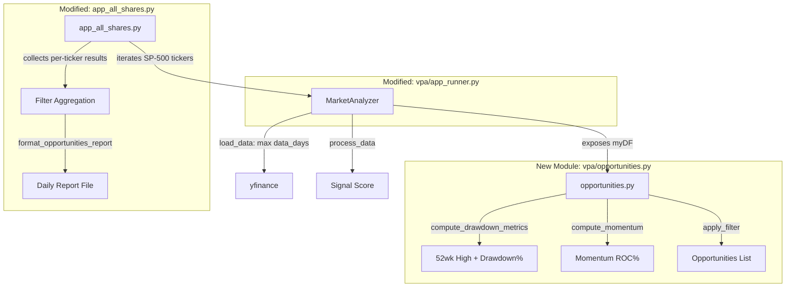

# Design Document: Momentum/Drawdown Filter

## Overview

The Momentum/Drawdown Filter is a new screening feature that identifies SP-500 tickers trading significantly below their 52-week high while exhibiting positive short-term momentum — potential bargain-with-reversal candidates.

The design introduces a new pure-function module (`vpa/opportunities.py`) containing all filter logic. This module operates on pandas DataFrames and has no dependency on yfinance or any external data source. Integration into the existing daily scan (`app_all_shares.py`) passes already-downloaded DataFrames to the filter, and the results are appended to the daily report file.

Key design decisions:
1. **Pure function module** — Filter logic is stateless and testable in isolation via synthetic DataFrames.
2. **Coordination via max(data_days)** — The data window in `load_data()` uses the largest data_days value across all enabled features (MA crossover and drawdown filter).
3. **Fail-safe per ticker** — If a ticker lacks sufficient data, it is excluded with a warning rather than crashing the entire scan.
4. **Config-driven** — All thresholds are configurable in the existing `config.json` under a new `drawdown_filter` section, following the precedent set by `ma_crossover`.

## Architecture



### Data Flow

1. `app_all_shares.py` reads config, determines data window via new coordination logic.
2. For each ticker, `MarketAnalyzer` fetches data using the coordinated window (max of MA and drawdown data_days).
3. After `process_data()` returns the signal score, the scan loop calls `compute_drawdown_metrics()` passing the DataFrame.
4. Qualifying tickers are collected into a list.
5. After all tickers are processed, the opportunities list is formatted and appended to the report.

## Components and Interfaces

### 1. `vpa/opportunities.py` — Filter Module (New)

Pure-function module. No class needed — functions operate on DataFrames and config dicts.

```python
"""Momentum/Drawdown Filter — identifies tickers with positive momentum trading below 52-week high."""

from typing import Optional
import pandas as pd
import logging

logger = logging.getLogger(__name__)


# --- Configuration ---

DEFAULT_DRAWDOWN_CONFIG = {
    "enabled": True,
    "drawdown_threshold": 20,
    "momentum_period": 20,
    "data_days": 365,
}


def load_drawdown_config(config: dict) -> dict:
    """Extract and validate drawdown_filter config section.
    
    Args:
        config: Full application config dict.
        
    Returns:
        Validated drawdown filter config dict with defaults applied.
    """
    ...


# --- Core Calculations ---

def compute_52_week_high(closes: pd.Series, window: int = 252) -> Optional[float]:
    """Compute the 52-week high from the last `window` trading days of closes.
    
    Args:
        closes: Series of closing prices (most recent last).
        window: Number of trading days for the look-back (default 252).
        
    Returns:
        The maximum closing price in the window, or None if insufficient data.
    """
    ...


def compute_drawdown_percentage(current_close: float, fifty_two_week_high: float) -> float:
    """Compute drawdown as percentage decline from peak.
    
    Formula: ((current_close - fifty_two_week_high) / fifty_two_week_high) * 100
    Result is negative when current price is below peak.
    
    Args:
        current_close: Latest closing price.
        fifty_two_week_high: Peak price over 252-day window.
        
    Returns:
        Drawdown percentage (negative value indicates decline from peak).
    """
    ...


def compute_momentum(closes: pd.Series, period: int = 20) -> Optional[float]:
    """Compute rate-of-change momentum over the given period.
    
    Formula: ((current_close - close_n_days_ago) / close_n_days_ago) * 100
    
    Args:
        closes: Series of closing prices (most recent last).
        period: Look-back period in trading days.
        
    Returns:
        Momentum percentage, or None if insufficient data.
    """
    ...


# --- Filter Application ---

def evaluate_ticker(
    df: pd.DataFrame,
    drawdown_threshold: float = 20.0,
    momentum_period: int = 20,
) -> Optional[dict]:
    """Evaluate a single ticker's DataFrame against the filter criteria.
    
    Args:
        df: DataFrame with at least a 'Close' column, sorted by date ascending.
        drawdown_threshold: Minimum drawdown percentage to qualify (default 20).
        momentum_period: Look-back period for momentum calculation (default 20).
        
    Returns:
        Dict with keys {drawdown_pct, momentum, fifty_two_week_high} if ticker
        qualifies, or None if it doesn't meet criteria or has insufficient data.
    """
    ...


# --- Report Formatting ---

def format_opportunities_report(opportunities: list[dict]) -> str:
    """Format the opportunities list into the report section text.
    
    Args:
        opportunities: List of dicts with keys {ticker, drawdown_pct, momentum}.
                      Pre-sorted by drawdown_pct ascending (largest drawdown first).
                      
    Returns:
        Formatted plain-text string for the report section.
    """
    ...
```

### 2. `vpa/app_runner.py` — Data Window Coordination (Modified)

Changes to `MarketAnalyzer`:

- `_init_drawdown_config()`: New method to load and validate the drawdown_filter config section (parallels `_init_ma_config()`).
- `load_data()`: Modified to compute `data_days = max(ma_data_days, drawdown_data_days)` when determining the yfinance request window.
- `get_dataframe()`: New public accessor to expose `self.myDF` for external filter use.

```python
# In MarketAnalyzer.__init__:
self._init_drawdown_config()

# In MarketAnalyzer.load_data():
def _get_data_days(self) -> int:
    """Return the largest data_days across all enabled features."""
    candidates = [100]  # base default
    if self.__ma_enabled:
        candidates.append(self.__ma_config["ma_data_days"])
    if self.__drawdown_enabled:
        candidates.append(self.__drawdown_config["data_days"])
    return max(candidates)

def get_dataframe(self) -> pd.DataFrame:
    """Public accessor for the loaded DataFrame."""
    return self.myDF
```

### 3. `vpa/app_all_shares.py` — Scan Integration (Modified)

After the existing per-ticker loop:

```python
# After existing signal_score collection loop:
from vpa.opportunities import evaluate_ticker, format_opportunities_report, load_drawdown_config

drawdown_config = load_drawdown_config(config)
opportunities = []

if drawdown_config["enabled"]:
    for ticker in tickers:
        # Re-use already-loaded DataFrame via MarketAnalyzer
        result = evaluate_ticker(
            df=analyzer.get_dataframe(),  # or store DFs during scan loop
            drawdown_threshold=drawdown_config["drawdown_threshold"],
            momentum_period=drawdown_config["momentum_period"],
        )
        if result is not None:
            result["ticker"] = ticker
            opportunities.append(result)

    # Sort by drawdown ascending (most negative first)
    opportunities.sort(key=lambda x: x["drawdown_pct"])

# Write to report
report_text = format_opportunities_report(opportunities)
log_file.write(report_text)
```

**Integration Note**: The scan loop currently creates a new `MarketAnalyzer` per ticker and doesn't store the DataFrame. The integration will store each analyzer's DataFrame in a dict keyed by ticker during the scan, then pass it to `evaluate_ticker()` in a second pass. This avoids re-fetching data.

### 4. Config Schema Addition

New `drawdown_filter` section in `vpa/config/config.json`:

```json
{
  "drawdown_filter": {
    "enabled": true,
    "drawdown_threshold": 20,
    "momentum_period": 20,
    "data_days": 365
  }
}
```

## Data Models

### Filter Configuration

| Field | Type | Default | Validation |
|-------|------|---------|------------|
| `enabled` | bool | `true` | — |
| `drawdown_threshold` | float | `20` | Must be 0–100; warn and use default otherwise |
| `momentum_period` | int | `20` | Must be ≥ 1; warn and use default otherwise |
| `data_days` | int | `365` | Must provide ≥ 252 trading days worth of calendar days |

### Ticker Evaluation Result

```python
# Returned by evaluate_ticker() when a ticker qualifies
{
    "ticker": str,            # e.g. "AAPL"
    "drawdown_pct": float,    # e.g. -32.5 (negative = below peak)
    "momentum": float,        # e.g. 4.2 (positive = upward ROC)
    "fifty_two_week_high": float,  # e.g. 198.23
}
```

### Report Output Format

```
Opportunities
=============
Ticker     Drawdown%   Momentum%
INTC       -45.2       3.8
BA         -38.1       2.1
...

```

When no opportunities are found:
```
Opportunities
=============
No opportunities found
```

When filter is disabled:
```
Opportunities
=============
Opportunities: disabled
```

## Error Handling

| Scenario | Behaviour |
|----------|-----------|
| Ticker has < 252 trading days | `evaluate_ticker()` returns `None`; ticker excluded from opportunities list; warning logged |
| Ticker has < momentum_period days after 252-day warm-up | `evaluate_ticker()` returns `None`; ticker excluded; warning logged |
| `drawdown_filter` section missing from config | Defaults applied (`enabled=true`, `threshold=20`, `period=20`, `data_days=365`) |
| `momentum_period < 1` | Warning logged; default value 20 used |
| `drawdown_threshold < 0` or `> 100` | Warning logged; default value 20 used |
| yfinance returns fewer rows than needed | Feature disabled for that ticker; warning logged; scan continues |
| Division by zero in momentum (close N days ago = 0) | Return `None` for that ticker; edge case unlikely with real market data but handled defensively |

All error paths log at WARNING level and never halt the scan. The scan is fault-tolerant per-ticker.

## Correctness Properties

*A property is a characteristic or behavior that should hold true across all valid executions of a system — essentially, a formal statement about what the system should do. Properties serve as the bridge between human-readable specifications and machine-verifiable correctness guarantees.*

### Property 1: Insufficient data exclusion

*For any* DataFrame with fewer than 252 rows, `evaluate_ticker()` SHALL return `None`, regardless of the closing price values or filter configuration parameters.

**Validates: Requirements 1.2**

### Property 2: 52-week high correctness

*For any* Series of closing prices with at least 252 entries, `compute_52_week_high(closes, 252)` SHALL return a value equal to `max(closes[-252:])`.

**Validates: Requirements 2.1, 2.3**

### Property 3: Drawdown formula correctness

*For any* pair of (current_close, fifty_two_week_high) where fifty_two_week_high > 0, `compute_drawdown_percentage(current_close, fifty_two_week_high)` SHALL return a value equal to `((current_close - fifty_two_week_high) / fifty_two_week_high) * 100`.

**Validates: Requirements 2.2**

### Property 4: Momentum formula correctness

*For any* Series of closing prices with at least `period + 1` entries and where `closes[-period - 1]` > 0, `compute_momentum(closes, period)` SHALL return a value equal to `((closes[-1] - closes[-period - 1]) / closes[-period - 1]) * 100`.

**Validates: Requirements 3.1**

### Property 5: Momentum insufficient data exclusion

*For any* DataFrame that has at least 252 rows but where the total length minus 252 is less than momentum_period (i.e., insufficient trailing data for momentum after the 52-week window warm-up), `evaluate_ticker()` SHALL return `None`.

**Validates: Requirements 3.2**

### Property 6: Filter predicate correctness

*For any* DataFrame producing a valid drawdown_pct and momentum, `evaluate_ticker()` SHALL return a non-None result if and only if `drawdown_pct <= -drawdown_threshold` AND `momentum > 0`.

**Validates: Requirements 4.1**

### Property 7: Report contains all required fields

*For any* non-empty list of opportunity dicts (each containing ticker, drawdown_pct, momentum), the output of `format_opportunities_report()` SHALL contain the ticker name, drawdown percentage, and momentum value for every entry in the input list.

**Validates: Requirements 5.1**

### Property 8: Report sorted by drawdown ascending

*For any* list of opportunity dicts passed to `format_opportunities_report()`, the drawdown percentages in the output SHALL appear in ascending order (most negative / largest drawdown first).

**Validates: Requirements 5.2**

### Property 9: Invalid config values use defaults

*For any* `momentum_period` value less than 1, OR any `drawdown_threshold` value outside [0, 100], `load_drawdown_config()` SHALL return the default value (20 for momentum_period, 20 for drawdown_threshold) for the invalid field.

**Validates: Requirements 6.4, 6.5**

### Property 10: Data window coordination returns max

*For any* pair of (ma_data_days, drawdown_data_days) where both features are enabled, `_get_data_days()` SHALL return a value equal to `max(ma_data_days, drawdown_data_days)`.

**Validates: Requirements 7.1**

## Testing Strategy

### Approach

The testing strategy uses a dual approach:
- **Property-based tests** (via `hypothesis`) verify universal properties across randomised inputs — ensuring correctness holds broadly, not just for hand-picked examples.
- **Unit tests** (via `pytest`) cover specific examples, edge cases, config defaults, and integration seams.

This mirrors the established pattern in `vpa/tests/test_ma_crossover.py`.

### Property-Based Testing

**Library**: `hypothesis` (already in use in the project)
**Minimum iterations**: 100 per property test
**Tag format**: `Feature: momentum-drawdown-filter, Property {N}: {title}`

Each of the 10 correctness properties above maps to one property-based test function. The generators will produce:
- Random closing price series (floats between 1.0 and 1000.0, lengths from 1 to 500)
- Random config parameters (threshold, period, data_days)
- Random opportunity dicts for report formatting tests

### Unit Tests

| Area | Tests |
|------|-------|
| Config loading | Defaults when section missing; valid section parsed; disabled flag; invalid values warned |
| Data window | Max logic with both enabled, only drawdown, only MA, both disabled |
| Filter edge cases | All-time-high ticker (drawdown ≈ 0); exactly at threshold boundary; zero momentum |
| Report formatting | Empty list; disabled message; single entry; multiple entries |
| Integration | End-to-end with synthetic DataFrames (no yfinance) |

### Test File Structure

```
vpa/tests/
├── test_ma_crossover.py          (existing)
├── test_opportunities.py         (new — properties + unit tests for vpa/opportunities.py)
└── test_data_window.py           (new — data window coordination tests)
```

### Shared Test Helpers

Reuse existing `make_temp_config()` and `make_minimal_df()` from `test_ma_crossover.py`. Add:

```python
def make_price_series(length: int, base: float = 100.0, trend: float = 0.0) -> pd.DataFrame:
    """Generate a synthetic price DataFrame with configurable length and trend."""
    ...
```

### What Is NOT Property-Tested

- yfinance data fetching (external service — integration test with mocks)
- File I/O (report writing to disk — integration test)
- Logging output (side-effect — verified via caplog in unit tests)

