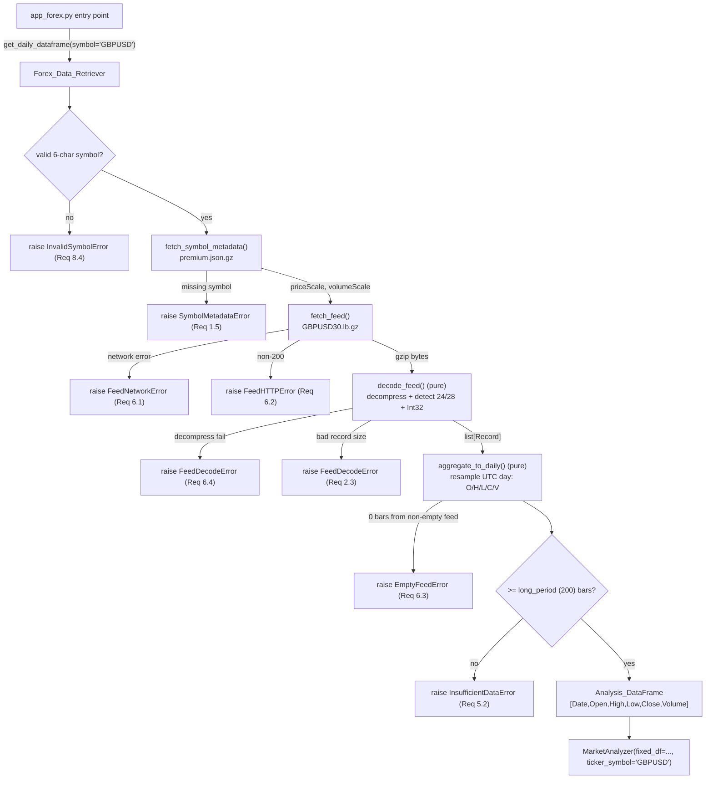

# Design Document

## Overview

This design replaces the Selenium/Firefox-based forex data retrieval in the VPA trading application (`d:\projects\trading`) with a browserless retriever that downloads the gzipped Dukascopy binary feed directly from `data.forexsb.com`, decodes it, and aggregates M30 intraday bars into daily (D1) bars client-side. The retriever produces the exact `["Date", "Open", "High", "Low", "Close", "Volume"]` DataFrame that `MarketAnalyzer` already consumes, so all downstream analysis is unchanged.

The work is tracked by Jira **SP-309** ("Replace Selenium forex scraping with API or direct download"), project `trading`, fixVersion "Trading Bot - VPA 0.5", label "trading".

### Why this approach

Investigation (a stdlib-only proof of concept) confirmed the forexsb browser UI generates its `GBPUSD_D1.csv` in-browser from a gzipped binary Dukascopy feed at a predictable, unauthenticated URL. The PoC used only `urllib`, `gzip`, `struct`, `pathlib`, and `pandas` — all already in `requirements.txt` — to decode `GBPUSD30.lb.gz` into 200,000 M30 bars (2010→today) and aggregate them to ~5,017 daily bars with volume, current to today, in the shape `MarketAnalyzer` expects. This removes the dependency on geckodriver and Firefox, which is the fragile part of the scheduled Raspberry Pi job. (Requirements 1, 2, 3)

### Verified data-source facts

- **Feed URL:** `https://data.forexsb.com/datafeed/data/dukascopy/{SYMBOL}{PERIOD}.lb.gz` — gzipped, no API key, no auth. A `Referer: https://data.forexsb.com/data-app` header may help; the PoC succeeded with a plain GET plus that header.
- **Symbol metadata:** `https://data.forexsb.com/datafeed/info/premium.json.gz` — a gzipped JSON keyed by symbol. GBPUSD: `priceScale=100000`, `volumeScale=1`, `digits=5`.
- **Period is numeric minutes:** M30 = `30`. M1/M5/M15/M30 return HTTP 200; H1/H4/D1 return 404. Daily is **not** stored server-side and must be aggregated from M30 client-side.
- **Binary `.lb` format** (after gunzip), little-endian Int32 fields: a record is **24 bytes** (time, open, high, low, close, volume) or **28 bytes** ("spread record" variant, adds a trailing spread Int32).
- **Timestamp:** `timestamp_ms = 946684800000 + (time_field * 60000)` (epoch base = 2000-01-01T00:00:00Z; `time_field` is minutes since that base).
- **Prices:** `open/high/low/close = int32_field / priceScale`.
- **Volume:** `ceil((volume_int32 or 1) / volumeScale)`.

## Architecture

The retriever lives in a new small package `vpa/forex_data/` with a clean separation between the one network-touching function and the pure, network-free functions that do the decoding and aggregation. This separation is deliberate: the pure functions can be exercised by unit and Hypothesis property tests without any network (Requirement 9), and the single fetch function is the only thing that needs mocking in tests.

Chosen layout (a package rather than a single module, so the pure logic sits in its own testable files):

```
vpa/forex_data/
  __init__.py          # exports Forex_Data_Retriever + get_daily_dataframe
  retriever.py         # Forex_Data_Retriever orchestrator + get_daily_dataframe()
  feed.py              # fetch_feed() (network) + fetch_symbol_metadata() (network)
  decoder.py           # decode_feed() (pure): decompress + record-size detect + Int32 decode
  aggregator.py        # aggregate_to_daily() (pure): M30 records -> D1 DataFrame
  errors.py            # typed exceptions (ForexRetrievalError + subclasses)
```

> A single `vpa/forex_data.py` module would also satisfy the requirements; the package is preferred because it keeps `decoder.py` and `aggregator.py` (the property-tested pure logic) physically separate from `feed.py` (the network boundary), which makes the "no network in tests" contract obvious. (Requirement 9.3)

### Data flow



### Boundaries and responsibilities

| Layer | Function | Network? | Testable how |
|---|---|---|---|
| Network | `fetch_feed(symbol, period)` | Yes | Mock/monkeypatch; a few integration examples |
| Network | `fetch_symbol_metadata()` | Yes | Mock/monkeypatch; a few integration examples |
| Pure | `decode_feed(raw_gz_bytes, price_scale, volume_scale)` | No | Unit + Hypothesis property tests |
| Pure | `aggregate_to_daily(records)` | No | Unit + Hypothesis property tests |
| Orchestration | `get_daily_dataframe(symbol="GBPUSD")` | Yes (delegates) | Inject bytes / mock fetch |

The orchestrator wires the layers together and enforces cross-cutting rules (symbol validation, metadata caching, minimum-row check). Because the pure functions accept already-fetched bytes / already-decoded records, tests can drive them directly with synthetic inputs and never open a socket. (Requirements 9.1, 9.2, 9.3)

## Components and Interfaces

### `feed.py` — network boundary

```python
def fetch_symbol_metadata(
    url: str = "https://data.forexsb.com/datafeed/info/premium.json.gz",
) -> dict:
    """GET + gunzip + json.loads the premium metadata. Returns the full dict
    keyed by symbol. Raises FeedNetworkError / FeedHTTPError / FeedDecodeError."""

def fetch_feed(
    symbol: str,
    period: int = 30,
    base_url: str = "https://data.forexsb.com/datafeed/data/dukascopy",
) -> bytes:
    """GET {base_url}/{SYMBOL}{period}.lb.gz and return the raw gzipped bytes.
    Sends a 'Referer: https://data.forexsb.com/data-app' header.
    Raises FeedNetworkError (URLError/socket) and FeedHTTPError (non-200)."""
```

- Uses `urllib.request` only. HTTP status handling: a `urllib.error.HTTPError` carries `.code`, which is surfaced in `FeedHTTPError` (Requirement 6.2). Any other `urllib.error.URLError` / socket error becomes `FeedNetworkError` (Requirement 6.1). Neither returns data to the caller on failure.
- `fetch_feed` returns raw gzipped bytes (not decompressed) so the pure decoder owns decompression and can be property-tested on synthetic gz buffers.

### `decoder.py` — pure decode

```python
RECORD_SIZES = (28, 24)  # check 28 (spread-record) first, matching forexsb app.js
EPOCH_BASE_MS = 946684800000  # 2000-01-01T00:00:00Z

@dataclass(frozen=True)
class Record:
    timestamp_ms: int
    open: float
    high: float
    low: float
    close: float
    volume: int

def decode_feed(
    raw_gz_bytes: bytes,
    price_scale: int,
    volume_scale: int,
) -> list[Record]:
    """Decompress raw_gz_bytes, detect record size, decode little-endian Int32
    fields into Records. Pure and deterministic — no network, no globals."""
```

Decode algorithm:
1. `gzip.decompress(raw_gz_bytes)` → `buf`. On failure raise `FeedDecodeError` (Requirement 6.4).
2. If `len(buf) == 0` → return `[]` (Requirement 2.4).
3. Detect record size: `28 if len(buf) % 28 == 0 else 24 if len(buf) % 24 == 0 else raise FeedDecodeError` (record-size mismatch, emit nothing — Requirements 2.2, 2.3). 28 is checked first to mirror forexsb's own app.js.
4. For each `size`-byte record, unpack the leading six fields as little-endian Int32 (`struct` format `"<6i"` for the first 24 bytes; the trailing spread Int32 in 28-byte records is read but not used):
   - `timestamp_ms = EPOCH_BASE_MS + (time_field * 60000)` (Requirement 2.6)
   - `open/high/low/close = int32_field / price_scale` (Requirement 2.7)
   - `volume = ceil((volume_int32 or 1) / volume_scale)` (Requirement 2.8)
5. Return the records in file order (already chronological).

> **Ambiguity note — record-size detection.** A buffer length divisible by both 24 and 28 (i.e. divisible by 168) is theoretically ambiguous. This design resolves it by matching forexsb's app.js, which checks the 28-byte spread-record shape first. Realistic feeds are large and the 28 vs 24 choice is a property of the feed variant, not per-buffer, so this is a safe, documented tie-break.

### `aggregator.py` — pure aggregation

```python
DAILY_COLUMNS = ["Date", "Open", "High", "Low", "Close", "Volume"]

def aggregate_to_daily(records: list[Record]) -> pd.DataFrame:
    """Resample M30 (or any intraday) records into D1 bars grouped by UTC
    calendar day. Pure and deterministic. Empty input -> empty DataFrame with
    the correct columns/dtypes (no error)."""
```

Aggregation algorithm (matches the verified PoC / forexsb client logic):
1. Build a DataFrame from records; convert `timestamp_ms` to a UTC `DatetimeIndex`.
2. `resample("1D")` (calendar day, UTC) and agg: `Open=first`, `High=max`, `Low=min`, `Close=last`, `Volume=sum` (Requirement 3.2).
3. `dropna()` to drop days with no records (weekends/holidays), `reset_index()`, rename the index to `Date`, and strip tz so `Date` is tz-naive datetime.
4. Reorder to exactly `["Date","Open","High","Low","Close","Volume"]`, sorted ascending by `Date` (Requirements 3.1, 3.3, 4.1).
5. Empty input → return an empty DataFrame with those columns and correct dtypes (Requirement 3.4).

### `retriever.py` — orchestrator

```python
SYMBOL_LENGTH = 6
DEFAULT_SYMBOL = "GBPUSD"
M30_PERIOD = 30

class Forex_Data_Retriever:
    def __init__(self, min_bars: int = 200):
        # min_bars defaults to the Long_Period_SMA window (config long=200)
        self._metadata_cache: dict | None = None  # cached within a run

    def get_daily_dataframe(self, symbol: str = DEFAULT_SYMBOL) -> pd.DataFrame:
        ...

# Module-level convenience matching the requirement's public API:
def get_daily_dataframe(symbol: str = DEFAULT_SYMBOL, min_bars: int = 200) -> pd.DataFrame:
    return Forex_Data_Retriever(min_bars=min_bars).get_daily_dataframe(symbol)
```

`get_daily_dataframe` steps:
1. **Validate symbol** (Requirement 8.1, 8.4): strip, require exactly 6 alphabetic chars; uppercase for the URL, treating input case-insensitively. Reject before any network call with `InvalidSymbolError`.
2. **Metadata** (Requirements 1.4, 1.5): fetch `premium.json.gz` once, cache on the instance for the run; look up `priceScale`/`volumeScale` for the symbol. Missing symbol/scales → `SymbolMetadataError`.
3. **Fetch** the M30 feed (Requirement 1.3) → raw gz bytes; network/HTTP errors surface per Requirement 6.
4. **Decode** via `decode_feed` (Requirement 2).
5. **Aggregate** via `aggregate_to_daily` (Requirement 3).
6. **Empty check** (Requirement 6.3): if the feed decoded to zero records / zero daily bars, raise `EmptyFeedError`.
7. **Sufficiency check** (Requirement 5): if `len(daily) < min_bars` raise `InsufficientDataError`; never return a partial set.
8. Return the Analysis_DataFrame.

### `app_forex.py` — rewritten entry point (integration)

The Selenium block is deleted; orchestration is preserved:

```python
import pandas as pd
from vpa.app_runner import MarketAnalyzer
from vpa.forex_data import get_daily_dataframe

my_df = get_daily_dataframe(symbol="GBPUSD")  # full history; MA needs >=200 rows

analyzer = MarketAnalyzer(
    config_path="config/config.json", log_level="INFO",
    fixed_df=my_df, ticker_symbol="GBPUSD", log_prefix="GBPUSD",
)
trade_signal = analyzer.process_data()
analyzer.graph_intervals()

if trade_signal >= 15:
    analyzer.log("BUY Recommendation")
elif trade_signal <= -15:
    analyzer.log("SELL Recommendation")
else:
    analyzer.log("DO NOT TRADE")
```

- No `selenium` import remains (Requirement 10.1). `MarketAnalyzer` sorts the `fixed_df` by "Date" and checks row count against the long-period SMA itself (Requirements 4.3, 4.7).
- **Note on `.tail(51)`:** the old code trimmed to 51 rows, but the config's long-period SMA is **200** (`ma_crossover.ma_periods.long`). To keep the MA crossover feature enabled, the new entry point passes the full daily history rather than trimming below 200. The `min_bars=200` sufficiency check (Requirement 5) guarantees enough rows.
- BUY/SELL/DO NOT TRADE thresholds and `graph_intervals()` are unchanged (Requirements 4.4–4.7).

### Removal of Selenium (Requirement 10)

- Delete `vpa/forex_auto/` (`base_page.py`, `forex_home_page.py`) in its entirety (Requirement 10.2).
- Remove `selenium~=4.34.0` from `requirements.txt` (Requirement 10.3). `urllib`/`gzip`/`struct`/`pathlib` are stdlib; `pandas`, `pytest`, `hypothesis` are already present.

## Data Models

### `Record` (decoded intraday bar)

| Field | Type | Derivation | Requirement |
|---|---|---|---|
| `timestamp_ms` | `int` | `946684800000 + time_field * 60000` | 2.6 |
| `open` | `float` | `open_int32 / price_scale` | 2.7 |
| `high` | `float` | `high_int32 / price_scale` | 2.7 |
| `low` | `float` | `low_int32 / price_scale` | 2.7 |
| `close` | `float` | `close_int32 / price_scale` | 2.7 |
| `volume` | `int` | `ceil((volume_int32 or 1) / volume_scale)` | 2.8 |

Immutable (`frozen=True` dataclass) to reinforce decode determinism (Requirement 9.1).

### Binary record layout (little-endian Int32)

| Offset | Field | Notes |
|---|---|---|
| 0 | time | minutes since 2000-01-01T00:00:00Z |
| 4 | open | scaled int |
| 8 | high | scaled int |
| 12 | low | scaled int |
| 16 | close | scaled int |
| 20 | volume | scaled int |
| 24 | spread | present only in 28-byte records; read, unused |

### `Symbol_Metadata` (subset used)

```json
{ "GBPUSD": { "priceScale": 100000, "volumeScale": 1, "digits": 5 } }
```

Only `priceScale` and `volumeScale` are consumed. Cached on the retriever instance for the duration of one run (Requirements 1.4, 8.3).

### `Analysis_DataFrame` (output contract)

Columns in exact order `["Date", "Open", "High", "Low", "Close", "Volume"]`; `Date` is tz-naive `datetime64[ns]`; O/H/L/C are float, `Volume` numeric. This matches what `MarketAnalyzer` receives today as `fixed_df` and then sorts by "Date". (Requirements 4.1, 4.2)

### Exception hierarchy (`errors.py`)

```
ForexRetrievalError (base)
├── InvalidSymbolError      # Req 8.4  — symbol not 6-char currency pair
├── SymbolMetadataError     # Req 1.5  — metadata unavailable / no scales for symbol
├── FeedNetworkError        # Req 6.1  — network failure reaching the feed
├── FeedHTTPError           # Req 6.2  — non-200 status (carries .status_code)
├── FeedDecodeError         # Req 2.3, 6.4 — decompress failure or record-size mismatch
├── EmptyFeedError          # Req 6.3  — decoded to zero records
└── InsufficientDataError   # Req 5.2  — fewer D1 bars than long-period SMA window
```

All are raised before any data is returned to the caller, so the scheduled job fails loudly rather than analyzing bad data (Requirement 6).

## Correctness Properties

*A property is a characteristic or behavior that should hold true across all valid executions of a system — essentially, a formal statement about what the system should do. Properties serve as the bridge between human-readable specifications and machine-verifiable correctness guarantees.*

The pure functions `decode_feed` and `aggregate_to_daily` are the natural home for property-based tests: they are deterministic, take explicit inputs, and touch no network. The properties below were derived from the acceptance-criteria prework and consolidated to remove redundancy.

### Property 1: Decode round-trip recovers field values

*For any* list of synthetic records (each a tuple of little-endian Int32 fields for time/open/high/low/close/volume, plus an optional spread field), encoding them into a `.lb` buffer at either the 24- or 28-byte record size and gzipping produces bytes that, when passed through `decode_feed` with a given `price_scale` and `volume_scale`, yield records whose `timestamp_ms == 946684800000 + time_field*60000`, whose `open/high/low/close == field/price_scale`, and whose `volume == ceil((volume_field or 1)/volume_scale)`, in the same order and count as the source records.

**Validates: Requirements 2.1, 2.2, 2.5, 2.6, 2.7, 2.8**

### Property 2: Malformed buffer length is rejected

*For any* decompressed buffer whose length is greater than zero and is not an exact multiple of 24 or 28, `decode_feed` raises `FeedDecodeError` and emits no records.

**Validates: Requirements 2.3**

### Property 3: Daily aggregation computes correct per-day OHLCV

*For any* set of decoded intraday records, `aggregate_to_daily` produces exactly one bar per distinct UTC calendar day present in the input, where each bar's Open is the open of the earliest record that day, Close is the close of the latest record that day, High is the maximum high, Low is the minimum low, and the most recent UTC day in the input is present as the last bar.

**Validates: Requirements 3.1, 3.2, 3.5**

### Property 4: Daily bars are in ascending chronological order

*For any* set of decoded intraday records, the `Date` column of the aggregated DataFrame is strictly increasing.

**Validates: Requirements 3.3**

### Property 5: Volume is preserved under aggregation

*For any* set of decoded intraday records, each daily bar's Volume equals the arithmetic sum of the Volume values of the source records assigned to that bar's UTC calendar day, and therefore the sum of all daily-bar Volumes equals the sum of all source-record volumes.

**Validates: Requirements 3.2, 9.4**

### Property 6: Output DataFrame shape is invariant

*For any* set of decoded intraday records (including the empty set), the aggregated DataFrame has columns exactly `["Date", "Open", "High", "Low", "Close", "Volume"]` in that order, with `Date` a tz-naive datetime dtype and Open/High/Low/Close/Volume numeric dtypes.

**Validates: Requirements 3.4, 4.1, 4.2**

### Property 7: Symbol normalization and URL derivation

*For any* string consisting of exactly six alphabetic characters in any letter case, the retriever normalizes it to uppercase and derives the feed URL as `https://data.forexsb.com/datafeed/data/dukascopy/{UPPER}30.lb.gz`.

**Validates: Requirements 1.3, 8.1, 8.3**

### Property 8: Invalid symbols are rejected before any retrieval

*For any* string that is not exactly six alphabetic characters, the retriever raises `InvalidSymbolError` and performs no metadata or feed fetch.

**Validates: Requirements 8.4**

### Property 9: Decode and aggregation are deterministic

*For any* input byte buffer, two invocations of `decode_feed` produce identical record lists; and *for any* set of decoded records, two invocations of `aggregate_to_daily` produce DataFrames identical in count, ordering, and per-bar field values.

**Validates: Requirements 9.1, 9.2**

## Error Handling

All failures raise a typed exception from the `ForexRetrievalError` hierarchy and return no data, so the scheduled Pi job fails loudly instead of feeding bad data into `MarketAnalyzer`.

| Condition | Where detected | Exception | Requirement |
|---|---|---|---|
| Symbol not exactly 6 alphabetic chars | `get_daily_dataframe` (pre-fetch) | `InvalidSymbolError` | 8.4 |
| Metadata unavailable or symbol/scales missing | `fetch_symbol_metadata` / lookup | `SymbolMetadataError` | 1.5 |
| Network failure reaching feed/metadata | `fetch_feed` / `fetch_symbol_metadata` | `FeedNetworkError` | 6.1 |
| Non-200 HTTP status | `fetch_feed` (`HTTPError.code`) | `FeedHTTPError` (carries `status_code`) | 6.2 |
| Feed bytes cannot be gunzipped | `decode_feed` | `FeedDecodeError` | 6.4 |
| Buffer length not a multiple of 24/28 | `decode_feed` | `FeedDecodeError` | 2.3 |
| Decoded to zero records | `get_daily_dataframe` | `EmptyFeedError` | 6.3 |
| Fewer daily bars than long-period SMA (200) | `get_daily_dataframe` | `InsufficientDataError` | 5.2 |

Boundary behaviors that are **not** errors:
- Zero-length decompressed buffer → empty record list (Requirement 2.4).
- Empty record list into the aggregator → empty DataFrame with correct columns/dtypes (Requirement 3.4). *(The empty-feed error 6.3 is enforced by the orchestrator, not the pure aggregator, keeping the aggregator total and property-testable.)*

Design rationale: the pure functions never swallow errors and never perform I/O, so error conditions are either surfaced as typed exceptions (bad length, decompress failure) or as benign empty results (empty buffers). The orchestrator layers the "empty feed" and "insufficient data" policy checks on top, keeping policy separate from the pure transforms.

## Testing Strategy

This feature is well suited to property-based testing: `decode_feed` and `aggregate_to_daily` are pure functions over a large input space (arbitrary Int32 fields, arbitrary record counts, arbitrary day groupings) with clear universal properties (round-trip, volume invariant, determinism, ordering). Network functions are **not** property-tested; they are covered by a small number of mocked/example tests. The project already has `pytest`, `pytest-cov`, `coverage`, and `hypothesis` in `requirements.txt`, so no new libraries are introduced.

### Testing without network (Requirement 9.3)

- The pure functions (`decode_feed`, `aggregate_to_daily`) accept already-fetched bytes and already-decoded records, so tests drive them directly with synthetic inputs — no socket is opened.
- Orchestrator tests inject bytes by monkeypatching `feed.fetch_feed` and `feed.fetch_symbol_metadata` (e.g. `monkeypatch.setattr`) to return canned bytes/dicts or to raise the relevant `urllib` errors. This exercises `get_daily_dataframe` end-to-end offline.

### Property-based tests (Hypothesis)

- Library: **Hypothesis** (already present). Each property test runs a **minimum of 100 iterations** (`@settings(max_examples=100)` or higher).
- A test helper `encode_records(records, size)` builds synthetic `.lb` buffers (little-endian Int32) and gzips them, so the decode round-trip can generate valid inputs.
- Each property test carries a tag comment referencing its design property, using the format:
  `# Feature: replace-selenium-forex-scraping, Property {number}: {property_text}`

| Test | Property | Generators |
|---|---|---|
| `test_decode_round_trip` | P1 | lists of Int32 field tuples; record size ∈ {24, 28}; positive `price_scale`, `volume_scale` |
| `test_decode_bad_length_raises` | P2 | byte buffers with length not divisible by 24 or 28 (and > 0) |
| `test_aggregation_ohlcv` | P3 | lists of records spanning multiple UTC days |
| `test_daily_bars_ascending` | P4 | lists of records (unordered timestamps) |
| `test_volume_preserved` | P5 | lists of records with arbitrary volumes |
| `test_output_shape` | P6 | lists of records incl. empty |
| `test_symbol_normalization_url` | P7 | 6-letter strings, mixed case |
| `test_invalid_symbol_rejected` | P8 | strings that are not exactly 6 alpha chars |
| `test_decode_aggregate_determinism` | P9 | buffers / record lists, invoked twice and compared |

### Unit / example tests

- **Metadata lookup** (Req 1.4): sample metadata dict → correct GBPUSD scales; missing symbol → `SymbolMetadataError` (Req 1.5).
- **Zero-length buffer** (Req 2.4): decodes to `[]` with no error.
- **Empty aggregation** (Req 3.4): empty records → empty DataFrame with correct columns.
- **Default symbol** (Req 8.2): no-arg `get_daily_dataframe()` targets GBPUSD.
- **Sufficiency boundary** (Req 5.1, 5.2): exactly 200 bars passes; 199 raises `InsufficientDataError` and returns nothing.
- **Error mapping** (Req 6.1, 6.2, 6.3, 6.4): mocked `fetch_feed` raising `URLError` → `FeedNetworkError`; `HTTPError(code=404)` → `FeedHTTPError` carrying 404; non-gzip bytes → `FeedDecodeError`; zero-record feed → `EmptyFeedError`.
- **Signal thresholds** (Req 4.4–4.6): with a stubbed `MarketAnalyzer`, `trade_signal` of 15/−15/0 logs BUY/SELL/DO NOT TRADE respectively; boundary values 14 and −14 log DO NOT TRADE.

### Integration / smoke tests

- **No-Selenium check** (Req 1.1, 1.2, 10.1): assert `import vpa.forex_data` and `app_forex.py` do not import `selenium`; assert `vpa/forex_auto/` is removed and `selenium` is gone from `requirements.txt` (Req 10.2, 10.3).
- **Cross-platform** (Req 7.1–7.3): grep/review that there are no `sys.platform`/`os.name` branches, no hardcoded separators (pathlib only), and no reference to `/home/mypi/Downloads`.
- **Wiring** (Req 4.3, 4.7): with a mocked retriever returning a synthetic df, `app_forex` constructs `MarketAnalyzer(fixed_df=..., ticker_symbol="GBPUSD")`, calls `process_data()` and `graph_intervals()`.
- **Live feed integration** (optional, network-gated, marked and skippable in CI): one call to the real feed to confirm HTTP 200 and a non-empty decode — kept to a single example, not repeated.

### Deployment verification (Requirement 11 — Definition of Done)

Because `app_forex.py` runs on the Raspberry Pi via the existing `Rundeck_Job` and `vpa/scripts/start_vpa_forex.sh`, the ticket is only **Done** after the code is deployed and verified on the Pi:
1. Pull latest on the Pi and ensure the venv has the updated `requirements.txt` (selenium removed); confirm geckodriver/Firefox are not required (Req 11.1).
2. Run the scheduled job (or `python app_forex.py`) against live GBPUSD data and confirm a trade-signal log entry is produced (Req 11.2).
3. Until deployed and verified, SP-309 stays in **Mostly Done**, not Done (Req 11.3). See the `pi-access` steering for how to reach the Pi.

## Requirements Traceability

| Requirement | Addressed by |
|---|---|
| 1 Browserless retrieval | `feed.py` (urllib), stdlib-only decode/aggregate; no browser |
| 2 Decode binary feed | `decoder.decode_feed`; Properties 1, 2 |
| 3 Aggregate to daily | `aggregator.aggregate_to_daily`; Properties 3, 4, 5, 6 |
| 4 MarketAnalyzer contract | Output shape (Property 6), rewritten `app_forex.py` |
| 5 Sufficient data | `min_bars=200` check in orchestrator; sufficiency unit tests |
| 6 Error handling | `errors.py` hierarchy; error-mapping unit tests |
| 7 Cross-platform | pathlib, no OS branches, no hardcoded paths; smoke tests |
| 8 Symbol configurability | validation + normalization; Properties 7, 8 |
| 9 Testability | pure functions; Properties 1–9; offline tests |
| 10 Remove Selenium | delete `forex_auto/`, drop `selenium`; no-Selenium smoke test |
| 11 Pi deployment | deploy + verify via Rundeck job; ticket stays Mostly Done until verified |
