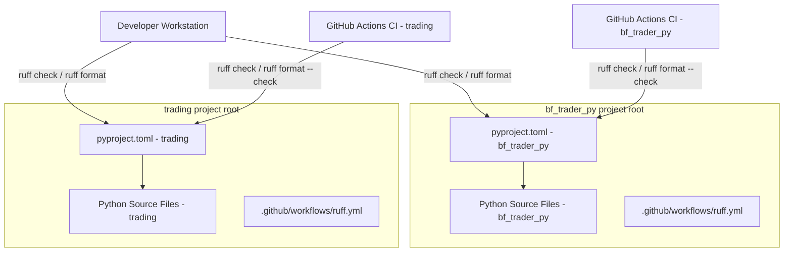

# Design Document: Ruff Python Tooling

## Overview

This design covers the integration of [Ruff](https://docs.astral.sh/ruff/) as the standard Python linter and formatter for **both** Python projects in the workspace: **bf_trader_py** and **trading**. Ruff replaces the need for multiple tools (flake8, black, isort) with a single fast binary written in Rust.

The scope includes:
- A `pyproject.toml` configuration file at the root of each project
- A GitHub Actions CI workflow for automated checks in each project
- An initial formatting pass per project to bring existing code into compliance
- Addition of Ruff as a pinned development dependency in each project

## Architecture

The integration is purely configuration-based with no runtime code changes. Each project gets its own `pyproject.toml` and CI workflow, sharing identical core settings while allowing project-specific exclusions and first-party package declarations.



**Design Decision — Two project scope:** Both bf_trader_py and trading are in scope. Each project gets its own `pyproject.toml` with shared core settings and project-specific additions. This keeps each project self-contained while ensuring consistency.

**Design Decision — pyproject.toml over ruff.toml:** Using `pyproject.toml` keeps all project metadata in one file and is the community-standard location for tool configuration in modern Python projects.

## Components and Interfaces

### 1. Configuration File (`pyproject.toml`)

Each project gets its own `pyproject.toml` at its root. Core settings are identical; only `known-first-party` and project-specific exclusions differ.

#### Shared Core Settings (identical in both projects)

| Setting | Value | Rationale |
|---------|-------|-----------|
| `line-length` | 120 | Wider than PEP 8's 79 but standard for modern projects; matches typical monitor width |
| `target-version` | `"py311"` | Both projects use Python 3.11+ |
| `quote-style` | `"double"` | Consistent with Python community convention |
| `lint select` | `["E", "F", "I", "UP", "B"]` | pycodestyle errors, Pyflakes, isort, pyupgrade, flake8-bugbear |

#### bf_trader_py Configuration (`d:\projects\bf_trader_py\pyproject.toml`)

```toml
[tool.ruff]
line-length = 120
target-version = "py311"
exclude = [
    ".venv",
    "__pycache__",
    ".git",
    ".hypothesis",
    "build",
    "certs",
    "log",
]

[tool.ruff.format]
quote-style = "double"

[tool.ruff.lint]
select = [
    "E",   # pycodestyle errors
    "F",   # Pyflakes
    "I",   # isort
    "UP",  # pyupgrade
    "B",   # flake8-bugbear
]

[tool.ruff.lint.isort]
known-first-party = ["api", "betfair", "charts", "config", "decorators", "logic", "output", "scripts", "tests", "web"]
```

#### trading Configuration (`d:\projects\trading\pyproject.toml`)

```toml
[tool.ruff]
line-length = 120
target-version = "py311"
exclude = [
    ".venv",
    "__pycache__",
    ".git",
    ".hypothesis",
    "ml_validation_output",
    "test_data",
]

[tool.ruff.format]
quote-style = "double"

[tool.ruff.lint]
select = [
    "E",   # pycodestyle errors
    "F",   # Pyflakes
    "I",   # isort
    "UP",  # pyupgrade
    "B",   # flake8-bugbear
]

[tool.ruff.lint.isort]
known-first-party = ["ig", "options", "utils", "vpa"]
```

**Key differences between projects:**

| Setting | bf_trader_py | trading |
|---------|-------------|---------|
| `exclude` (project-specific) | `"build"`, `"certs"`, `"log"` | `"ml_validation_output"`, `"test_data"` |
| `known-first-party` | `["api", "betfair", "charts", "config", "decorators", "logic", "output", "scripts", "tests", "web"]` | `["ig", "options", "utils", "vpa"]` |

### 2. Consistency Between Projects

The following settings MUST be identical across both `pyproject.toml` files to satisfy Requirement 2:

- `line-length = 120`
- `target-version = "py311"`
- `quote-style = "double"`
- `select = ["E", "F", "I", "UP", "B"]`
- Common exclusions: `.venv`, `__pycache__`, `.git`, `.hypothesis`

Only `known-first-party` and additional project-specific entries in `exclude` may differ. Any other divergence is a conformance violation per Requirement 2.4.

### 3. GitHub Actions Workflows

Each project gets a `ruff.yml` workflow. The bf_trader_py project already has `.github/workflows/` (containing `qodana_code_quality.yml`), so the new file is added alongside it. The trading project needs the directory created.

#### bf_trader_py Workflow (`d:\projects\bf_trader_py\.github\workflows\ruff.yml`)

```yaml
name: Ruff

on:
  push:
    branches: [main]
  pull_request:
    branches: [main]

jobs:
  ruff:
    runs-on: ubuntu-latest
    timeout-minutes: 2
    steps:
      - uses: actions/checkout@v4

      - name: Set up Python
        uses: actions/setup-python@v5
        with:
          python-version: "3.11"

      - name: Install Ruff
        run: pip install ruff==0.8.6

      - name: Ruff lint check
        run: ruff check .

      - name: Ruff format check
        run: ruff format --check .
```

#### trading Workflow (`d:\projects\trading\.github\workflows\ruff.yml`)

```yaml
name: Ruff

on:
  push:
    branches: [master]
  pull_request:
    branches: [master]

jobs:
  ruff:
    runs-on: ubuntu-latest
    timeout-minutes: 2
    steps:
      - uses: actions/checkout@v4

      - name: Set up Python
        uses: actions/setup-python@v5
        with:
          python-version: "3.11"

      - name: Install Ruff
        run: pip install ruff==0.8.6

      - name: Ruff lint check
        run: ruff check .

      - name: Ruff format check
        run: ruff format --check .
```

**Design decisions:**

- **Branch names:** bf_trader_py uses `main`; trading uses `master`. Each workflow targets the correct default branch.
- **Pinned version (`ruff==0.8.6`):** Ensures reproducible CI runs. Version chosen as latest stable at time of design.
- **No virtual environment in CI:** Ruff has zero Python dependencies — installing it globally in the CI runner is simpler and faster.
- **`timeout-minutes: 2`:** Per Requirement 4.4. Ruff is extremely fast (typically <5s on large codebases), so 2 minutes is generous.
- **Separate lint and format steps:** Clear failure messages indicating whether the issue is a lint violation or a formatting drift.

### 4. Development Dependencies

Each project pins Ruff in its existing dependency file:

- **bf_trader_py:** Append `ruff==0.8.6` to `build/requirements.txt`
- **trading:** Append `ruff==0.8.6` to `requirements.txt`

The pinned version matches CI to prevent configuration drift.

**Design Decision — Use existing dependency files:** Both projects currently manage dependencies via `requirements.txt`. Migrating to pyproject.toml-based dependency management is out of scope for this ticket. Ruff config goes in pyproject.toml; the dependency pin stays in requirements.txt.

### 5. Initial Format Pass Process

The same process is applied to each project independently, committed as separate dedicated commits.

#### Steps (repeated per project)

```
Step 1: ruff format .         → Apply formatting to all files
Step 2: ruff check . --fix    → Auto-fix safe lint violations  
Step 3: ruff check .          → Verify zero remaining violations
Step 4: ruff format --check . → Verify formatting is clean
Step 5: git commit            → Single dedicated commit
```

**Commit messages:**
- bf_trader_py: `SP-323: apply Ruff formatting to bf_trader_py`
- trading: `SP-323: apply Ruff formatting to trading`

**Ordering rationale (Requirement 3.1):** Format first, then lint-fix. This ensures isort and other auto-fixes operate on consistently formatted code, avoiding cascading reformats.

## Data Models

No runtime data models are introduced. The relevant "data" is the TOML configuration schema:

| Section | Key | Type | Constraint |
|---------|-----|------|------------|
| `[tool.ruff]` | `line-length` | integer | Must be identical across both projects |
| `[tool.ruff]` | `target-version` | string | Python version string, must be identical across both projects |
| `[tool.ruff]` | `exclude` | array of strings | Common entries identical; project-specific entries allowed |
| `[tool.ruff.format]` | `quote-style` | string | Must be identical across both projects |
| `[tool.ruff.lint]` | `select` | array of strings | Must be identical across both projects |
| `[tool.ruff.lint.isort]` | `known-first-party` | array of strings | Project-specific; matches top-level importable packages |

## Error Handling

| Scenario | Handling |
|----------|----------|
| `ruff check .` finds violations | Non-zero exit code; developer runs `--fix` or manually resolves |
| `ruff format --check .` finds drift | Non-zero exit code; developer runs `ruff format .` to fix |
| CI step fails | GitHub Actions marks the workflow as failed; PR cannot merge (if branch protection is enabled) |
| Missing `pyproject.toml` | Ruff falls back to built-in defaults and emits a warning (Requirement 6.5) |
| Unknown rule code in `select` | Ruff exits with an error message identifying the invalid code |
| Platform-specific path issues | Avoided by using forward-slash separators in all exclude patterns (Requirement 5.1) |
| Configuration drift between projects | Developer compares core settings during review; CI enforces per-project compliance |

## Testing Strategy

**Why Property-Based Testing does not apply:** This feature is purely configuration and tooling setup — declarative TOML files, YAML workflow definitions, and one-time shell commands. There are no pure functions with input/output behavior to test, no data transformations, and no algorithms. The appropriate validation approach is smoke testing and integration verification.

**Validation approach:**

1. **Smoke tests (local, per project):**
   - After configuration: `ruff check .` exits 0
   - After configuration: `ruff format --check .` exits 0
   - Ruff reads the correct config: `ruff check --show-settings` shows expected values

2. **Integration tests (CI, per project):**
   - Push a deliberately mis-formatted file on a branch → CI workflow fails
   - Push compliant code → CI workflow passes
   - Verify workflow completes within 2-minute timeout

3. **Cross-platform verification:**
   - Run `ruff check .` and `ruff format --check .` on Windows (dev machine) and Linux (CI) with identical source files
   - Confirm identical results (no platform-dependent formatting differences)

4. **Configuration conformance:**
   - Manual review that both `pyproject.toml` files contain all required sections per Requirement 1
   - Verify core settings are identical between projects per Requirement 2
   - Verify `known-first-party` matches the actual importable package names in each project

All validation is performed as part of the implementation task execution — no automated test suite is created for tooling configuration.
