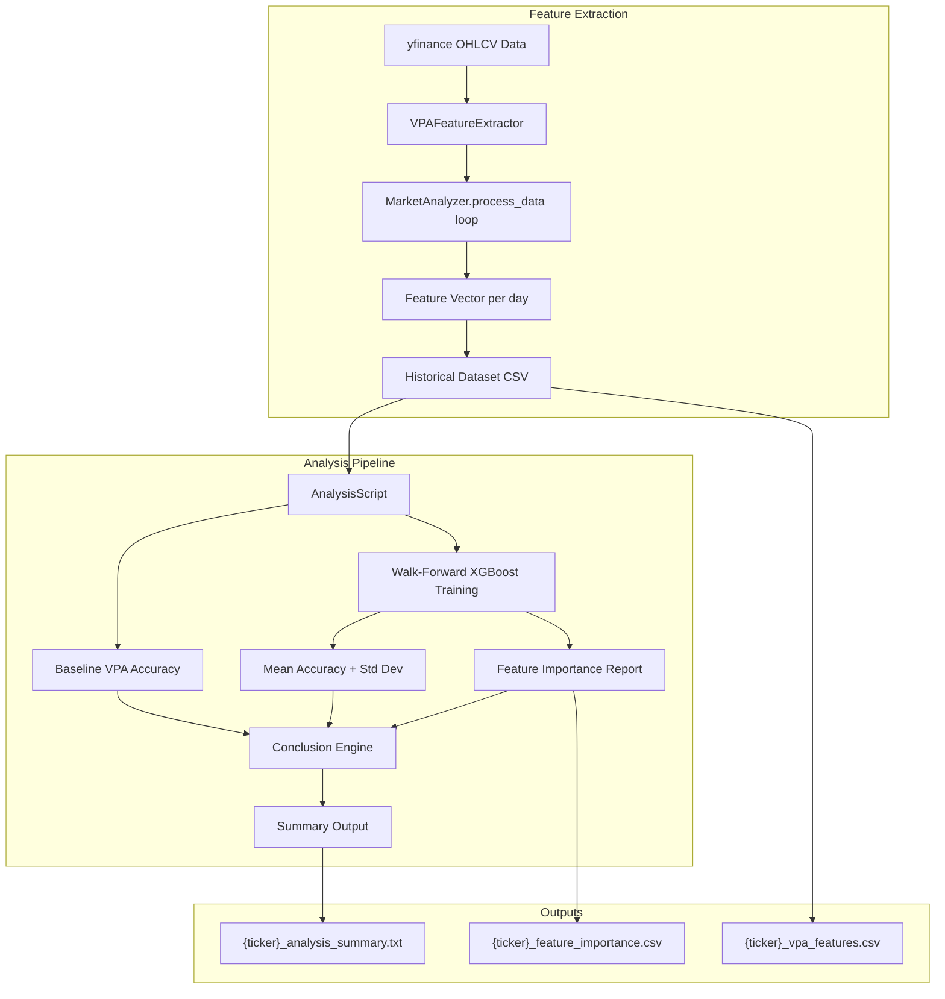
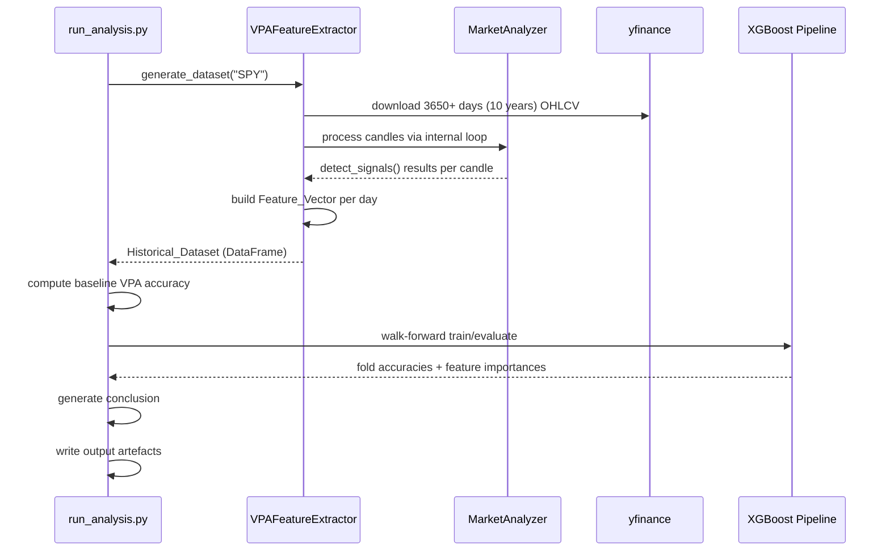

# Design Document: VPA ML Validation

## Overview

This feature adds an ML validation pipeline to the existing VPA (Volume Price Analysis) system to determine whether VPA intermediate features contain predictive information about next-day price direction for SPY. The system extracts a structured feature vector from the existing `MarketAnalyzer` processing loop, builds a labelled historical dataset, trains an XGBoost classifier with walk-forward validation, and produces a go/no-go conclusion backed by accuracy metrics and feature importance rankings.

The design preserves the existing `MarketAnalyzer` behaviour behind a configuration flag and adds a thin extraction layer that captures intermediate signals as a numeric vector suitable for ML training.

### Key Design Decisions

1. **Composition over inheritance** - A new `VPAFeatureExtractor` class wraps `MarketAnalyzer` rather than modifying it, keeping the existing trading logic unchanged.
2. **Feature-flag gated** - Extraction is controlled by a config flag (`enable_feature_extraction`). When disabled, the system delegates entirely to `MarketAnalyzer` with zero overhead.
3. **Single-script pipeline** - The analysis pipeline (dataset generation, baseline, ML training, reporting) runs as a single orchestrating script for simplicity, given this is a research spike.
4. **Fixed random seeds** - All stochastic operations use seed 42 for full reproducibility.

## Architecture



### Component Interaction Flow



## Components and Interfaces

### 1. VPAFeatureExtractor

**Location:** `vpa/ml_validation/feature_extractor.py`

**Responsibility:** Wraps `MarketAnalyzer` to extract a structured feature vector from each processed candle once rolling windows are full.

```python
class VPAFeatureExtractor:
    """Extracts VPA intermediate features as a structured vector for ML analysis."""

    def __init__(self, config_path: str, ticker_symbol: str, enable_extraction: bool = True):
        """
        Args:
            config_path: Path to the VPA config JSON.
            ticker_symbol: Ticker to analyse (e.g. "SPY").
            enable_extraction: If False, delegates to MarketAnalyzer with no extraction.
        """
        ...

    def generate_dataset(self, days: int = 3650) -> pd.DataFrame:
        """
        Download OHLCV data and produce a labelled feature dataset.

        Args:
            days: Calendar days of data to download (must yield 2500+ trading days
                  after warm-up).

        Returns:
            DataFrame with one row per trading day (after warm-up), containing
            all feature columns, metadata columns (date, close), and the
            next_day_direction label.

        Raises:
            InsufficientDataError: If fewer than 2000 valid labelled rows after warm-up.
        """
        ...

    def _extract_feature_vector(
        self, candle: Candle, signals: dict, adx_values: list,
        bar_counts: dict, acc_dist_result: tuple
    ) -> dict:
        """
        Build a single feature vector dict from intermediate MarketAnalyzer state.

        Returns a dict with fixed column names and numeric values.
        """
        ...
```

### 2. AnalysisScript

**Location:** `vpa/ml_validation/analysis.py`

**Responsibility:** Orchestrates baseline measurement, ML training, feature importance extraction, conclusion logic, and output file generation.

```python
class AnalysisScript:
    """Runs the full VPA ML validation analysis pipeline."""

    def __init__(self, dataset: pd.DataFrame, ticker: str, output_dir: Path):
        ...

    def compute_baseline_accuracy(self) -> float:
        """
        Compute baseline accuracy using VPA composite score sign as predictor.
        Excludes rows with null composite score.

        Returns:
            Accuracy as a float between 0 and 1.

        Raises:
            InsufficientDataError: If dataset has zero labelled rows.
        """
        ...

    def run_walk_forward_validation(self, n_splits: int = 5) -> WalkForwardResult:
        """
        Train XGBoost with TimeSeriesSplit walk-forward validation.

        Returns:
            WalkForwardResult containing per-fold accuracies, mean, std,
            and the final trained model.

        Raises:
            InsufficientDataError: If all splits are skipped.
        """
        ...

    def extract_feature_importance(self, model: XGBClassifier) -> pd.DataFrame:
        """
        Extract gain-based feature importance from trained model.

        Returns:
            DataFrame with columns [feature_name, importance_score],
            sorted descending, normalised to sum to 1.0.
        """
        ...

    def generate_conclusion(
        self, baseline_acc: float, ml_acc: float
    ) -> str:
        """
        Apply conclusion logic per Requirement 6 thresholds.

        Returns:
            One of the five defined conclusion strings.
        """
        ...

    def save_outputs(self) -> None:
        """Write all output artefacts to the output directory."""
        ...
```

### 3. WalkForwardValidator

**Location:** `vpa/ml_validation/walk_forward.py`

**Responsibility:** Encapsulates TimeSeriesSplit logic with minimum fold size enforcement.

```python
@dataclass
class WalkForwardResult:
    fold_accuracies: list[float]
    mean_accuracy: float
    std_accuracy: float
    model: XGBClassifier
    skipped_folds: list[int]

class WalkForwardValidator:
    """Walk-forward cross-validation with minimum sample enforcement."""

    def __init__(
        self,
        n_splits: int = 5,
        min_train_samples: int = 30,
        min_test_samples: int = 10,
        random_state: int = 42
    ):
        ...

    def validate(
        self, X: pd.DataFrame, y: pd.Series
    ) -> WalkForwardResult:
        """
        Run walk-forward validation using TimeSeriesSplit.

        Skips folds with insufficient samples, logs warnings.
        Raises InsufficientDataError if all folds are skipped.
        """
        ...
```

### 4. ConclusionEngine

**Location:** `vpa/ml_validation/conclusion.py`

**Responsibility:** Implements the decision tree from Requirement 6 for determining the conclusion string.

```python
class ConclusionEngine:
    """Determines the go/no-go conclusion based on accuracy thresholds."""

    EDGE_THRESHOLD = 52.0  # percentage
    IMPROVEMENT_THRESHOLD = 2.0  # percentage points

    @staticmethod
    def determine_conclusion(
        baseline_accuracy_pct: float, ml_accuracy_pct: float
    ) -> str:
        """
        Returns one of:
        - "No predictive edge detected"
        - "Features have signal but scoring rules are suboptimal"
        - "Real edge exists and ML improves it"
        - "Rule-based approach is near-optimal"
        - "Rule-based approach outperforms ML on this dataset"
        """
        ...
```

### 5. Entry Point Script

**Location:** `vpa/ml_validation/run_analysis.py`

**Responsibility:** CLI entry point that wires components together and runs the full pipeline.

```python
def main(ticker: str = "SPY", output_dir: str = "ml_validation_output"):
    """
    Run the complete VPA ML validation pipeline.

    1. Set random seeds (numpy=42)
    2. Generate dataset via VPAFeatureExtractor
    3. Save dataset CSV
    4. Compute baseline accuracy
    5. Run walk-forward ML validation
    6. Extract feature importance
    7. Generate conclusion
    8. Save all output artefacts
    """
    ...
```

## Data Models

### Feature Vector Schema

The feature vector contains 27 numeric features extracted from each processed candle:

| # | Column Name | Type | Source |
|---|---|---|---|
| 1 | spread_pct_p1 | float | Candle.spread_percentiles["period_one"] |
| 2 | spread_pct_p2 | float | Candle.spread_percentiles["period_two"] |
| 3 | spread_pct_p3 | float | Candle.spread_percentiles["period_three"] |
| 4 | volume_pct_p1 | float | Candle.volume_percentiles["period_one"] |
| 5 | volume_pct_p2 | float | Candle.volume_percentiles["period_two"] |
| 6 | volume_pct_p3 | float | Candle.volume_percentiles["period_three"] |
| 7 | adx | float | calculate_adx()[0] |
| 8 | dm_plus_smooth | float | calculate_adx()[2] |
| 9 | dm_minus_smooth | float | calculate_adx()[3] |
| 10 | avg_true_range | float | calculate_adx()[1] |
| 11 | up_bar_ratio_p1 | float | up_bar_count / period_one_length |
| 12 | up_bar_ratio_p2 | float | up_bar_count / period_two_length |
| 13 | up_bar_ratio_p3 | float | up_bar_count / period_three_length |
| 14 | is_shooting_star | int (0/1) | Candle.shooting_star |
| 15 | is_hammer | int (0/1) | Candle.hammer |
| 16 | is_long_legged_doji | int (0/1) | Candle.lld |
| 17 | vol_backed_p1 | int (0/1) | signals["period_one_volume_backed"] |
| 18 | vol_backed_p2 | int (0/1) | signals["period_two_volume_backed"] |
| 19 | vol_backed_p3 | int (0/1) | signals["period_three_volume_backed"] |
| 20 | acc_dist_flag | int (0/1) | identify_acc_or_dist()[0] |
| 21 | acc_dist_type | int (-1/0/1) | 1=Acc, -1=Dist, 0=neither |
| 22 | single_candle_score | float | signals["single_candle_signal_score"] |
| 23 | trend_score | float | signals["trend_signal_score"] |
| 24 | multiple_bar_score | float | signals["multiple_bar_signal_score"] |
| 25 | acc_dist_score | float | signals["acc_dist_signal_score"] |
| 26 | composite_score | float | sum of all four sub-scores |
| 27 | up_bar_current | int (0/1) | Candle.up_bar for current candle |

### Metadata Columns (excluded from feature array)

| Column Name | Type | Description |
|---|---|---|
| date | str (ISO-8601) | Trading date for the row |
| close | float | Closing price for the day |

### Label Column

| Column Name | Type | Description |
|---|---|---|
| next_day_direction | int (0/1) | 1 if next day's close > current close, else 0 |

### Historical Dataset CSV Structure

```
date,close,spread_pct_p1,...,composite_score,up_bar_current,next_day_direction
2023-01-20,394.25,65.0,...,7.5,1,1
2023-01-23,395.10,40.0,...,-3.0,0,0
...
```

- Header row with descriptive column names
- One row per trading day (after PERIOD_THREE_LENGTH warm-up), typically ~2500 rows for 10 years of data
- Final row excluded (no next-day label available)
- Rows with NaN OHLCV data dropped before processing

### Output File Structures

**Feature Importance CSV** (`{ticker}_feature_importance.csv`):
```
feature_name,importance_score
adx,0.1523
spread_pct_p3,0.1201
...
```

**Analysis Summary** (`{ticker}_analysis_summary.txt`):
```
VPA ML Validation Summary
=========================
Ticker: SPY
Data Range: 2014-07-15 to 2024-06-20
Valid Feature Rows: 2487

Baseline VPA Accuracy: 51.37%
ML Walk-Forward Accuracy: 54.12% (+/- 2.85%)

Top 5 Features by Importance:
  1. adx (0.1523)
  2. spread_pct_p3 (0.1201)
  3. volume_pct_p1 (0.0987)
  4. trend_score (0.0876)
  5. up_bar_ratio_p2 (0.0754)

Conclusion: Features have signal but scoring rules are suboptimal
```

### Configuration Extension

The existing `config.json` gains one new field:

```json
{
  "enable_feature_extraction": false,
  ...existing fields...
}
```

When `false` (default), the system behaves identically to the current `MarketAnalyzer`. When `true`, feature vectors are captured during `process_data()` iteration.

### Directory Structure

```
vpa/
  ml_validation/
    __init__.py
    feature_extractor.py      # VPAFeatureExtractor
    analysis.py               # AnalysisScript
    walk_forward.py           # WalkForwardValidator, WalkForwardResult
    conclusion.py             # ConclusionEngine
    run_analysis.py           # CLI entry point
  ml_validation_output/       # Generated at runtime
    SPY_vpa_features.csv
    SPY_feature_importance.csv
    SPY_analysis_summary.txt
```

## Correctness Properties

*A property is a characteristic or behavior that should hold true across all valid executions of a system — essentially, a formal statement about what the system should do. Properties serve as the bridge between human-readable specifications and machine-verifiable correctness guarantees.*

### Property 1: Feature vector structure completeness

*For any* valid candle state where all rolling windows are full, the extracted Feature_Vector SHALL contain exactly 27 numeric feature values, plus separate metadata fields (date as ISO-8601 string, close as float) that are NOT included in the numeric feature array.

**Validates: Requirements 1.1, 1.4**

### Property 2: Feature vector column order invariance

*For any* two separate invocations of the feature extractor with different candle data, the resulting Feature_Vectors SHALL have identical column names in identical order.

**Validates: Requirements 1.5**

### Property 3: Next-day direction labelling

*For any* sequence of closing prices, each row's `next_day_direction` label SHALL equal 1 if the next row's close is strictly greater than the current row's close, and 0 otherwise (including when they are equal).

**Validates: Requirements 2.2**

### Property 4: Dataset excludes unlabellable final row

*For any* generated dataset with N trading days after warm-up, the output dataset SHALL contain exactly N-1 rows (the final row having no next-day label is excluded).

**Validates: Requirements 2.5**

### Property 5: NaN OHLCV rows are dropped

*For any* input DataFrame containing rows with NaN values in any OHLCV column, those rows SHALL be absent from the generated dataset, and all remaining rows SHALL have non-NaN values in all OHLCV columns.

**Validates: Requirements 2.6**

### Property 6: Baseline classification rule

*For any* composite score value, the baseline predictor SHALL classify the direction as UP (1) when composite_score > 0, and DOWN (0) when composite_score <= 0.

**Validates: Requirements 3.1**

### Property 7: Baseline accuracy computation

*For any* dataset of predictions and actual labels (excluding rows with null composite scores), the computed baseline accuracy SHALL equal the count of rows where predicted direction matches actual direction, divided by the total count of non-null rows.

**Validates: Requirements 3.2, 3.4**

### Property 8: Model receives only feature columns

*For any* dataset passed to the walk-forward validator, the feature matrix X SHALL contain only the 27 feature columns and SHALL NOT contain the date, close, or next_day_direction columns.

**Validates: Requirements 4.2**

### Property 9: Walk-forward chronological ordering

*For any* walk-forward split, the maximum date in the training set SHALL be strictly earlier than the minimum date in the test set.

**Validates: Requirements 4.3**

### Property 10: Fold skip on insufficient samples

*For any* walk-forward split where the training fold has fewer than 30 samples OR the test fold has fewer than 10 samples, that split SHALL be skipped and a warning SHALL be logged.

**Validates: Requirements 4.7**

### Property 11: Feature importance report validity

*For any* set of gain-based feature importance scores extracted from a trained model, the Feature_Importance_Report SHALL be sorted in non-increasing order by importance score, and all normalised scores SHALL sum to 1.0 (within floating-point tolerance of 1e-6).

**Validates: Requirements 5.2, 5.3**

### Property 12: Conclusion engine correctness

*For any* pair of (baseline_accuracy_pct, ml_accuracy_pct) values, the conclusion engine SHALL return exactly one of the five defined conclusion strings, determined by:
- Both <= 52% → "No predictive edge detected"
- Baseline <= 52% AND ML > 52% → "Features have signal but scoring rules are suboptimal"
- Baseline > 52% AND ML > baseline + 2pp → "Real edge exists and ML improves it"
- Baseline > 52% AND |ML - baseline| <= 2pp → "Rule-based approach is near-optimal"
- Baseline > 52% AND ML < baseline - 2pp → "Rule-based approach outperforms ML on this dataset"

**Validates: Requirements 6.2, 6.3, 6.4, 6.5, 6.6**

### Property 13: Reproducibility — deterministic output

*For any* input dataset, running the full analysis pipeline twice with the same data SHALL produce identical accuracy metrics and identical feature importance rankings.

**Validates: Requirements 8.5**

## Error Handling

### Error Categories

| Error | Trigger | Handling |
|---|---|---|
| `InsufficientDataError` | < 2000 valid rows after warm-up | Raised during dataset generation; halts pipeline with descriptive message |
| `InsufficientDataError` | Zero labelled rows in dataset | Raised during baseline computation; halts pipeline |
| `InsufficientDataError` | All walk-forward folds skipped | Raised during ML validation; halts pipeline |
| Fold skip warning | Train fold < 30 or test fold < 10 samples | Logged as warning; fold skipped, remaining folds continue |
| Zero importance warning | All features have importance 0 | Logged as warning; report generated with all 0.0000 scores |
| Filesystem write error | OS error writing output file | Logged with file path; pipeline continues to remaining outputs |
| yfinance download failure | Network error or invalid ticker | Propagates as exception; pipeline halts |
| NaN in OHLCV data | Incomplete market data from yfinance | Rows silently dropped before processing |

### Error Propagation Strategy

- **Fatal errors** (InsufficientDataError, network failures): Raised immediately, pipeline terminates with a clear error message to stdout.
- **Recoverable errors** (filesystem write failures): Caught, logged, pipeline continues with remaining work.
- **Warnings** (fold skips, zero importance): Logged to stdout and included in the summary output where relevant.

### Custom Exception

```python
class InsufficientDataError(Exception):
    """Raised when the dataset has too few rows for the requested operation."""
    pass
```

## Testing Strategy

### Dual Testing Approach

This feature uses both **unit tests** (specific examples, edge cases) and **property-based tests** (universal properties across generated inputs). The two are complementary:

- **Property tests** cover the pure logic functions extensively via randomised inputs (feature extraction, labelling, accuracy, conclusion logic, normalisation).
- **Unit tests** cover integration points (yfinance interaction, file I/O), configuration checks, edge cases, and specific formatting requirements.

### Property-Based Testing

**Library:** [Hypothesis](https://hypothesis.readthedocs.io/) (Python PBT library)

**Configuration:**
- Minimum 100 examples per property test (via `@settings(max_examples=100)`)
- Each test tagged with a comment referencing the design property
- Tag format: `# Feature: vpa-ml-validation, Property {N}: {property_text}`

**Properties to implement:**

| Property | Component Under Test | Generator Strategy |
|---|---|---|
| 1: Feature vector structure | `VPAFeatureExtractor._extract_feature_vector` | Random percentiles (0-100), random signal dicts, random ADX tuples |
| 2: Column order invariance | `VPAFeatureExtractor._extract_feature_vector` | Multiple random candle states |
| 3: Next-day labelling | Labelling function | Random float sequences (closing prices) |
| 4: Final row exclusion | Dataset generation | Random DataFrames of varying length |
| 5: NaN dropping | Data cleaning | DataFrames with random NaN insertions |
| 6: Baseline classification | Classification rule | Random floats for composite score |
| 7: Baseline accuracy | Accuracy computation | Random 0/1 arrays for predictions and labels |
| 8: Feature columns only | Column filtering | DataFrames with feature + metadata columns |
| 9: Chronological ordering | Walk-forward splits | Time-indexed DataFrames |
| 10: Fold skip threshold | WalkForwardValidator | Datasets of varying sizes (small to large) |
| 11: Importance report validity | Normalisation + sorting | Random positive float arrays |
| 12: Conclusion engine | ConclusionEngine.determine_conclusion | Random pairs of percentages (0-100) |
| 13: Reproducibility | Full pipeline | Random valid datasets (run twice) |

### Unit Tests

**Edge cases:**
- Dataset with exactly 2000 rows (boundary)
- Dataset with 1999 rows (should raise InsufficientDataError)
- All composite scores are null (should raise error)
- All walk-forward folds too small (should raise error)
- All feature importances are zero (warning path)
- Filesystem write failure (mock OS error)

**Integration tests:**
- yfinance download produces correct DataFrame structure (mocked)
- Output files are written to correct paths
- CSV files have correct headers and data types
- Summary text file contains all required sections

**Configuration tests:**
- `enable_feature_extraction=false` produces no Feature_Vectors
- XGBoost uses random_state=42
- NumPy seed set to 42 at start
- TimeSeriesSplit configured with n_splits=5

### Test File Structure

```
vpa/
  tests/
    ml_validation/
      __init__.py
      test_feature_extractor.py       # Property tests 1, 2 + unit tests
      test_labelling.py               # Property tests 3, 4, 5
      test_baseline.py                # Property tests 6, 7
      test_walk_forward.py            # Property tests 8, 9, 10
      test_feature_importance.py      # Property test 11
      test_conclusion.py              # Property test 12
      test_reproducibility.py         # Property test 13
      test_integration.py             # Integration + edge case tests
```

### Running Tests

```bash
# All tests
pytest vpa/tests/ml_validation/ -v

# Property tests only (tagged with hypothesis)
pytest vpa/tests/ml_validation/ -v -k "property"

# Quick smoke test
pytest vpa/tests/ml_validation/ -v -k "not slow"
```
