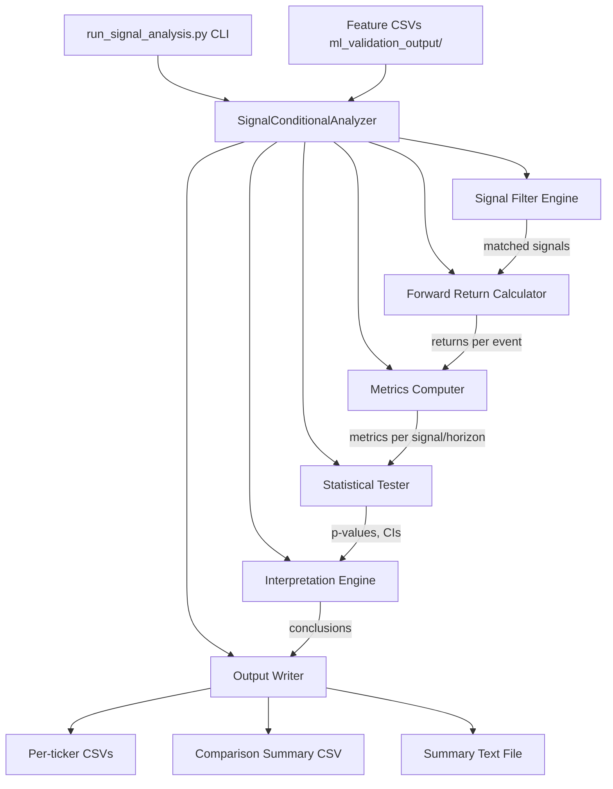

# Design Document: VPA Signal-Conditional Analysis

## Overview

This design describes the `SignalConditionalAnalyzer` - a statistical analysis pipeline that isolates high-conviction VPA signal events (firing on ~3-10% of trading days) and measures their directional hit rate over 3, 5, and 10 trading-day forward-return horizons. The module evaluates 5 signal types across 11 tickers, computes hit-rate metrics with statistical significance testing, and produces structured CSV and text output artefacts.

The key insight driving this work: SP-312 showed VPA composite score as a daily predictor yields ~50% accuracy. This analysis shifts the question from "does VPA predict tomorrow?" to "when VPA fires a strong signal, does the market move in the expected direction over the next 3-10 days?"

### Design Decisions

1. **Single-class design** - `SignalConditionalAnalyzer` encapsulates the full pipeline (filter, compute, test, output) mirroring the existing `AnalysisScript` pattern.
2. **Dataclass results** - Per-signal metrics are captured in frozen dataclasses for immutability and testability.
3. **No cross-ticker aggregation of raw data** - Each ticker is processed independently; cross-ticker summary is computed from per-ticker metrics only.
4. **Deterministic output** - Seeded RNG (numpy random_state 42) and sorted outputs ensure bit-for-byte reproducibility.

## Architecture



### Data Flow

1. **Load** - Read `{ticker}_vpa_features.csv`, sort by date, drop NaN close rows.
2. **Filter** - Apply 5 signal filters to each row, producing a mapping of `SignalType -> list[row_index]`.
3. **Compute Returns** - For each signal event, compute forward returns at t+3, t+5, t+10 (excluding events with insufficient future data).
4. **Compute Metrics** - For each (signal_type, horizon) pair: hit_rate, avg_win, avg_loss, profit_factor, signals_per_year.
5. **Statistical Test** - Binomial test against base rate + bootstrap CI (10000 resamples, seed 42).
6. **Interpret** - Apply hit-rate band logic to median cross-ticker results.
7. **Output** - Write per-ticker CSVs, comparison CSV, and summary text.

## Components and Interfaces

### Module: `vpa/ml_validation/signal_analysis.py`

```python
from dataclasses import dataclass
from enum import Enum
from pathlib import Path
from typing import Optional

import numpy as np
import pandas as pd
from scipy import stats

from vpa.ml_validation.exceptions import InsufficientDataError


class SignalType(Enum):
    STRONG_BULLISH = "strong_bullish"
    STRONG_BEARISH = "strong_bearish"
    ACCUMULATION = "accumulation"
    DISTRIBUTION = "distribution"
    ACCUMULATION_TEST_PASS = "accumulation_test_pass"


class SignalDirection(Enum):
    UP = "up"
    DOWN = "down"


SIGNAL_DIRECTIONS: dict[SignalType, SignalDirection] = {
    SignalType.STRONG_BULLISH: SignalDirection.UP,
    SignalType.STRONG_BEARISH: SignalDirection.DOWN,
    SignalType.ACCUMULATION: SignalDirection.UP,
    SignalType.DISTRIBUTION: SignalDirection.DOWN,
    SignalType.ACCUMULATION_TEST_PASS: SignalDirection.UP,
}

FORWARD_HORIZONS: list[int] = [3, 5, 10]


@dataclass(frozen=True)
class SignalMetrics:
    signal_type: SignalType
    horizon_days: int
    event_count: int
    hit_rate: Optional[float]
    base_rate: Optional[float]
    p_value: Optional[float]
    ci_lower: Optional[float]
    ci_upper: Optional[float]
    avg_win: Optional[float]
    avg_loss: Optional[float]
    profit_factor: Optional[float]
    signals_per_year: Optional[float]


@dataclass(frozen=True)
class CrossTickerSummary:
    signal_type: SignalType
    horizon_days: int
    median_hit_rate: Optional[float]
    mean_hit_rate: Optional[float]
    significant_ticker_count: int
    total_ticker_count: int
    median_profit_factor: Optional[float]
    best_ticker: Optional[str]
    best_hit_rate: Optional[float]
    worst_ticker: Optional[str]
    worst_hit_rate: Optional[float]
    conclusion: str


class SignalConditionalAnalyzer:
    TICKER_UNIVERSE: list[str] = [
        "SPY", "AAPL", "MSFT", "NVDA", "TSLA",
        "AMD", "KO", "JNJ", "CAT", "BA", "XOM",
    ]
    COMPOSITE_THRESHOLD: float = 15.0
    ACC_DIST_SCORE_THRESHOLD: float = 15.0
    MIN_EVENTS_FOR_STATS: int = 5
    MIN_ROWS_FOR_ANALYSIS: int = 2
    BOOTSTRAP_RESAMPLES: int = 10000
    BOOTSTRAP_SEED: int = 42

    def __init__(self, output_dir: Path):
        self.output_dir = Path(output_dir)

    def load_dataset(self, ticker: str) -> pd.DataFrame: ...
    def classify_signals(self, df: pd.DataFrame) -> dict[SignalType, list[int]]: ...
    def compute_forward_returns(self, df: pd.DataFrame, indices: list[int], horizon: int) -> np.ndarray: ...
    def compute_base_rate(self, df: pd.DataFrame, horizon: int) -> float: ...
    def compute_metrics(self, returns: np.ndarray, signal_type: SignalType, horizon: int, base_rate: float, dataset_years: float) -> SignalMetrics: ...
    def binomial_test(self, hits: int, n: int, base_rate: float) -> float: ...
    def bootstrap_ci(self, hit_miss_array: np.ndarray) -> tuple[float, float]: ...
    def analyse_ticker(self, ticker: str) -> list[SignalMetrics]: ...
    def compute_cross_ticker_summary(self, all_metrics: dict[str, list[SignalMetrics]]) -> list[CrossTickerSummary]: ...
    def interpret(self, median_hit_rate: float, significant_count: int, total_count: int) -> str: ...
    def write_per_ticker_csv(self, ticker: str, metrics: list[SignalMetrics]) -> None: ...
    def write_comparison_csv(self, summaries: list[CrossTickerSummary]) -> None: ...
    def write_summary_text(self, summaries: list[CrossTickerSummary]) -> None: ...
    def run(self) -> None: ...
```

### Module: `vpa/ml_validation/run_signal_analysis.py`

```python
import argparse
from pathlib import Path
import numpy as np
from vpa.ml_validation.signal_analysis import SignalConditionalAnalyzer

def main(output_dir: str = "ml_validation_output"):
    np.random.seed(42)
    analyzer = SignalConditionalAnalyzer(output_dir=Path(output_dir))
    analyzer.run()

if __name__ == "__main__":
    parser = argparse.ArgumentParser(description="VPA Signal-Conditional Analysis")
    parser.add_argument("--output-dir", type=str, default="ml_validation_output")
    args = parser.parse_args()
    main(output_dir=args.output_dir)
```

### Key Method Contracts

| Method | Input | Output | Notes |
|--------|-------|--------|-------|
| `load_dataset` | ticker string | DataFrame sorted by date, NaN-close rows dropped | Raises `InsufficientDataError` if < 2 rows remain |
| `classify_signals` | cleaned DataFrame | `{SignalType: [row_indices]}` | NaN fields -> no match for that filter |
| `compute_forward_returns` | DataFrame, indices, horizon | array of floats | Excludes events with insufficient future rows or zero close |
| `compute_metrics` | returns array, signal_type, horizon, base_rate, years | `SignalMetrics` | Returns metrics with None fields if < MIN_EVENTS_FOR_STATS |
| `binomial_test` | hits, n, base_rate | p-value float | Two-sided binomial test via scipy |
| `bootstrap_ci` | binary array | (ci_lower, ci_upper) | 10000 resamples, seed 42, 2.5th/97.5th percentiles |
| `interpret` | median_hit_rate, sig_count, total_count | conclusion string | Applies Req 7 band logic |

## Data Models

### Input: Feature Dataset CSV

| Column | Type | Description |
|--------|------|-------------|
| `date` | ISO 8601 string | Trading date |
| `close` | float | Closing price |
| `composite_score` | float | VPA composite score (-100 to 100 range) |
| `acc_dist_flag` | int (0/1) | Accumulation/distribution detected |
| `acc_dist_type` | int (-1/0/1) | Type: 1=accumulation, -1=distribution |
| `acc_dist_score` | float | Accumulation/distribution strength score |

### Signal Classification Rules

| Signal Type | Filter Condition | Direction |
|-------------|-----------------|-----------|
| Strong Bullish | `composite_score >= 15` | UP |
| Strong Bearish | `composite_score <= -15` | DOWN |
| Accumulation | `acc_dist_flag == 1 AND acc_dist_type == 1` | UP |
| Distribution | `acc_dist_flag == 1 AND acc_dist_type == -1` | DOWN |
| Accumulation Test Pass | `acc_dist_flag == 1 AND acc_dist_type == 1 AND acc_dist_score >= 15` | UP |

### Output: Per-Ticker CSV Schema

File: `ml_validation_output/{ticker}_signal_analysis.csv`

| Column | Type | Format |
|--------|------|--------|
| signal_type | string | enum value name |
| horizon_days | int | 3, 5, or 10 |
| event_count | int | integer |
| hit_rate | float | 4 decimal places |
| base_rate | float | 4 decimal places |
| p_value | float | 4 decimal places |
| ci_lower | float | 4 decimal places |
| ci_upper | float | 4 decimal places |
| avg_win | float | 4 decimal places |
| avg_loss | float | 4 decimal places |
| profit_factor | float | 4 decimal places |
| signals_per_year | float | 1 decimal place |

### Output: Cross-Ticker Summary CSV Schema

File: `ml_validation_output/signal_comparison_summary.csv`

| Column | Type | Format |
|--------|------|--------|
| signal_type | string | enum value name |
| horizon_days | int | 3, 5, or 10 |
| median_hit_rate | float | 4 decimal places |
| mean_hit_rate | float | 4 decimal places |
| significant_ticker_count | int | integer |
| total_ticker_count | int | integer |
| median_profit_factor | float | 4 decimal places |
| best_ticker | string | ticker symbol |
| best_hit_rate | float | 4 decimal places |
| worst_ticker | string | ticker symbol |
| worst_hit_rate | float | 4 decimal places |

### Interpretation Bands

| Condition | Conclusion |
|-----------|-----------|
| median_hit_rate < 45% AND >=1 ticker p < 0.05 | "Reliable contrarian indicator - invert the signal" |
| median_hit_rate <= 55% AND >50% tickers p >= 0.05 | "Signal is noise - remove or reduce signal weight" |
| 55% < median_hit_rate < 60% AND >=1 ticker p < 0.05 | "Weak but real edge - keep signal, consider as filter only" |
| median_hit_rate >= 60% AND >=1 ticker p < 0.01 | "Strong signal - build trading strategy around this event type" |
| None of the above | "Inconclusive - insufficient statistical evidence" |

Note: The contrarian criterion (< 45%) takes precedence over the noise criterion when both conditions are met.

## Correctness Properties

### Property 1: Signal classification completeness

*For any* Feature_Dataset row where composite_score >= 15, the classify_signals method SHALL include that row's index in the STRONG_BULLISH signal set. Symmetrically, rows with composite_score <= -15 SHALL appear in STRONG_BEARISH, rows with acc_dist_flag == 1 AND acc_dist_type == 1 in ACCUMULATION, rows with acc_dist_flag == 1 AND acc_dist_type == -1 in DISTRIBUTION, and rows matching all three accumulation conditions plus acc_dist_score >= 15 in ACCUMULATION_TEST_PASS.

**Validates: Requirements 1.1, 1.2, 1.3, 1.4, 1.5**

### Property 2: Signal non-exclusivity

*For any* Feature_Dataset row that satisfies the filter conditions of multiple Signal_Types simultaneously, that row's index SHALL appear in ALL matching signal sets.

**Validates: Requirements 1.6**

### Property 3: NaN signal field handling

*For any* Feature_Dataset row where one or more of composite_score, acc_dist_flag, acc_dist_type, or acc_dist_score is NaN, that row SHALL NOT appear in any signal set that depends on the NaN field. Fields that are not NaN SHALL still be evaluated normally.

**Validates: Requirements 1.7, 8.2**

### Property 4: Forward return formula correctness

*For any* signal event at row index t where at least N rows exist after t and close[t] > 0, the computed N-day forward return SHALL equal close[t+N] / close[t] - 1 to within floating-point tolerance (1e-10).

**Validates: Requirements 2.1, 2.2, 2.3, 2.5**

### Property 5: Forward return exclusion on insufficient data

*For any* signal event at row index t where fewer than N rows exist after t in the dataset, that event SHALL NOT be included in the N-day horizon analysis. Events with close[t] == 0 SHALL be excluded from all horizons.

**Validates: Requirements 2.4, 2.6**

### Property 6: Hit rate direction correctness

*For any* bullish Signal_Type with a set of forward returns, hit_rate SHALL equal the count of returns > 0 divided by total count. *For any* bearish Signal_Type, hit_rate SHALL equal the count of returns < 0 divided by total count. Returns exactly equal to zero count as misses in both cases.

**Validates: Requirements 3.1, 3.2**

### Property 7: Profit factor boundary conditions

*For any* set of forward returns where all are hits (zero misses), profit_factor SHALL be float('inf'). *For any* set where all are misses (zero hits), profit_factor SHALL be 0.0. *For any* mixed set, profit_factor SHALL equal sum(abs(winning_returns)) / sum(abs(losing_returns)).

**Validates: Requirements 3.5, 3.7, 3.8**

### Property 8: Base rate independence from signal events

*For any* ticker dataset, the Base_Rate for a given horizon SHALL be computed from ALL rows in the dataset that have sufficient future data, not just signal rows.

**Validates: Requirements 4.1**

### Property 9: Bootstrap reproducibility

*For any* binary hit/miss array, running bootstrap_ci twice with the same seed (42) SHALL produce identical (ci_lower, ci_upper) values to within floating-point tolerance.

**Validates: Requirements 4.4, 8.4**

### Property 10: Interpretation precedence

*For any* Signal_Type with median_hit_rate < 45% AND at least one ticker showing p < 0.05, the conclusion SHALL be the contrarian conclusion regardless of whether the noise criterion is also satisfied.

**Validates: Requirements 7.4**

### Property 11: Deterministic output

*For any* set of input Feature_Dataset CSVs, running the full pipeline twice SHALL produce bit-for-byte identical output files.

**Validates: Requirements 8.5**

## Error Handling

### Error Categories

| Error | Trigger | Handling |
|---|---|---|
| Missing CSV file | `{ticker}_vpa_features.csv` not found at expected path | Log warning with ticker name, skip ticker, continue |
| Malformed CSV file | File exists but cannot be parsed as valid CSV | Log warning identifying the file, skip ticker, continue |
| `InsufficientDataError` | Ticker dataset has fewer than 2 usable rows after NaN exclusion | Raised from `load_dataset()`; caught in `run()`, logged, ticker skipped |
| NaN in close column | Rows with NaN close prices in loaded dataset | Silently dropped during `load_dataset()` before any computation |
| NaN in signal fields | Rows with NaN in signal columns | Row treated as non-matching for filters that depend on the NaN field |
| Zero close price | `close[t] == 0` for a signal event | Event excluded from all forward return calculations |
| Insufficient events for stats | Signal_Type has < 5 events for a ticker/horizon | p_value, ci_lower, ci_upper set to NaN; note added to CSV |
| Insufficient ticker coverage | Fewer than 3 tickers have data for a Signal_Type/horizon | Cross-ticker summary includes note about insufficient coverage |
| All tickers missing | No valid datasets loaded for any ticker | Pipeline raises `InsufficientDataError` and terminates |

### Error Propagation Strategy

- **Fatal errors** (no valid tickers at all): `InsufficientDataError` raised, pipeline terminates with descriptive message to stdout.
- **Recoverable errors** (missing/malformed single ticker, insufficient events): Logged as warning, ticker or metric skipped, pipeline continues.
- **Silent handling** (NaN rows, zero close): Rows/events excluded without warning since this is expected data quality handling.

## Testing Strategy

### Dual Testing Approach

Property-based tests (Hypothesis) cover the pure computational logic exhaustively via randomised inputs. Unit tests cover integration points, file I/O, edge cases, and specific formatting.

### Property-Based Tests

**Library:** [Hypothesis](https://hypothesis.readthedocs.io/)

**Configuration:** Minimum 100 examples per property test (`@settings(max_examples=100)`)

| Property | Component Under Test | Generator Strategy |
|---|---|---|
| 1: Classification completeness | `classify_signals()` | Random DataFrames with composite_score in [-30, 30], acc_dist fields in valid ranges |
| 2: Non-exclusivity | `classify_signals()` | DataFrames specifically constructed to match multiple filters |
| 3: NaN handling | `classify_signals()` | DataFrames with random NaN insertions in signal fields |
| 4: Forward return formula | `compute_forward_returns()` | Random price sequences (positive floats) |
| 5: Exclusion on insufficient data | `compute_forward_returns()` | Short DataFrames (length 1 to 15) |
| 6: Hit rate direction | `compute_metrics()` | Random arrays of positive and negative floats |
| 7: Profit factor bounds | `compute_metrics()` | All-positive arrays, all-negative arrays, mixed arrays |
| 8: Base rate independence | `compute_base_rate()` | Random DataFrames with forward returns pre-computed |
| 9: Bootstrap reproducibility | `bootstrap_ci()` | Random binary arrays, run twice |
| 10: Interpretation precedence | `interpret()` | Random (median_hit_rate, sig_count, total_count) triples |
| 11: Deterministic output | `run()` (integration) | Fixed test dataset, run twice, compare outputs |

### Unit Tests

**Edge cases:**
- Zero signal events for a type - metrics report insufficient data
- All wins (100% hit rate) - profit factor is inf
- All losses (0% hit rate) - profit factor is 0
- Single event - metrics computed but stats skipped (< 5 events)
- Dataset with exactly 2 rows - analysis proceeds
- Dataset with 1 row - InsufficientDataError raised
- All signal fields NaN - empty signal sets for all types
- Zero close price - event excluded

**Integration tests:**
- Full pipeline with known test data produces expected CSV output
- Missing ticker file logged and skipped
- CLI entry point runs without error
- Output files have correct column headers
- Numeric formatting matches spec (4 decimal places)

### Test File Structure

```
vpa/
  tests/
    ml_validation/
      test_signal_analysis.py       # Property tests 1-11 + unit tests + integration
```

### Running Tests

```bash
# All signal analysis tests
pytest vpa/tests/ml_validation/test_signal_analysis.py -v

# Property tests only
pytest vpa/tests/ml_validation/test_signal_analysis.py -v -k "property"

# Quick smoke test
pytest vpa/tests/ml_validation/test_signal_analysis.py -v -k "not slow"
```
