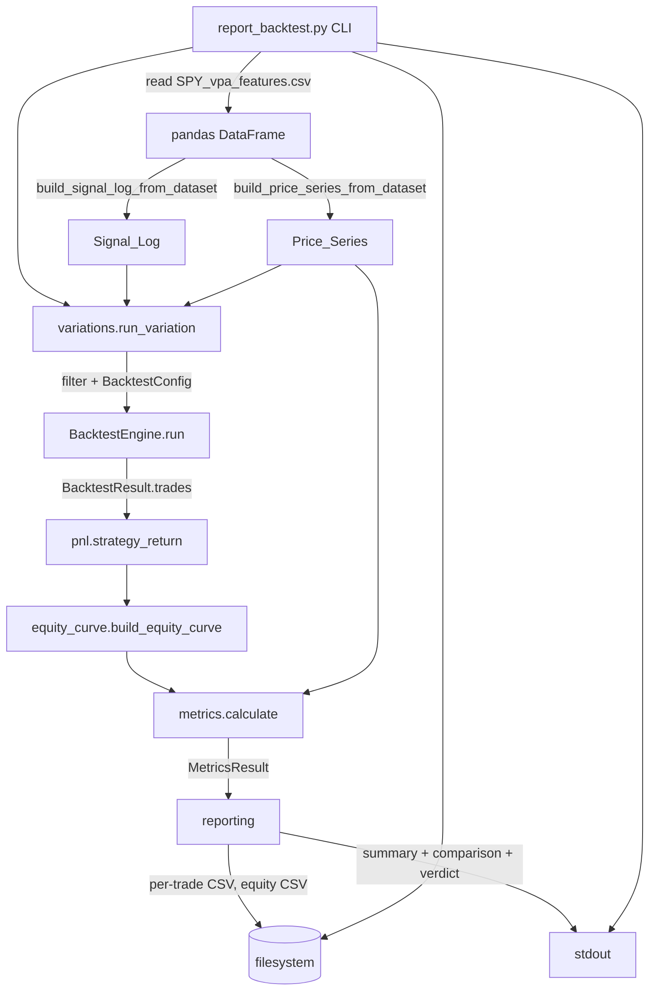
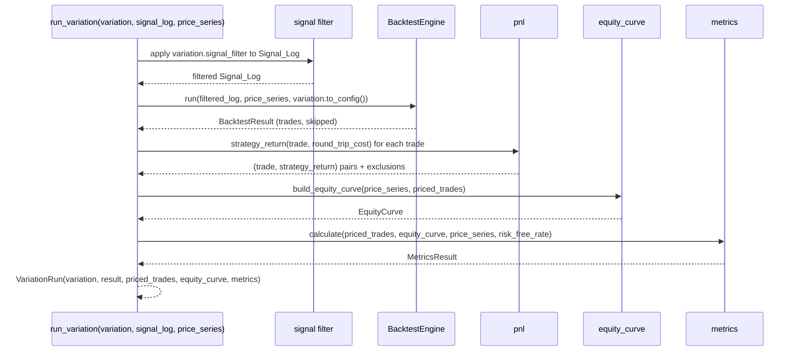

# Design Document: VPA Strategy Backtest Report (SP-333)

## Overview

SP-333 turns the deterministic per-trade log produced by the SP-317 `BacktestEngine` into a full
strategy performance report: direction-aware P&L, a daily equity curve, a performance-metrics suite,
a strategy-vs-buy-and-hold comparison, and a tradeability verdict for SPY VPA signals.

The design is strictly additive. The existing engine (`BacktestEngine`, `BacktestConfig`,
`FixedHoldExitStrategy`, the `ExitStrategy` Protocol, `PositionMode`, and the dataset builders) is
reused unchanged. New behaviour is delivered through:

- **A new `StopLossExitStrategy`** implementing the existing `ExitStrategy` Protocol
  (`resolve_exit(entry_index, price_series, hold_period) -> ExitResult`). It wraps a
  `FixedHoldExitStrategy` for the hold-boundary fallback and adds path-based stop detection.
- **New pure modules** that consume a `BacktestResult`: `pnl.py` (direction-aware per-trade return),
  `equity_curve.py` (daily equity series), `metrics.py` (the metrics suite + `MetricsResult`),
  `variations.py` (the `StrategyVariation` config and the catalogue of variations), and
  `reporting.py` (CSV + stdout rendering, comparison table, tradeability conclusion).
- **A new CLI entry** `report_backtest.py` — the only component that touches the filesystem (loading
  the SPY dataset and writing CSV files).

### Purity boundary

The engine core, all exit strategies, `pnl`, `equity_curve`, and `metrics` are **pure**: they operate
only on caller-supplied in-memory values, perform no network/filesystem access, and never import
`yfinance`. Only `report_backtest.py` (and its thin orchestration helpers) read the dataset and write
CSVs. `reporting.py` prints to stdout via an injectable writer so it can be tested without touching
the filesystem. This preserves the SP-317 determinism guarantee (Req 1, Req 2).

### Design decisions and rationale

- **DOWN P&L computed from raw prices, not `return_pct`.** `TradeRecord.return_pct` is the long-basis
  net return `exit/entry - 1 - cost`. Deriving the short return from it would double-count the embedded
  long cost. So for DOWN trades we compute `(entry_price / exit_price) - 1 - round_trip_cost` from the
  raw prices, subtracting the cost exactly once (Req 8.2, 8.4). This means `pnl` needs the
  `round_trip_cost` used for the run; it is carried on the `StrategyVariation` and threaded through.
- **Direction resolved from `SIGNAL_DIRECTIONS`.** `TradeRecord` carries `signal_type` but not
  direction, so `pnl`/`metrics` map `signal_type -> SignalDirection` via the existing
  `SIGNAL_DIRECTIONS` table (Req 5.2, 8). A signal type absent from the map is excluded with an
  indication (Req 8.6).
- **`StopLossExitStrategy` implements the Protocol, does not subclass the engine.** New exit behaviour
  plugs in through `BacktestConfig.exit_strategy`; the engine is never modified, subclassed, or
  monkeypatched (Req 1.4, 7.1).
- **Metrics are computed off the equity curve, not re-derived from trades.** Sharpe, drawdown, total
  return, and time-in-market all read the single canonical equity curve so the numbers are internally
  consistent (Req 9-14).

## Architecture

### Module layout

All new modules live under `vpa/backtesting/`, alongside the reused SP-317 files.

```
vpa/backtesting/
  engine.py              # SP-317, REUSED UNCHANGED
  config.py              # SP-317, REUSED UNCHANGED
  models.py              # SP-317, REUSED UNCHANGED (PricePoint, TradeRecord, ExitResult, ...)
  exit_strategy.py       # SP-317 ExitStrategy Protocol + FixedHoldExitStrategy;
                         #   EXTENDED with StopLossExitStrategy (pure, Protocol-conformant)
  signal_log_builder.py  # SP-317, REUSED UNCHANGED (dataset builders)
  run_backtest.py        # SP-317 counts-only CLI, REUSED UNCHANGED

  pnl.py                 # NEW  direction-aware per-trade Strategy_Return (pure)
  equity_curve.py        # NEW  daily equity-curve construction (pure)
  metrics.py             # NEW  MetricsResult + Metrics_Calculator (pure)
  variations.py          # NEW  StrategyVariation config + variation catalogue + runner (pure)
  reporting.py           # NEW  CSV rows, stdout summary, comparison table, verdict (pure render)
  report_backtest.py     # NEW  CLI: dataset load + CSV write (ONLY filesystem-touching module)
```

### Component flow



### Per-variation pipeline



The runner calls `BacktestEngine.run` exactly once per variation and configures hold period, exit
strategy, and position mode purely through `BacktestConfig` fields (Req 1.1, 1.4). If the engine
raises for one variation, that variation is recorded as failed and the remaining variations continue
(Req 1.5, 6.4, 19.5).

## Components and Interfaces

All signatures target Python 3.11, ruff line-length 120, double quotes.

### 1. `StopLossExitStrategy` (extends `exit_strategy.py`)

Implements the existing `ExitStrategy` Protocol. Pure: reads only the supplied `price_series`.

```python
from vpa.ml_validation.signal_analysis import SignalDirection

@dataclass(frozen=True)
class StopLossExitStrategy:
    """Path-based stop-loss exit resolving on the first forward stop breach (Req 7).

    ``threshold`` is a negative fraction (e.g. -0.02 for -2%). ``direction`` selects
    the long vs short stop test. Falls back to the fixed-hold exit price when the
    stop is not breached within ``hold_period`` (Req 7.8).
    """

    threshold: float                      # negative fraction, e.g. -0.02 (Req 7.2, 7.9)
    direction: SignalDirection = SignalDirection.UP
    _fixed_hold: FixedHoldExitStrategy = field(default_factory=FixedHoldExitStrategy)

    def resolve_exit(
        self, entry_index: int, price_series: list[PricePoint], hold_period: int
    ) -> ExitResult: ...
```

Resolution algorithm (Req 7.2-7.8):

1. `entry_price = price_series[entry_index].close`.
2. Long stop price `= entry_price * (1 + threshold)`; short stop price uses the same formula
   (threshold negative), tested against `high` for shorts (Req 7.2, 7.4).
3. Scan forward bars `j` in ascending index order, from `entry_index + 1` up to and including
   `min(entry_index + hold_period, last_index)` (the hold boundary is included so a same-day
   breach wins the tie, Req 7.7):
   - **Long:** breach when `price_series[j].low <= long_stop`. If `price_series[j].open <= long_stop`
     (gapped through), exit price is the day's `open`; otherwise exit price is `long_stop`
     (Req 7.3, 7.5, 7.6).
   - **Short:** breach when `price_series[j].high >= short_stop`. If `price_series[j].open >= short_stop`,
     exit price is `open`; otherwise `short_stop` (Req 7.4, 7.5, 7.6).
   - On the first breach, return `ExitResult(exit_index=j, exit_price=<stop or open>, reason=None)`.
4. No breach within the hold window: delegate to `_fixed_hold.resolve_exit(...)` and return its result
   verbatim (Req 7.8), which also yields `INSUFFICIENT_FUTURE_DATA_EXIT` when the horizon runs past
   the series end.

> Note: because the engine validates the exit price via `_is_valid_price`, `StopLossExitStrategy`
> returns raw prices and lets the engine reject zero/NaN exits, matching `FixedHoldExitStrategy`.

### 2. `pnl.py` — direction-aware per-trade P&L (pure)

```python
@dataclass(frozen=True)
class PricedTrade:
    """A TradeRecord paired with its direction-aware Strategy_Return."""
    trade: TradeRecord
    direction: SignalDirection
    strategy_return: float

@dataclass(frozen=True)
class TradeExclusion:
    """An indication that a trade was excluded from P&L (Req 8.5, 8.6)."""
    trade: TradeRecord
    reason: str            # "exit_price_zero" | "unknown_direction"

def direction_for(signal_type: SignalType) -> SignalDirection | None:
    """SIGNAL_DIRECTIONS lookup; None when the type is absent (Req 8.6)."""

def strategy_return(trade: TradeRecord, round_trip_cost: float) -> float:
    """Direction-aware Strategy_Return for a single trade (Req 8.1-8.4).

    UP:   trade.return_pct
    DOWN: (trade.entry_price / trade.exit_price) - 1 - round_trip_cost   # raw prices, cost once
    """

def price_trades(
    trades: list[TradeRecord], round_trip_cost: float
) -> tuple[list[PricedTrade], list[TradeExclusion]]:
    """Map every trade to a PricedTrade; collect exclusions for exit_price==0
    (Req 8.5) and unknown direction (Req 8.6) without raising."""
```

### 3. `equity_curve.py` — daily equity construction (pure)

```python
@dataclass(frozen=True)
class EquityPoint:
    date: str        # ISO 8601 YYYY-MM-DD
    equity: float

def build_equity_curve(
    price_series: list[PricePoint], priced_trades: list[PricedTrade]
) -> list[EquityPoint]:
    """One EquityPoint per Price_Series date, ascending, starting at 1.0 (Req 9).

    For each date, multiply carried capital by product_over_i(1 + r_i) across all
    trades whose exit_date equals that date; days with no closing trade carry the
    previous capital forward unchanged. The same-day product is order-independent
    (Req 9.4). Empty Price_Series -> empty curve (Req 15.7)."""
```

Same-day closes are grouped by `exit_date` into a `dict[str, list[float]]` of strategy returns; the
per-date multiplier is `math.prod(1 + r for r in returns_that_day)`, which is independent of ordering.

### 4. `metrics.py` — `Metrics_Calculator` (pure)

```python
TRADING_DAYS_PER_YEAR = 252
DEFAULT_RISK_FREE_RATE = 0.04

def calculate(
    priced_trades: list[PricedTrade],
    equity_curve: list[EquityPoint],
    price_series: list[PricePoint],
    risk_free_rate: float = DEFAULT_RISK_FREE_RATE,
) -> MetricsResult:
    """Compute the full metrics suite from the priced trades, the equity curve,
    and the Price_Series. Never raises on empty/degenerate input (Req 15)."""
```

Internal pure helpers (each independently property-testable):

```python
def total_return(equity_curve: list[EquityPoint]) -> float                      # Req 10.1, 10.4, 10.5
def buy_and_hold_return(price_series: list[PricePoint]) -> float                 # Req 10.2, 10.4, 10.5
def annualised_return(total_ret: float, price_series: list[PricePoint]) -> float # Req 11.2, 11.3, 11.5, 11.6
def trades_per_year(n_trades: int, price_series: list[PricePoint]) -> float      # Req 11.4, 11.5
def daily_returns(equity_curve: list[EquityPoint]) -> list[float]               # Req 12.3
def sharpe_ratio(equity_curve, risk_free_rate) -> float                          # Req 12 (sample std N-1)
def max_drawdown(equity_curve: list[EquityPoint]) -> float                       # Req 13
def win_rate(priced_trades) -> float                                             # Req 14.1, 14.2
def profit_factor(priced_trades) -> float                                        # Req 14.4, 15.2, 15.3
def average_win(priced_trades) -> float                                          # Req 14.3, 15.4
def average_loss(priced_trades) -> float                                         # Req 14.3, 15.5
def expectancy(priced_trades) -> float                                           # Req 14.5
def time_in_market(priced_trades, price_series) -> float                         # Req 14.6, 14.7
```

Key formula notes:
- **Sharpe** (Req 12.5-12.8): `daily_rf = risk_free_rate / 252`; sample std uses `statistics.stdev`
  (N-1 divisor). `sharpe = ((mean(daily) - daily_rf) / std) * sqrt(252)`. Returns 0.0 when `std == 0`
  or fewer than two daily returns.
- **Max drawdown** (Req 13): running peak via a single forward pass; drawdown at t is
  `equity_t / peak_t - 1`; result is `min(...)`, clamped to `[-1.0, 0.0]`; 0.0 for empty curve or a
  zero running peak.
- **Annualised return** (Req 11.6): if `total_ret <= -1` return `-1.0` without evaluating the
  negative-base power; if `years == 0` return `0.0` (Req 11.5).
- **Profit factor** (Req 15.2, 15.3): wins but no losses -> `float("inf")`; no wins and no losses
  -> `0.0`.
- **Time in market** (Req 14.6): each position is open `[entry_date, exit_date)`; build a set of the
  Price_Series dates covered by any open interval so overlapping STACKING trades are counted once.

### 5. `variations.py` — strategy configuration + runner (pure)

```python
from collections.abc import Callable

SignalFilter = Callable[[SignalEntry], bool]

@dataclass(frozen=True)
class StrategyVariation:
    """A fully specified, named backtest configuration (Req 3-7)."""
    name: str                                   # e.g. "Baseline", "Contrarian_Only"
    signal_filter: SignalFilter                 # which SignalEntry records to include
    hold_period: int = 10                       # Req 3.2 default
    round_trip_cost: float = 0.001
    position_mode: PositionMode = PositionMode.NO_OVERLAP
    exit_strategy_factory: Callable[[], ExitStrategy] = FixedHoldExitStrategy
    risk_free_rate: float = DEFAULT_RISK_FREE_RATE

    def to_config(self) -> BacktestConfig: ...   # builds BacktestConfig from these fields

@dataclass(frozen=True)
class VariationRun:
    """The full per-variation outcome consumed by reporting."""
    variation: StrategyVariation
    result: BacktestResult
    priced_trades: list[PricedTrade]
    exclusions: list[TradeExclusion]
    equity_curve: list[EquityPoint]
    metrics: MetricsResult

@dataclass(frozen=True)
class VariationFailure:
    """A variation that failed to complete (Req 1.5, 6.4, 19.5)."""
    name: str
    error: str

def build_default_variations() -> list[StrategyVariation]:
    """Baseline, Contrarian_Only, All_Signals, the four Variable_Hold variations
    {5,10,15,20}, the Stop_Loss variations {-0.02,-0.03}, and Signal_Stacking (Req 3-7, 19.4)."""

def validate_hold_period(hold_period: int) -> None:
    """Reject non-int or < 1 with a descriptive error before invoking the engine (Req 6.3)."""

def run_variation(
    variation: StrategyVariation,
    signal_log: list[SignalEntry],
    price_series: list[PricePoint],
) -> VariationRun: ...

def run_variations(
    variations: list[StrategyVariation],
    signal_log: list[SignalEntry],
    price_series: list[PricePoint],
) -> tuple[list[VariationRun], list[VariationFailure]]:
    """Run each variation, isolating engine errors per variation (Req 1.5, 6.4)."""
```

Variation filters (Req 3.1, 4.1, 5.1):
- **Baseline** — accepts every `SignalEntry` (no type filter), hold 10, `FixedHoldExitStrategy`,
  NO_OVERLAP (Req 3).
- **Contrarian_Only** — accepts only `DISTRIBUTION` and `STRONG_BEARISH`; both are DOWN signals, so
  P&L treats them as shorts (Req 4).
- **All_Signals** — accepts every entry whose `signal_type` is in `SIGNAL_DIRECTIONS`; unknown types
  are excluded with an indication (Req 5.3).
- **Variable_Hold {5,10,15,20}** — four Baseline-style variations differing only in `hold_period`
  (Req 6.1).
- **Stop_Loss {-0.02,-0.03}** — `exit_strategy_factory` builds a `StopLossExitStrategy` at that
  threshold (Req 7.9).
- **Signal_Stacking** — `position_mode = STACKING` (Req 7.10).

### 6. `reporting.py` — rendering (pure)

```python
PER_TRADE_HEADER = ["entry_date", "exit_date", "entry_price", "exit_price",
                    "signal_type", "signal_direction", "strategy_return"]   # Req 16.2
EQUITY_HEADER = ["date", "equity"]                                          # Req 17.2

def per_trade_rows(run: VariationRun) -> list[list[str]]:
    """Header + one row per PricedTrade, ordered by (entry_date, exit_date) (Req 16.2, 16.3, 16.4)."""

def equity_rows(equity_curve: list[EquityPoint]) -> list[list[str]]:
    """Header + one row per date, ascending (Req 17)."""

def variation_filename(name: str, kind: str) -> str:
    """Unique, filesystem-safe name, e.g. 'baseline_trades.csv' (Req 16.1)."""

def format_summary(run: VariationRun) -> str:
    """Multi-line stdout summary: variation name, trade count, every metric on its
    own 'name: value' line; prints 0 trades when empty (Req 18)."""

def format_comparison_table(
    runs: list[VariationRun], failures: list[VariationFailure],
    buy_and_hold: float, bnh_annualised: float,
) -> str:
    """One row per completed variation + a buy-and-hold SPY row, columns
    Total_Return / Annualised_Return / Sharpe_Ratio / Max_Drawdown; names failed
    variations (Req 19)."""

def select_best(runs: list[VariationRun]) -> VariationRun | None:
    """Best by highest Sharpe, tie-break highest Total_Return, then ascending name (Req 20.1, 20.2)."""

def format_tradeability_conclusion(runs: list[VariationRun], buy_and_hold: float) -> str:
    """Name the best variation and state whether its Total_Return is strictly greater
    than buy_and_hold; otherwise state the edges are not tradeable after costs (Req 20)."""
```

### 7. `report_backtest.py` — CLI (only filesystem access)

```python
def load_spy_dataset(output_dir: str = "ml_validation_output") -> pd.DataFrame:
    """Read ml_validation_output/SPY_vpa_features.csv. FileNotFoundError terminates
    without a report (Req 21.2); builder KeyErrors propagate unchanged (Req 21.3)."""

def main(output_dir: str = "ml_validation_output",
         out_dir: str = "ml_validation_output",
         risk_free_rate: float = DEFAULT_RISK_FREE_RATE) -> None:
    """Load SPY, build Signal_Log/Price_Series, run all default variations, write
    per-trade + equity CSVs, print summaries, comparison table, and verdict."""
```

## Data Models

All new records are frozen dataclasses, matching the SP-317 convention (immutability, safe reuse).
Reused SP-317 types are not redefined.

### Reused from SP-317 (`models.py`, unchanged)

| Type | Key fields |
|---|---|
| `PricePoint` | `date`, `open`, `high`, `low`, `close` |
| `SignalEntry` | `date`, `signal_type: SignalType`, `direction: SignalDirection` |
| `TradeRecord` | `entry_date`, `exit_date`, `entry_price`, `exit_price`, `return_pct`, `signal_type` |
| `ExitResult` | `exit_index`, `exit_price`, `reason` |
| `BacktestResult` | `trades: list[TradeRecord]`, `skipped: list[SkippedSignal]` |
| `PositionMode` | `NO_OVERLAP`, `STACKING` |
| `SignalType` / `SignalDirection` / `SIGNAL_DIRECTIONS` | from `ml_validation.signal_analysis` |

### New records

```python
@dataclass(frozen=True)
class PricedTrade:
    trade: TradeRecord
    direction: SignalDirection
    strategy_return: float

@dataclass(frozen=True)
class TradeExclusion:
    trade: TradeRecord
    reason: str                      # "exit_price_zero" | "unknown_direction"

@dataclass(frozen=True)
class EquityPoint:
    date: str
    equity: float

@dataclass(frozen=True)
class MetricsResult:
    """Complete metrics suite for one Strategy_Variation (Req 10-15, 18, 19)."""
    total_return: float
    annualised_return: float
    buy_and_hold_return: float
    sharpe_ratio: float
    max_drawdown: float
    win_rate: float
    profit_factor: float             # may be float("inf") (Req 15.2)
    average_win: float
    average_loss: float
    expectancy: float
    time_in_market: float
    number_of_trades: int
    trades_per_year: float
    notes: tuple[str, ...] = ()      # zero-denominator / exclusion indications (Req 10.5, 13.5)

@dataclass(frozen=True)
class StrategyVariation:
    name: str
    signal_filter: Callable[[SignalEntry], bool]
    hold_period: int = 10
    round_trip_cost: float = 0.001
    position_mode: PositionMode = PositionMode.NO_OVERLAP
    exit_strategy_factory: Callable[[], ExitStrategy] = FixedHoldExitStrategy
    risk_free_rate: float = 0.04

@dataclass(frozen=True)
class VariationRun:
    variation: StrategyVariation
    result: BacktestResult
    priced_trades: list[PricedTrade]
    exclusions: list[TradeExclusion]
    equity_curve: list[EquityPoint]
    metrics: MetricsResult

@dataclass(frozen=True)
class VariationFailure:
    name: str
    error: str
```

### The no-trades / empty `MetricsResult`

When a variation produces zero trades (or the Price_Series is empty), `metrics.calculate` returns a
`MetricsResult` with `total_return`, `annualised_return`, `sharpe_ratio`, `max_drawdown`, `win_rate`,
`profit_factor`, `average_win`, `average_loss`, `expectancy`, `time_in_market`, and `trades_per_year`
all `0.0`, and `number_of_trades = 0` — never raising (Req 15.1, 15.7). `buy_and_hold_return` is still
computed from the Price_Series when it has >= 2 points.

## Correctness Properties

*A property is a characteristic or behavior that should hold true across all valid executions of a
system-essentially, a formal statement about what the system should do. Properties serve as the bridge
between human-readable specifications and machine-verifiable correctness guarantees.*

The pure numeric core of this feature (direction-aware P&L, equity-curve construction, and the metric
formulas) is an excellent fit for property-based testing: the functions are pure, behaviour varies
richly with input, the input space (prices, returns, date spans) is large, and 100+ generated cases
find edge cases that hand-picked examples miss. Rendering, dataset loading, and orchestration
(Req 16-21) are covered by example/integration tests instead (see Testing Strategy).

Following the property reflection, redundant properties were consolidated: separate "adds a row" and
"total-return sign" checks fold into the equity-curve compounding and total-return properties; the
per-direction P&L checks combine into the direction-aware P&L property plus the cost-once invariant.

### Property 1: Stop price formula

*For any* positive entry price and any stop threshold expressed as a negative fraction, the stop price
computed by `StopLossExitStrategy` equals `entry_price * (1 + threshold)` and is strictly less than the
entry price.

**Validates: Requirements 7.2**

### Property 2: Stop breach resolves at the first breaching bar

*For any* price path where a stop is breached within the hold window, `StopLossExitStrategy` resolves
the exit on the earliest forward bar (ascending index) that breaches the stop — for a long, the first
bar with `low <= stop`; for a short, the first bar with `high >= stop` — at the stop price, or at that
bar's `open` when the open has already gapped past the stop.

**Validates: Requirements 7.3, 7.4, 7.5, 7.6**

### Property 3: No breach falls back to the fixed-hold exit

*For any* price path in which the stop is never breached within the hold window, `StopLossExitStrategy`
returns exactly the `ExitResult` that `FixedHoldExitStrategy` returns for the same entry index and hold
period.

**Validates: Requirements 7.7, 7.8**

### Property 4: Direction-aware P&L

*For any* trade, when its Signal_Direction is UP the Strategy_Return equals `TradeRecord.return_pct`;
when its Signal_Direction is DOWN the Strategy_Return equals `(entry_price / exit_price) - 1 - round_trip_cost`
computed from the raw entry and exit prices.

**Validates: Requirements 8.1, 8.2, 8.3**

### Property 5: Round-trip cost applied exactly once for DOWN trades

*For any* DOWN trade and any non-negative round-trip cost, the Strategy_Return equals the raw
short-equivalent return `(entry_price / exit_price) - 1` minus the round-trip cost exactly once (it is
never derived from, and never additionally penalised by, the cost already embedded in
`TradeRecord.return_pct`).

**Validates: Requirements 8.4**

### Property 6: Equity-curve length and initial value invariant

*For any* Price_Series and any set of priced trades, the equity curve has exactly one point per
Price_Series date in ascending date order, and its first point equals the starting capital of 1.0.

**Validates: Requirements 9.1, 9.2, 9.6**

### Property 7: Same-day compounding is order-independent

*For any* set of trades closing on the same date, the equity carried after that date is
`capital_before * product_over_i(1 + Strategy_Return_i)` and is invariant under any permutation of the
order in which those closing trades are applied; days with no closing trade carry the previous capital
forward unchanged.

**Validates: Requirements 9.3, 9.4, 9.5**

### Property 8: Total return and buy-and-hold formulas

*For any* equity curve with two or more points, `Total_Return == final_equity / initial_equity - 1`;
*for any* Price_Series with two or more points, `Buy_And_Hold_Return == last_close / first_close - 1`.

**Validates: Requirements 10.1, 10.2, 10.3**

### Property 9: Annualisation formula and guards

*For any* total return and Price_Series with `years > 0` and `Total_Return > -1`,
`Annualised_Return == (1 + Total_Return) ** (1 / years) - 1` where `years == (distinct_dates - 1) / 252`;
and `Trades_Per_Year == number_of_trades / years`.

**Validates: Requirements 11.2, 11.3, 11.4**

### Property 10: Sharpe ratio equals the reference computation

*For any* equity curve with two or more daily returns and non-zero sample standard deviation, the
Sharpe ratio equals `((mean_daily_return - risk_free_rate / 252) / sample_std_daily_return) * sqrt(252)`,
where the sample standard deviation uses the N-1 divisor.

**Validates: Requirements 12.3, 12.4, 12.5, 12.6**

### Property 11: Max drawdown is the deepest peak-relative decline and lies in [-1, 0]

*For any* equity curve, the Max_Drawdown equals the minimum over all t of
`equity_at_t / running_peak_at_t - 1`, and the reported value always lies in the closed interval
`[-1.0, 0.0]`; a never-declining curve yields 0.0.

**Validates: Requirements 13.1, 13.2, 13.3**

### Property 12: Win rate lies in [0, 1] and expectancy is the mean strategy return

*For any* set of priced trades, `Win_Rate == number_of_wins / number_of_trades` lies in `[0, 1]`
(zero-return trades count in the denominator but as neither win nor loss), and `Expectancy` equals the
arithmetic mean of the Strategy_Return values across all trades.

**Validates: Requirements 14.1, 14.2, 14.5**

### Property 13: Profit factor equals wins over absolute losses

*For any* set of priced trades containing at least one winning and at least one losing trade,
`Profit_Factor == sum_of_winning_returns / abs(sum_of_losing_returns)`.

**Validates: Requirements 14.4**

### Property 14: Time in market counts each open day once and lies in [0, 1]

*For any* set of priced trades (including overlapping STACKING trades) over a Price_Series,
`Time_In_Market == days_with_an_open_position / total_days_in_span`, where a position is open on
`[entry_date, exit_date)`, each calendar day with any open position is counted exactly once, and the
result lies in `[0, 1]`.

**Validates: Requirements 14.6, 14.7**

### Property 15: Per-trade CSV ordering

*For any* set of priced trades, the per-trade CSV data rows are ordered by `entry_date` ascending and
then by `exit_date` ascending, and every row (and the header) contains exactly the seven columns
`entry_date, exit_date, entry_price, exit_price, signal_type, signal_direction, strategy_return` in
that order.

**Validates: Requirements 16.2, 16.3**

### Property 16: Best-variation selection and tie-break ordering

*For any* set of completed variation runs, `select_best` returns the run with the highest Sharpe ratio;
ties on Sharpe are broken by the highest Total_Return, and remaining ties by ascending variation name.

**Validates: Requirements 20.1, 20.2**

### Property 17: Determinism of the metrics pipeline

*For any* fixed Signal_Log, Price_Series, and risk-free rate, running a variation twice produces
identical priced trades, equity curve, and `MetricsResult`.

**Validates: Requirements 2.2, 2.3**

## Error Handling

The design distinguishes three failure classes: **hard aborts** (terminate the whole report),
**per-variation failures** (isolate and continue), and **graceful exclusions/degenerate values**
(record an indication, never raise).

### Hard aborts (terminate without a report)

| Condition | Behaviour | Requirement |
|---|---|---|
| SPY dataset file missing | `load_spy_dataset` lets `FileNotFoundError` propagate; the CLI terminates before running any variation | 21.2 |
| Dataset missing a date/OHLC column | `build_price_series_from_dataset` raises `KeyError` naming the column; propagated unchanged | 21.3 |
| Invalid hold period passed to a variation | `validate_hold_period` raises `ValueError` before the engine is invoked | 6.3 |

### Per-variation failures (isolate and continue)

`run_variations` wraps each `run_variation` call. If `BacktestEngine.run` raises (e.g. `ValueError`
for a bad hold period reaching the engine), the offending variation is recorded as a
`VariationFailure(name, error)`, previously completed runs are retained, and the remaining variations
still execute (Req 1.5, 6.4). The comparison table omits failed variations' rows and prints an
indication naming each failed variation (Req 19.5).

### Graceful exclusions and degenerate metrics (never raise)

| Condition | Behaviour | Requirement |
|---|---|---|
| Trade `exit_price == 0` | Excluded from P&L; `TradeExclusion(reason="exit_price_zero")` recorded | 8.5 |
| Trade direction neither UP nor DOWN | Excluded from P&L; `TradeExclusion(reason="unknown_direction")` recorded | 8.6, 5.3 |
| Zero trades / empty Price_Series | No-trades `MetricsResult` (all metrics 0.0); empty equity curve | 15.1, 15.7 |
| `initial_equity == 0` or `first_close == 0` | Affected metric reported 0.0 with a note | 10.5 |
| `years == 0` | Annualised return and trades/year reported 0.0 | 11.5 |
| `Total_Return <= -1` | Annualised return reported -1.0 without evaluating the negative-base power | 11.6 |
| Sharpe: `std == 0` or fewer than two daily returns | Sharpe reported 0.0 | 12.7, 12.8 |
| Drawdown: empty curve or a zero running peak | Max drawdown reported 0.0 (with a note for the zero-peak case) | 13.4, 13.5 |
| Profit factor: wins but no losses | `float("inf")` | 15.2 |
| Profit factor: no wins and no losses | 0.0 | 15.3 |
| No winning trade / no losing trade | Average_Win / Average_Loss reported 0.0 | 15.4, 15.5 |

All exclusion indications and zero-denominator notes are surfaced on `MetricsResult.notes` and/or the
`VariationRun.exclusions` list so the report can print them without interrupting the run.

## Testing Strategy

Testing follows the existing SP-317 convention (see `vpa/tests/backtesting/`): Hypothesis property
tests tagged with the design property, plus focused example/unit tests for edge cases and rendering.
All code targets ruff (line-length 120, double quotes, `target-version = "py311"`) and runs under
`pytest`. New tests live under `vpa/tests/backtesting/`:

```
test_stop_loss_exit_strategy.py   # Properties 1-3 + gap/tie/no-breach examples
test_pnl.py                       # Properties 4-5 + exit_price==0 / unknown-direction examples
test_equity_curve.py              # Properties 6-7 + empty-series example
test_metrics.py                   # Properties 8-14, 17 + all Req 15 edge-case examples
test_reporting.py                 # Property 15-16 + summary/comparison/verdict examples
test_report_backtest.py           # Req 21 dataset-loading integration (temp CSV, missing file)
test_variations.py                # variation filters + one-failure-continues example
```

### Property-based testing (Hypothesis)

Hypothesis is already a project dependency (used throughout the SP-317 suite). Each correctness
property is implemented by a **single** property test configured with `@settings(max_examples=100)`
(minimum 100 iterations) and tagged with a comment in the required format, e.g.:

```python
# Feature: vpa-strategy-backtest-report, Property 4: Direction-aware P&L
@settings(max_examples=100)
@given(...)
def test_property_4_direction_aware_pnl(...): ...
```

Generators build:
- Positive finite prices (`st.floats(min_value=1.0, max_value=10_000, allow_nan=False, allow_infinity=False)`),
  reusing the SP-317 `_make_price_series` pattern with sequential ISO dates.
- OHLC paths where `low <= open,close <= high` for stop-loss path tests, including deliberately gapped
  opens.
- Trade sets with mixed UP/DOWN directions and controllable same-day `exit_date` clustering for
  equity-curve order-independence (Property 7, tested by shuffling the same-day group).

Model-based checks compute the reference value independently (e.g. Sharpe via `statistics.mean` /
`statistics.stdev` and `math.sqrt(252)`; drawdown via a plain Python running-max loop) and assert
`math.isclose(..., abs_tol=1e-9)`.

### Example-based and integration testing

- **Metric edge cases (Req 15):** explicit tests for zero trades, all-wins (`inf` profit factor),
  no-wins-no-losses (0.0), a single trade, and an empty Price_Series.
- **CSV output (Req 16, 17):** assert header-only files for zero trades / empty spans, exact column
  order, and unique per-variation filenames.
- **Stdout summary (Req 18):** capture stdout (via an injected writer or `capsys`) and assert every
  metric name/value, the variation name, and the trade count (0 when empty) appear.
- **Comparison table + verdict (Req 19, 20):** run at least the three required variations (Baseline,
  Contrarian_Only, All_Signals) over a small synthetic dataset; assert a row per completed variation
  plus a buy-and-hold row, populated columns, a named/omitted failed variation, and the
  strictly-greater-than buy-and-hold wording (including the tie case).
- **Dataset loading (Req 21):** integration tests write a temporary SPY CSV and assert the pipeline
  loads it via the builders; a missing file raises `FileNotFoundError` (no report); a CSV missing an
  OHLC column raises the builder's `KeyError` unchanged.

### Purity verification

Engine-core, exit-strategy, `pnl`, `equity_curve`, and `metrics` purity (no network/filesystem, no
`yfinance`) is enforced by construction and confirmed by review of the import graph: none of these
modules import `yfinance`, `pathlib`/`open`, or network libraries. The determinism property
(Property 17) additionally guards against hidden nondeterminism.

## Requirements Traceability

| Requirement | Design component(s) | Verified by |
|---|---|---|
| 1. Reuse engine without re-implementation | `variations.run_variation`/`run_variations`, `StrategyVariation.to_config` | example tests (single `engine.run` call, config-only), Property 17 |
| 2. Engine-core purity preserved | purity boundary; `engine`/`exit_strategy`/`pnl`/`metrics` pure | Property 17, purity/import-graph review, Req 2.4 empty-input guards |
| 3. Baseline variation | Baseline `StrategyVariation` (no filter, hold 10, FixedHold, NO_OVERLAP) | `test_variations.py`, Property 4 |
| 4. Contrarian_Only variation | Contrarian_Only filter (DISTRIBUTION/STRONG_BEARISH, DOWN) | `test_variations.py`, Properties 4-5 |
| 5. All_Signals variation | All_Signals filter + `SIGNAL_DIRECTIONS` guard | `test_variations.py`, Req 5.3 exclusion example |
| 6. Variable_Hold variations | Variable_Hold {5,10,15,20}, `validate_hold_period` | `test_variations.py` (Req 6.3, 6.4 examples) |
| 7. Stop-loss & stacking | `StopLossExitStrategy`, Stop_Loss {-0.02,-0.03}, Signal_Stacking | Properties 1-3 + gap/tie examples |
| 8. Direction-aware P&L | `pnl.strategy_return`, `price_trades` | Properties 4-5, Req 8.5/8.6 exclusion examples |
| 9. Equity curve construction | `equity_curve.build_equity_curve` | Properties 6-7, empty-series example |
| 10. Total return & buy-and-hold | `metrics.total_return`, `buy_and_hold_return` | Property 8, Req 10.4/10.5 examples |
| 11. Annualised return & frequency | `metrics.annualised_return`, `trades_per_year` | Property 9, Req 11.5/11.6 examples |
| 12. Sharpe ratio | `metrics.sharpe_ratio`, `daily_returns` | Property 10, Req 12.7/12.8 examples |
| 13. Max drawdown | `metrics.max_drawdown` | Property 11, Req 13.4/13.5 examples |
| 14. Win rate / profit factor / avg / expectancy / time-in-market | `metrics.*` helpers | Properties 12-14 |
| 15. Metric edge cases | no-trades `MetricsResult`, profit-factor branches | Req 15 example tests |
| 16. Per-trade CSV | `reporting.per_trade_rows`, `variation_filename` | Property 15, header-only/filename examples |
| 17. Equity curve CSV | `reporting.equity_rows` | ordering/one-row-per-date example, empty-span example |
| 18. Stdout summary | `reporting.format_summary` | stdout-capture examples |
| 19. Comparison table | `reporting.format_comparison_table` | comparison example (>=3 variations + BnH, failure omission) |
| 20. Tradeability conclusion | `reporting.select_best`, `format_tradeability_conclusion` | Property 16, strictly-greater/tie wording examples |
| 21. SPY dataset loading | `report_backtest.load_spy_dataset` + builders | `test_report_backtest.py` (missing file, missing column) |

## Notes and Open Questions

- **Filename scheme (Req 16.1):** the design uses `{slugified_variation_name}_trades.csv` and
  `{slugified_variation_name}_equity.csv` under the CLI's output directory to guarantee uniqueness
  across variations. If a specific naming convention is preferred (e.g. including the ticker or a
  timestamp), it can be adjusted in `reporting.variation_filename` without touching the pure core.
- **Buy-and-hold annualised column:** the comparison table's Annualised_Return for the buy-and-hold
  row is derived from `buy_and_hold_return` over the same span using the same annualisation helper, so
  strategy and buy-and-hold rows are directly comparable (Req 19.2, 19.3).
